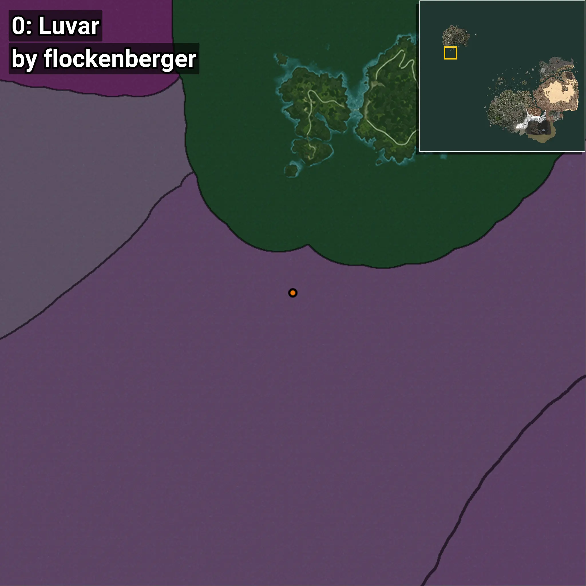
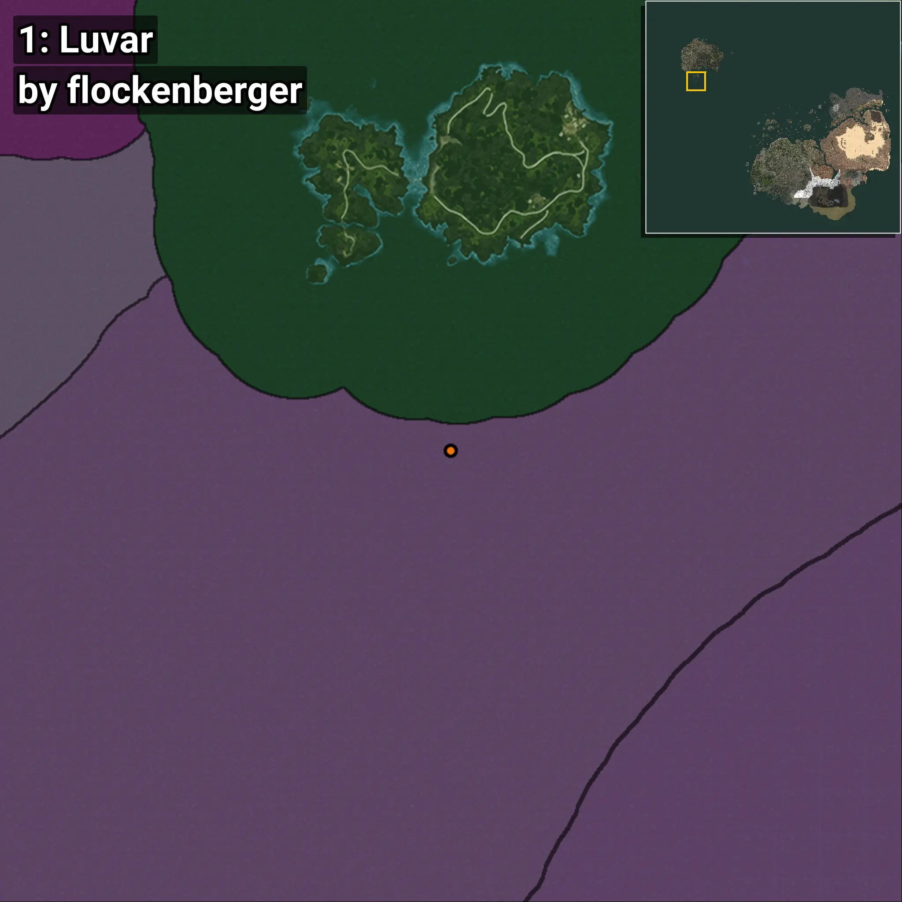
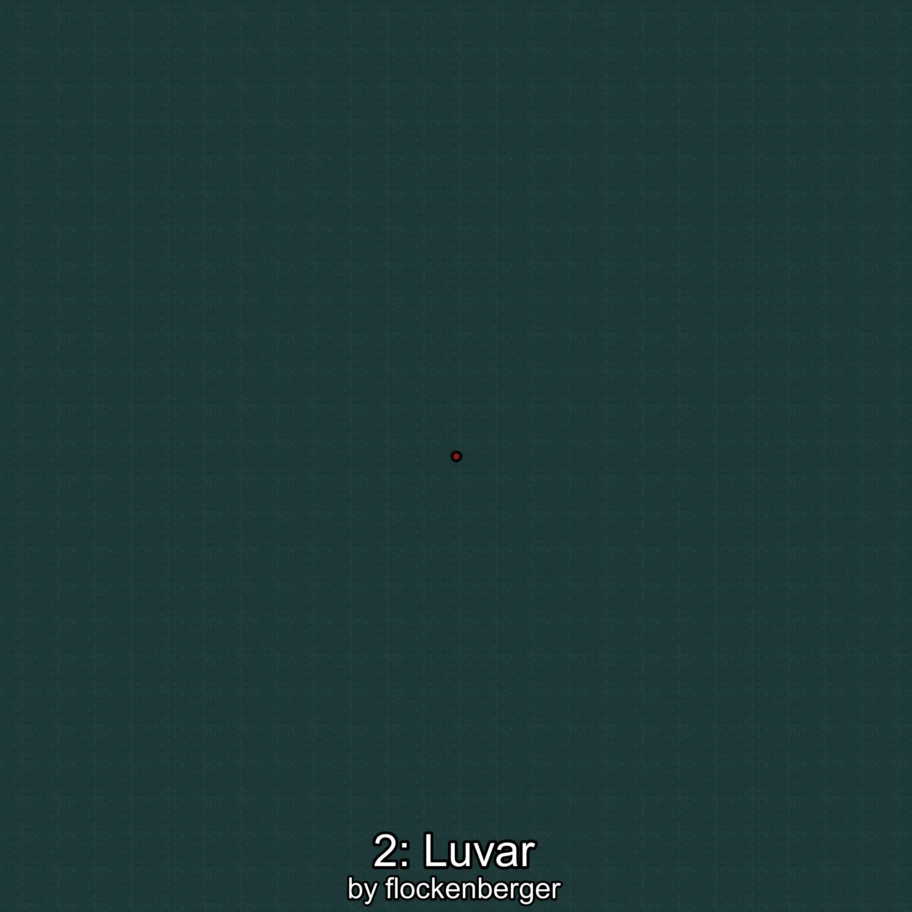

# Luvar
Creado por **flockenberger**

## ⚠️ Advertencia:
Los puntos de pesca se generan según la __**posición de tu personaje**__ — __no__ donde cae el flotador.  
En el océano especialmente, la dirección en la que lances la caña puede colocar tu flotador en una **zona de pesca diferente**, lo que puede resultar en capturar el pez incorrecto.  
Esto solo ocurre en raros casos — cuando la posición está justo en el **borde de una zona** y lanzas hacia el lado “equivocado”.

- Para verificar la posición puedes usar la guía [AQUÍ](https://flockenberger.github.io/bdo-fish-position/)
- O ver la guía [AQUÍ](https://youtu.be/t-VXcRoNojk)

## Waypoints
```xml
<!--
    Puntos de pesca para: Luvar
    Creado por: flockenberger
-->
<WorldmapBookMark>
    <BookMark BookMarkName="0: Luvar" PosX="-106101.0" PosY="-7949.0" PosZ="630062.0" />
    <BookMark BookMarkName="1: Luvar" PosX="-329474.66" PosY="-7872.1377" PosZ="1011159.4" />
    <BookMark BookMarkName="2: Luvar" PosX="-1370348.0" PosY="-7636.0" PosZ="331671.0" />
    <BookMark BookMarkName="3: Luvar" PosX="-105738.0" PosY="-8243.0" PosZ="629043.0" />
    <BookMark BookMarkName="4: Luvar" PosX="-105417.0" PosY="-7975.0" PosZ="634253.0" />
</WorldmapBookMark>
```

     