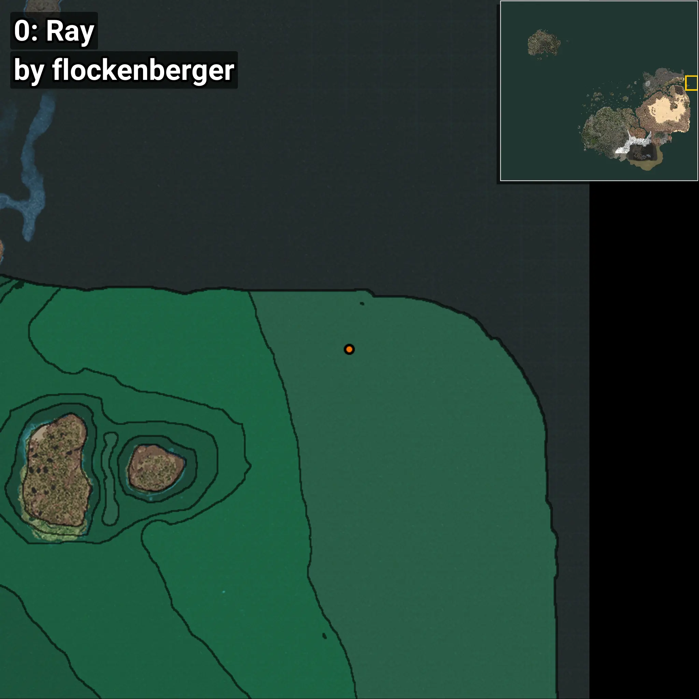
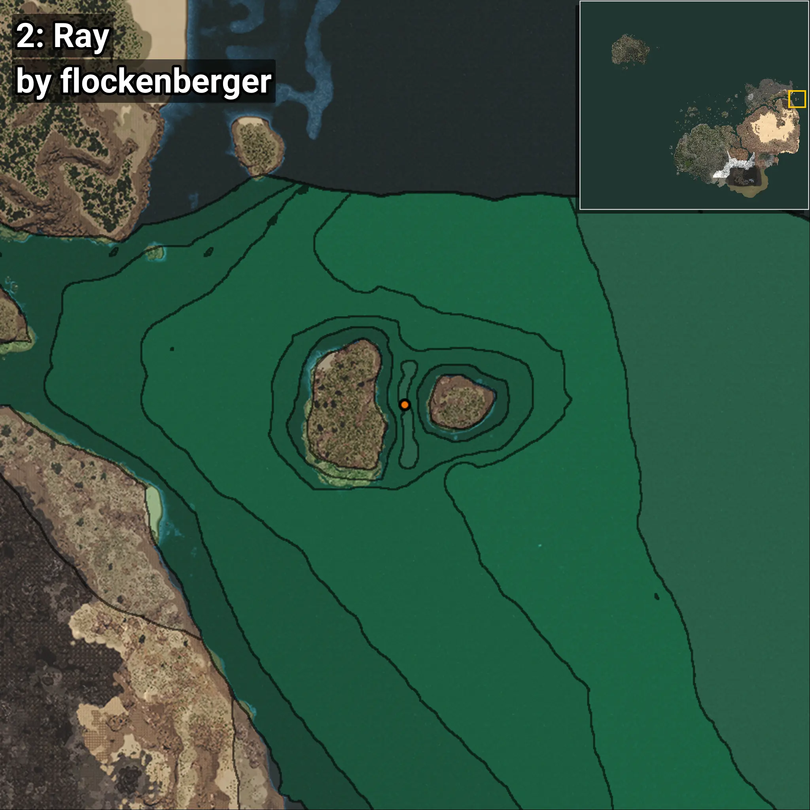
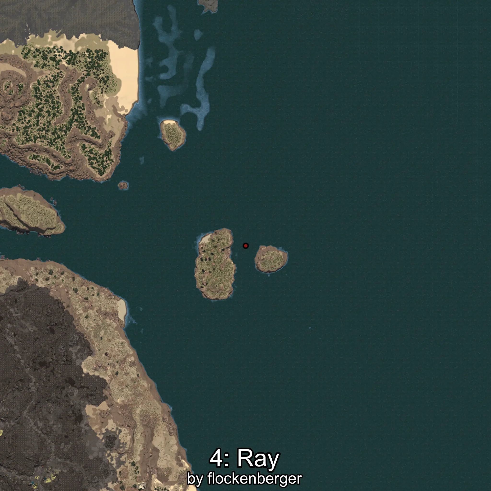

# Mantarraya
Creado por **flockenberger**

## ⚠️ Advertencia:
Los puntos de pesca se generan según la __**posición de tu personaje**__ — __no__ donde cae el flotador.  
En el océano especialmente, la dirección en la que lances la caña puede colocar tu flotador en una **zona de pesca diferente**, lo que puede resultar en capturar el pez incorrecto.  
Esto solo ocurre en raros casos — cuando la posición está justo en el **borde de una zona** y lanzas hacia el lado “equivocado”.

- Para verificar la posición puedes usar la guía [AQUÍ](https://flockenberger.github.io/bdo-fish-position/)
- O ver la guía [AQUÍ](https://youtu.be/t-VXcRoNojk)

## Waypoints
```xml
<!--
    Puntos de pesca para: Mantarraya
    Creado por: flockenberger
-->
<WorldmapBookMark>
    <BookMark BookMarkName="0: Mantarraya" PosX="1420683.0" PosY="-7775.0" PosZ="261588.0" />
    <BookMark BookMarkName="1: Mantarraya" PosX="405433.0" PosY="-8075.0" PosZ="260571.0" />
    <BookMark BookMarkName="2: Mantarraya" PosX="1262875.0" PosY="-7909.0" PosZ="550010.0" />
    <BookMark BookMarkName="3: Mantarraya" PosX="1419332.0" PosY="-7753.0" PosZ="187229.0" />
    <BookMark BookMarkName="4: Mantarraya" PosX="1264254.0" PosY="-7910.0" PosZ="560560.0" />
</WorldmapBookMark>
```

     