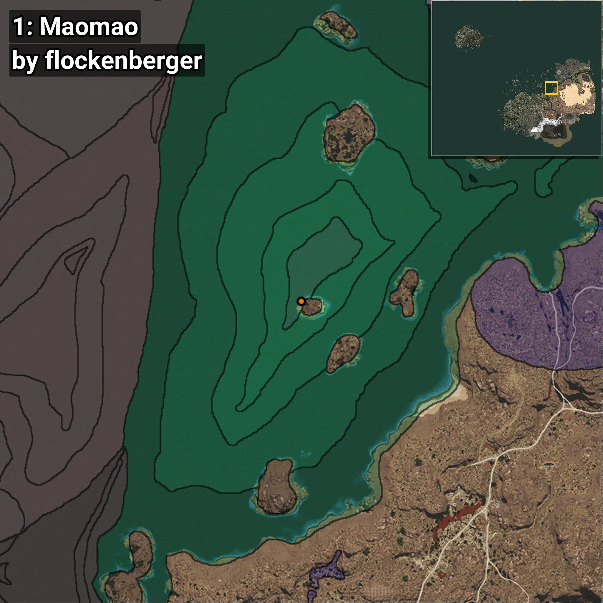
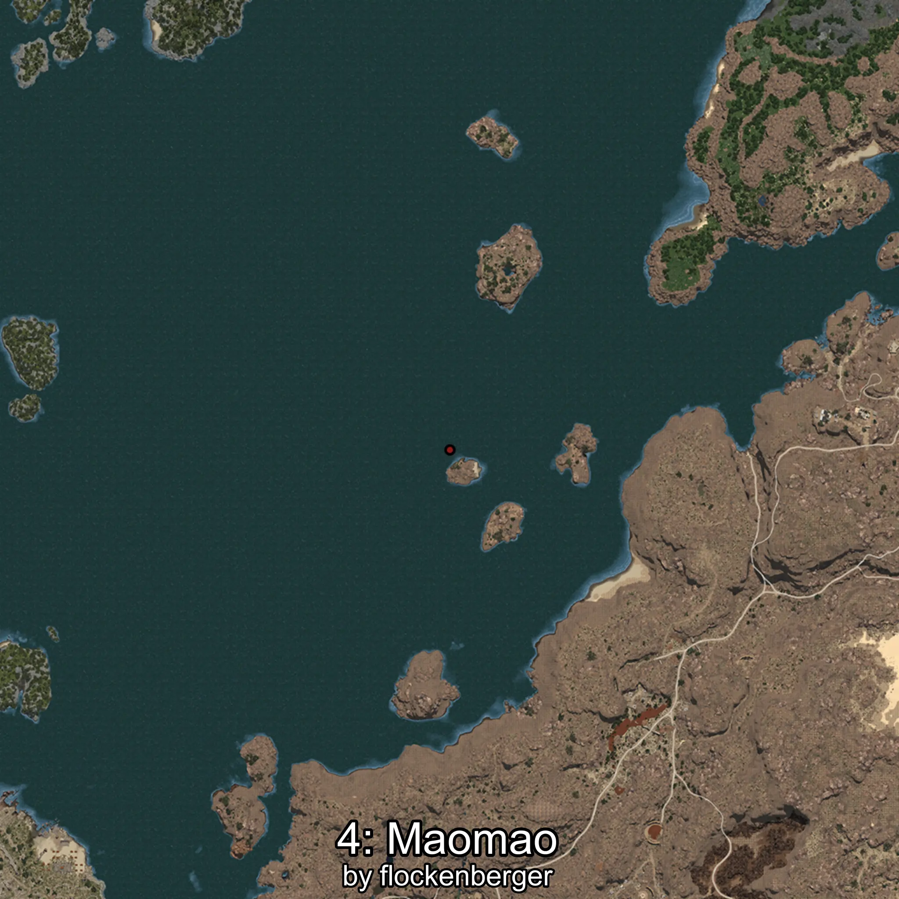
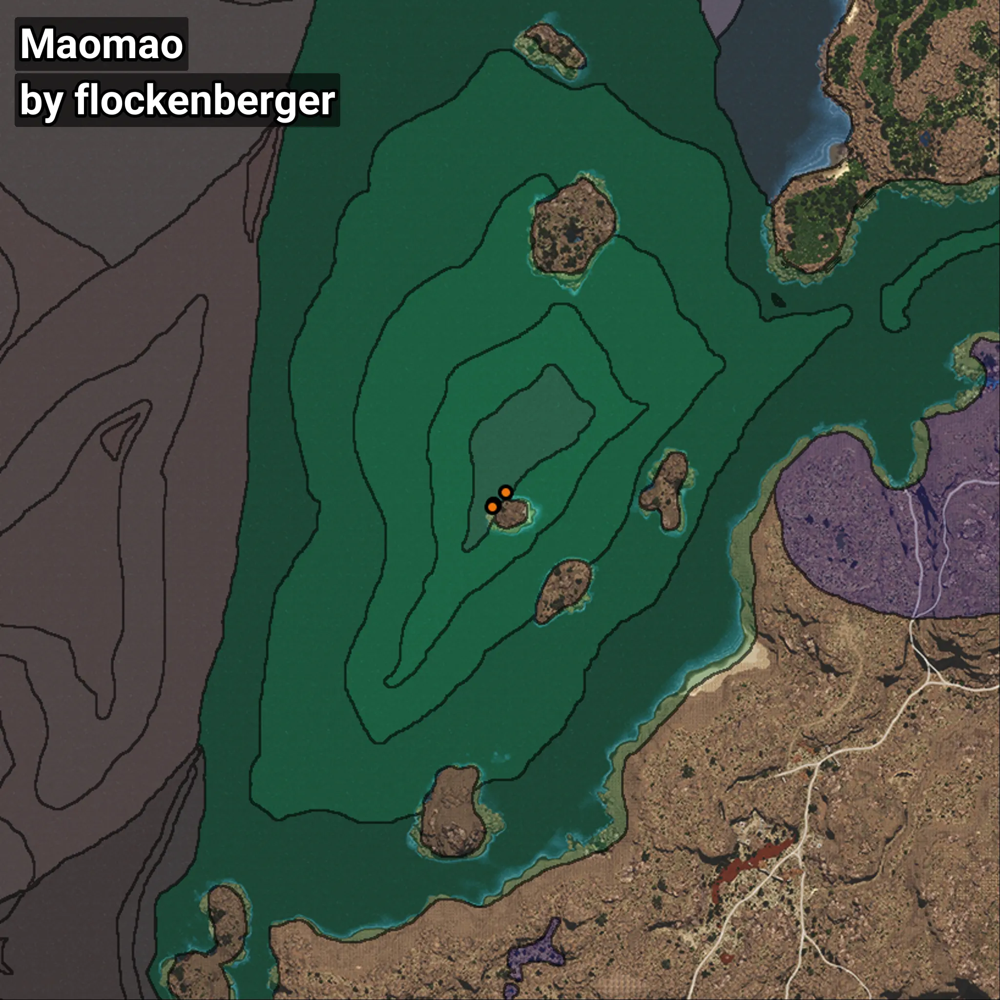

# Maomao
```xml
<!--
    Puntos de pesca para: Maomao
    Creado por: flockenberger
-->
<WorldmapBookMark>
    <BookMark BookMarkName="0: Maomao" PosX="403424.0" PosY="-7911.0" PosZ="258994.0" />
    <BookMark BookMarkName="1: Maomao" PosX="403488.0" PosY="-7902.0" PosZ="259046.0" />
    <BookMark BookMarkName="2: Maomao" PosX="406438.0" PosY="-8190.0" PosZ="262032.0" />
    <BookMark BookMarkName="3: Maomao" PosX="403489.0" PosY="-7922.0" PosZ="259101.0" />
    <BookMark BookMarkName="4: Maomao" PosX="403026.0" PosY="-7987.0" PosZ="258659.0" />
</WorldmapBookMark>
```

## ⚠️ Advertencia:
Los puntos de pesca se generan según la __**posición de tu personaje**__ — __no__ donde cae el flotador.  
En el océano especialmente, la dirección en la que lances la caña puede colocar tu flotador en una **zona de pesca diferente**, lo que puede resultar en capturar el pez incorrecto.  
Presta atención a las vistas previas que muestran la ubicación en relación a las zonas marcadas.

- Para verificar la posición de tu flotador puedes usar la guía [AQUÍ](https://flockenberger.github.io/bdo-fish-position/)
- O ver la guía [AQUÍ](https://youtu.be/t-VXcRoNojk)

## Vistas Previas
      