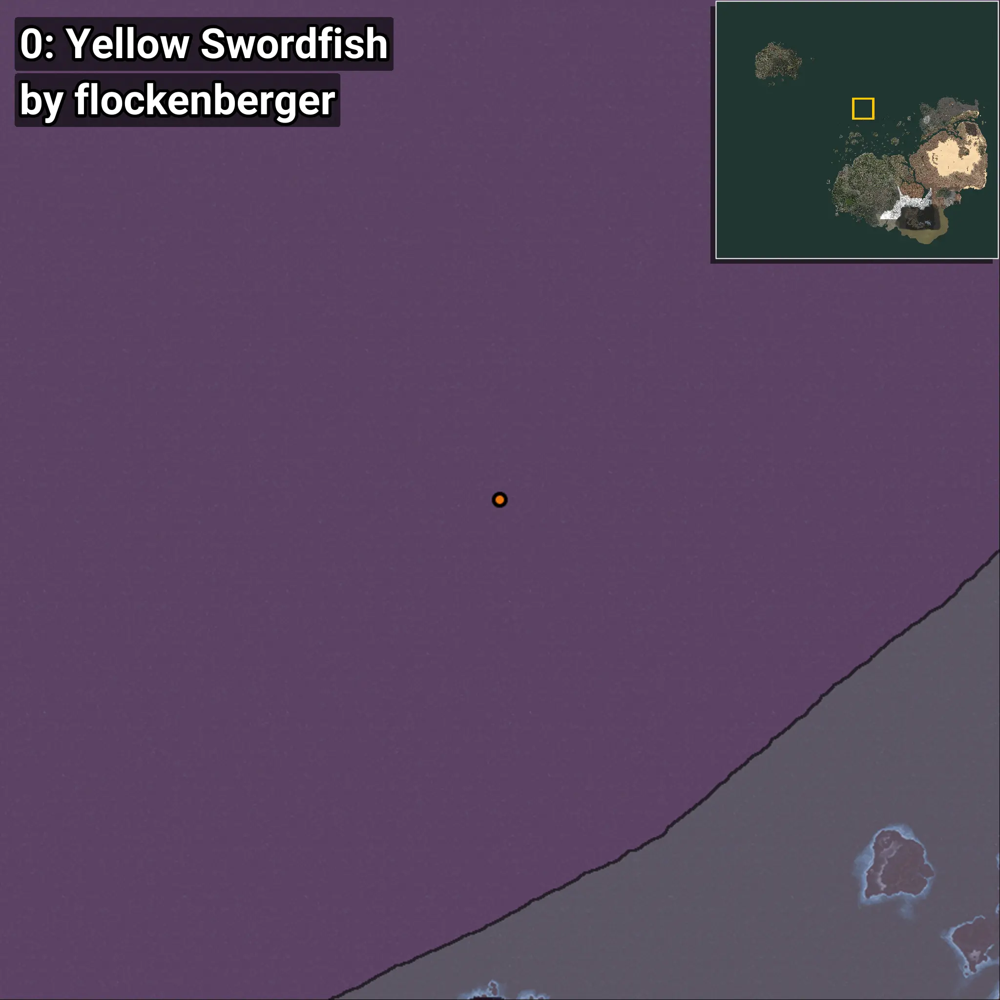
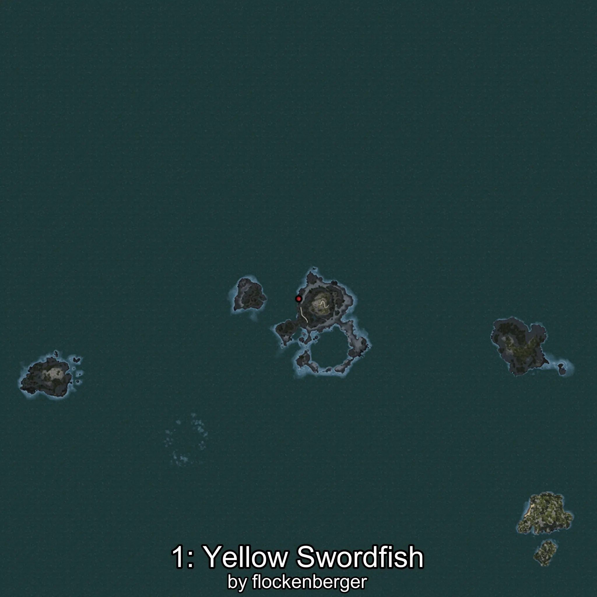
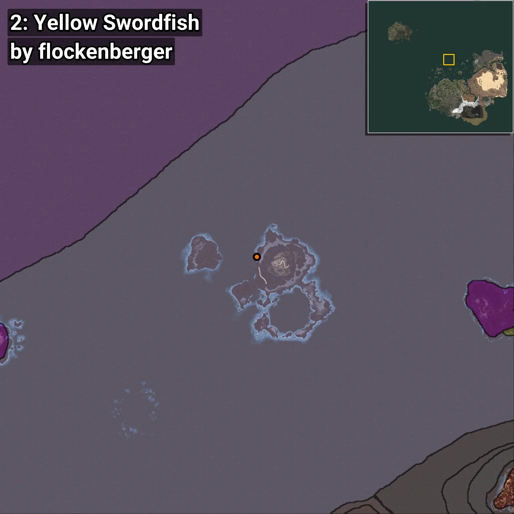
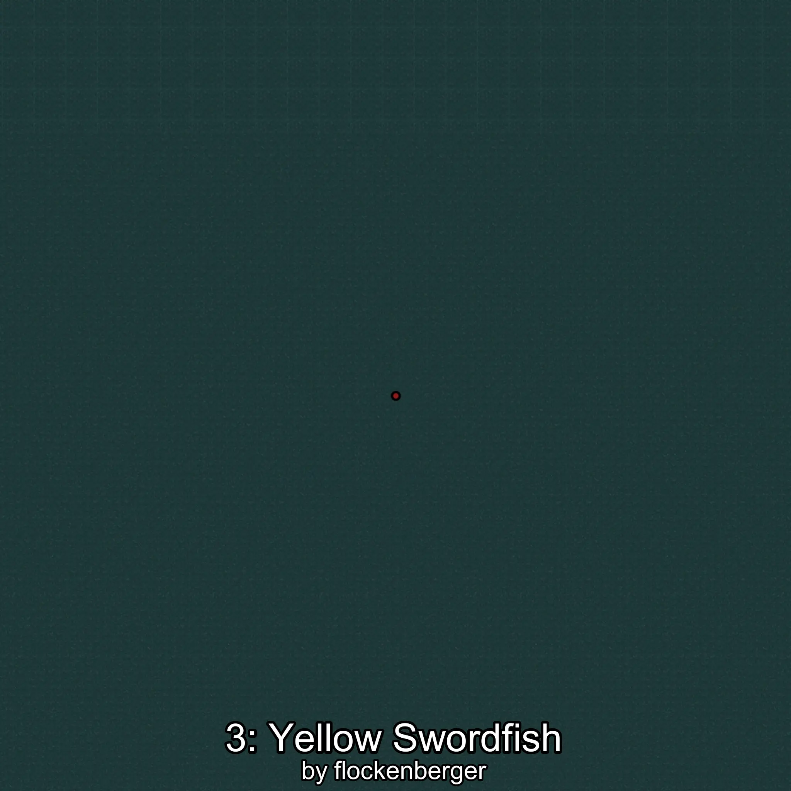

# Marlin
```xml
<!--
    Puntos de pesca para: Marlin
    Creado por: flockenberger
-->
<WorldmapBookMark>
    <BookMark BookMarkName="0: Marlin" PosX="-229333.0" PosY="-7416.0" PosZ="720543.0" />
    <BookMark BookMarkName="1: Marlin" PosX="-228223.0" PosY="-7832.0" PosZ="714409.0" />
    <BookMark BookMarkName="2: Marlin" PosX="-105523.0" PosY="-8156.0" PosZ="629100.0" />
    <BookMark BookMarkName="3: Marlin" PosX="-105491.0" PosY="-8143.0" PosZ="629048.0" />
    <BookMark BookMarkName="4: Marlin" PosX="-359127.84" PosY="-7888.1704" PosZ="886380.0" />
</WorldmapBookMark>
```

## ⚠️ Advertencia:
Los puntos de pesca se generan según la __**posición de tu personaje**__ — __no__ donde cae el flotador.  
En el océano especialmente, la dirección en la que lances la caña puede colocar tu flotador en una **zona de pesca diferente**, lo que puede resultar en capturar el pez incorrecto.  
Presta atención a las vistas previas que muestran la ubicación en relación a las zonas marcadas.

- Para verificar la posición de tu flotador puedes usar la guía [AQUÍ](https://flockenberger.github.io/bdo-fish-position/)
- O ver la guía [AQUÍ](https://youtu.be/t-VXcRoNojk)

## Vistas Previas
      