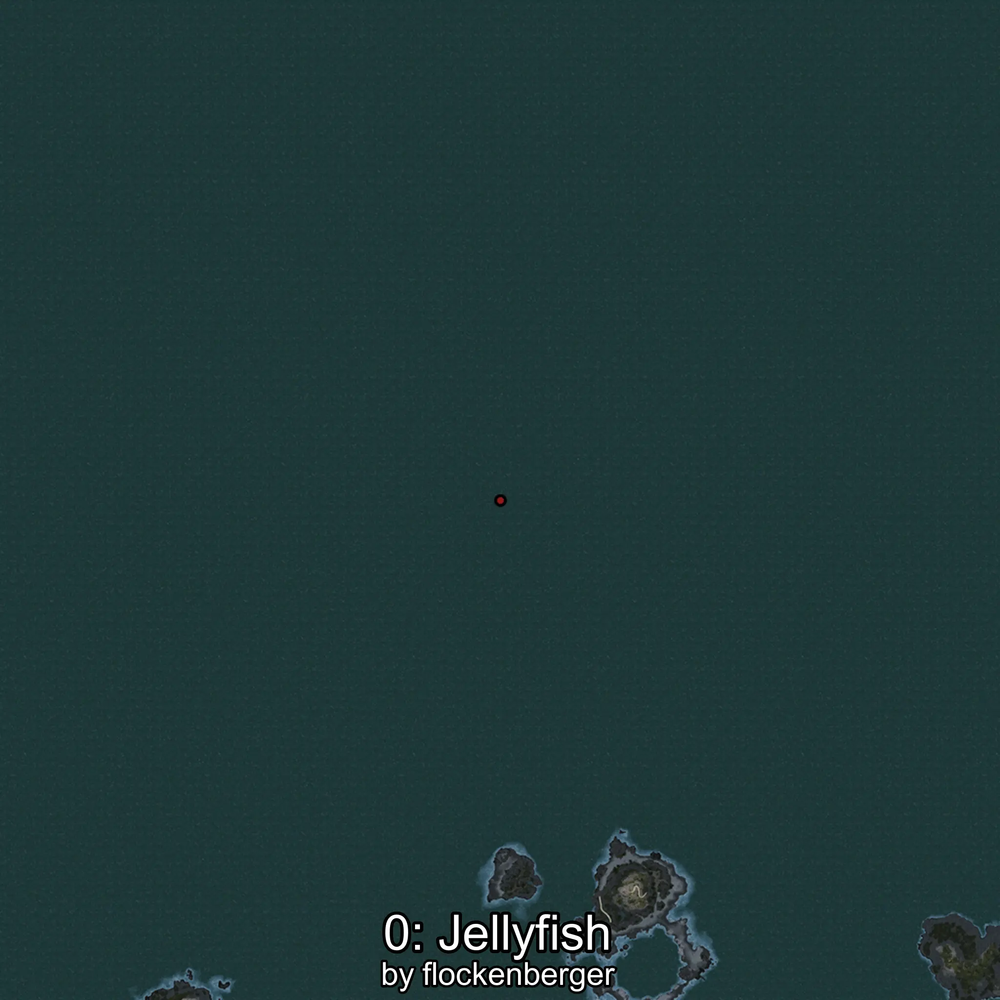
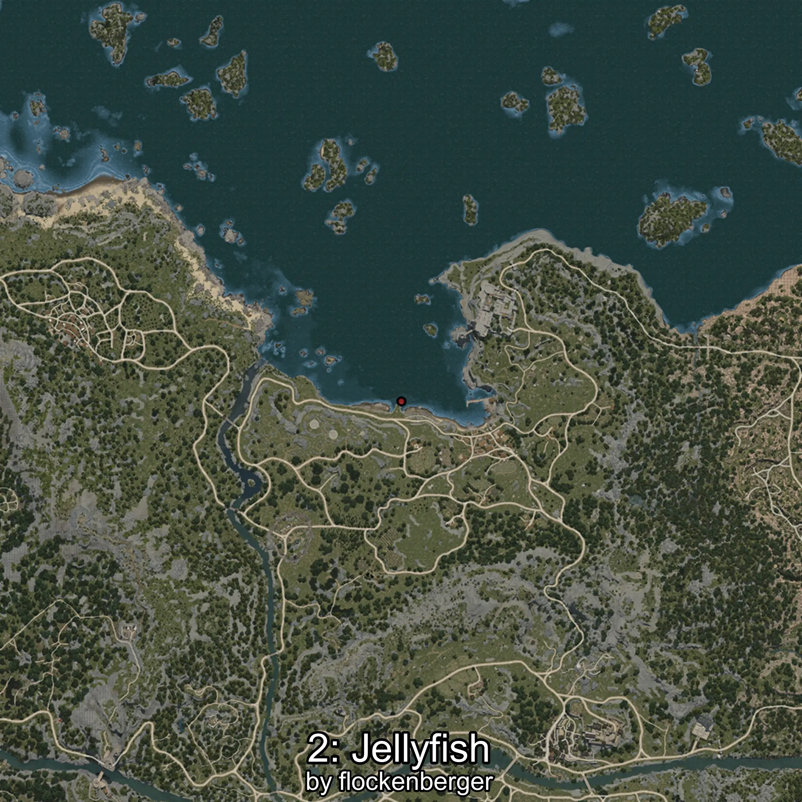
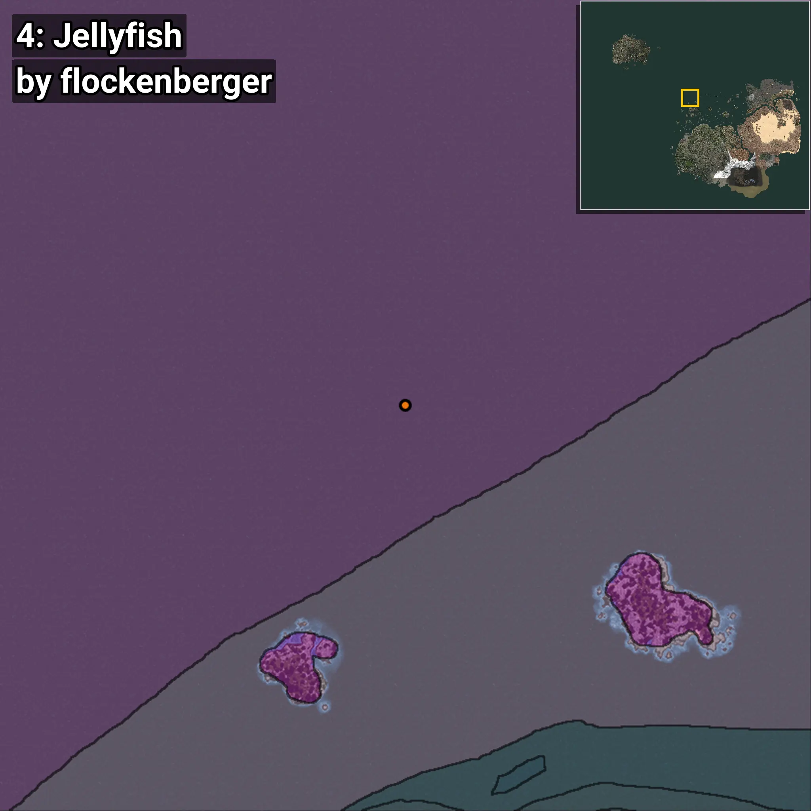
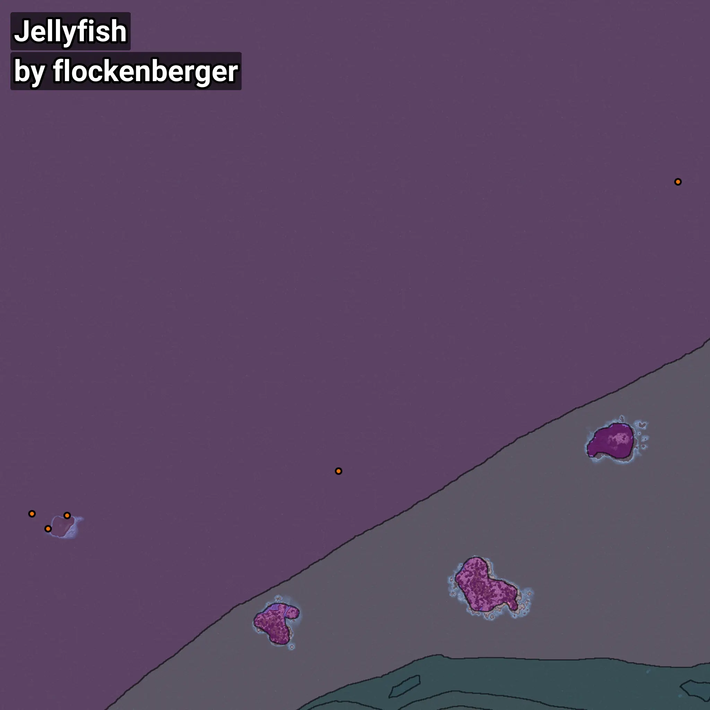

# Medusa
```xml
<!--
    Puntos de pesca para: Medusa
    Creado por: flockenberger
-->
<WorldmapBookMark>
    <BookMark BookMarkName="0: Medusa" PosX="-520761.0" PosY="-7973.0" PosZ="549502.0" />
    <BookMark BookMarkName="1: Medusa" PosX="-530962.0" PosY="-7844.0" PosZ="542567.0" />
    <BookMark BookMarkName="2: Medusa" PosX="-201764.0" PosY="-7791.0" PosZ="723887.0" />
    <BookMark BookMarkName="3: Medusa" PosX="-539231.0" PosY="-7725.0" PosZ="550531.0" />
    <BookMark BookMarkName="4: Medusa" PosX="-379080.47" PosY="-8208.0" PosZ="572800.0" />
</WorldmapBookMark>
```

## ⚠️ Advertencia:
Los puntos de pesca se generan según la __**posición de tu personaje**__ — __no__ donde cae el flotador.  
En el océano especialmente, la dirección en la que lances la caña puede colocar tu flotador en una **zona de pesca diferente**, lo que puede resultar en capturar el pez incorrecto.  
Presta atención a las vistas previas que muestran la ubicación en relación a las zonas marcadas.

- Para verificar la posición de tu flotador puedes usar la guía [AQUÍ](https://flockenberger.github.io/bdo-fish-position/)
- O ver la guía [AQUÍ](https://youtu.be/t-VXcRoNojk)

## Vistas Previas
      