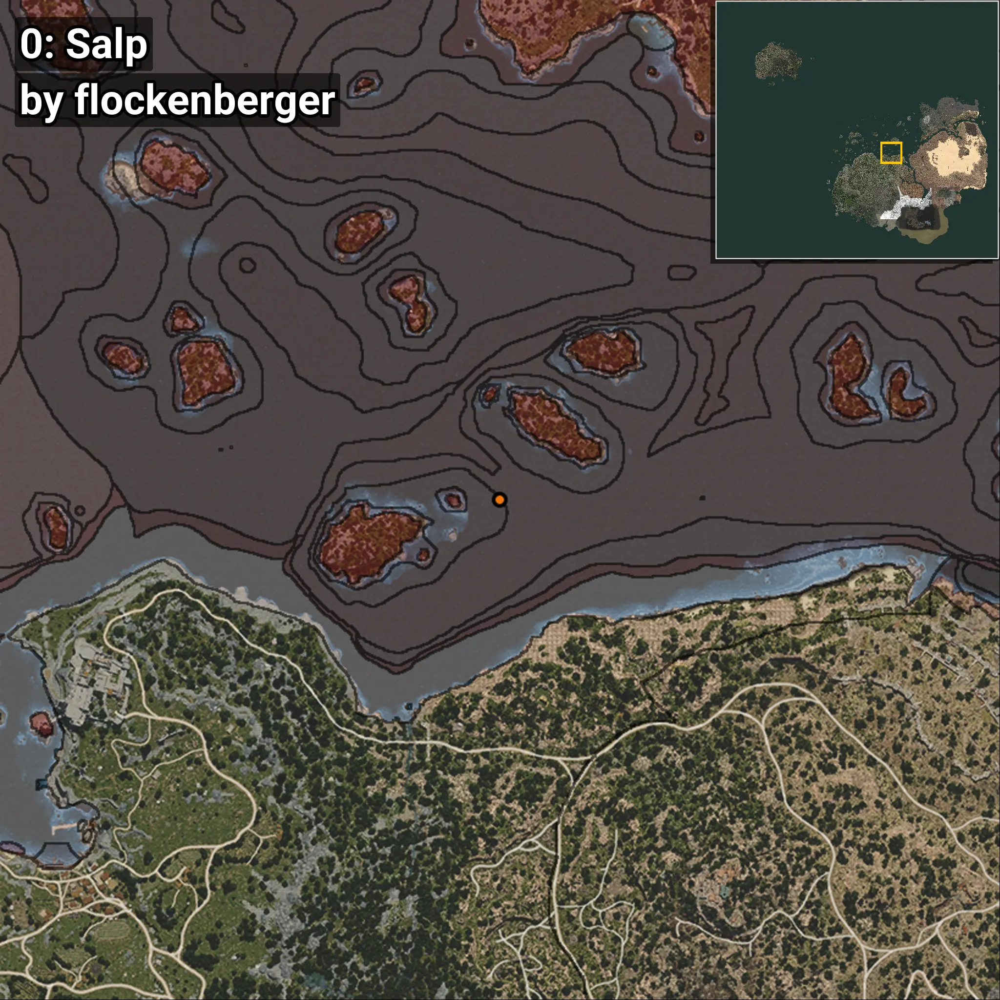
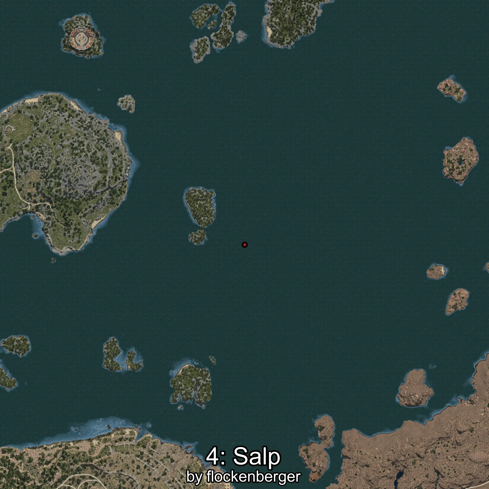

# Melatina
Creado por **flockenberger**

## ⚠️ Advertencia:
Los puntos de pesca se generan según la __**posición de tu personaje**__ — __no__ donde cae el flotador.  
En el océano especialmente, la dirección en la que lances la caña puede colocar tu flotador en una **zona de pesca diferente**, lo que puede resultar en capturar el pez incorrecto.  
Esto solo ocurre en raros casos — cuando la posición está justo en el **borde de una zona** y lanzas hacia el lado “equivocado”.

- Para verificar la posición puedes usar la guía [AQUÍ](https://flockenberger.github.io/bdo-fish-position/)
- O ver la guía [AQUÍ](https://youtu.be/t-VXcRoNojk)

## Waypoints
```xml
<!--
    Puntos de pesca para: Melatina
    Creado por: flockenberger
-->
<WorldmapBookMark>
    <BookMark BookMarkName="0: Melatina" PosX="233463.0" PosY="-7913.0" PosZ="202065.0" />
    <BookMark BookMarkName="1: Melatina" PosX="-229449.0" PosY="-3913.0" PosZ="-53399.0" />
    <BookMark BookMarkName="2: Melatina" PosX="274042.0" PosY="-7566.0" PosZ="171765.0" />
    <BookMark BookMarkName="3: Melatina" PosX="311577.0" PosY="-7899.0" PosZ="73224.0" />
    <BookMark BookMarkName="4: Melatina" PosX="286880.0" PosY="-8208.0" PosZ="273599.0" />
</WorldmapBookMark>
```

     