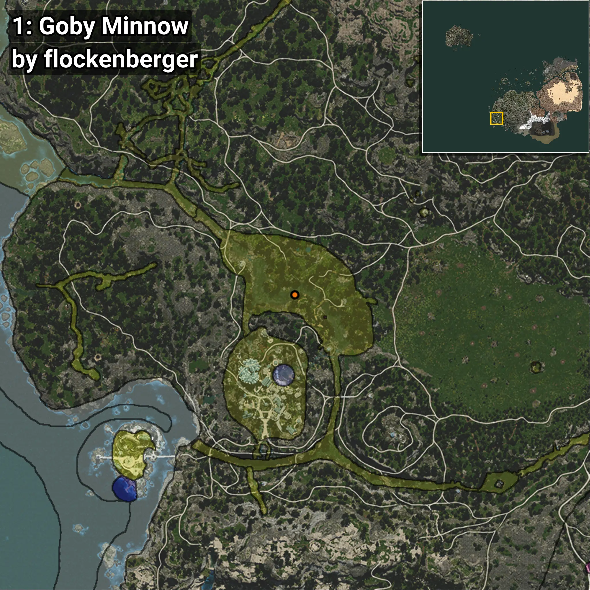
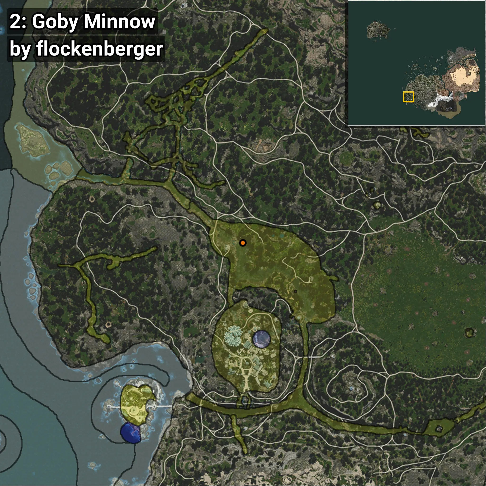
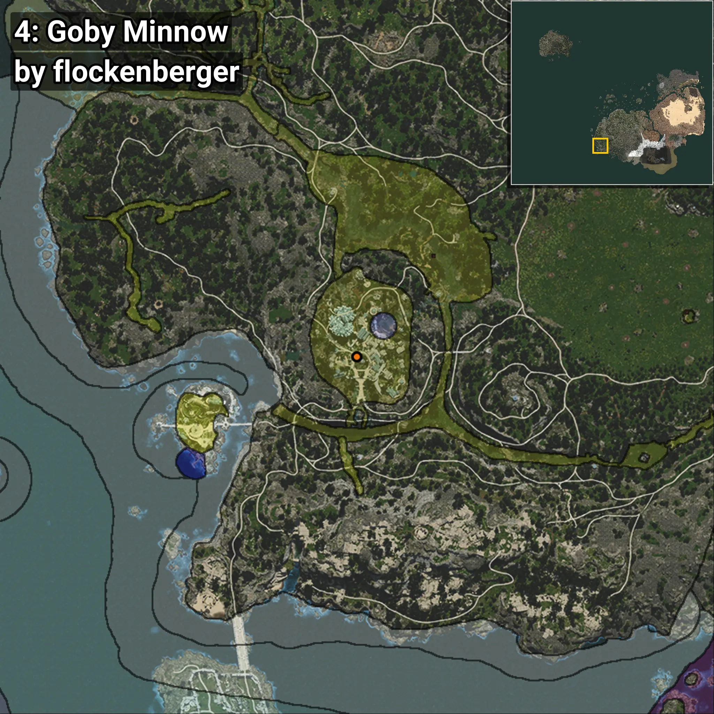
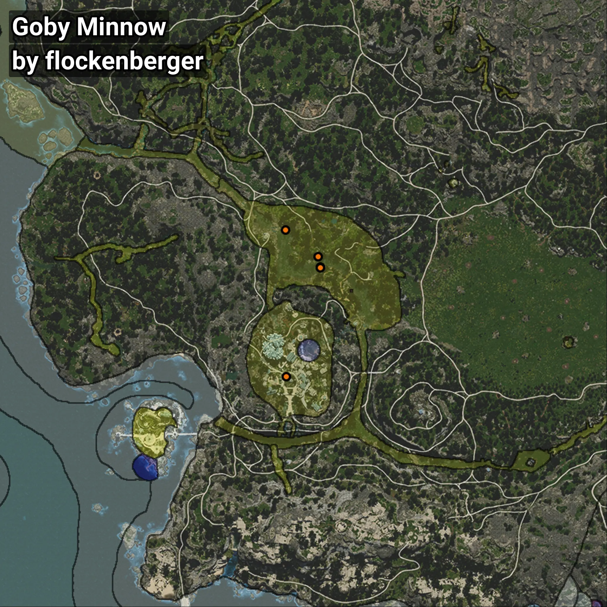

# Minnow
```xml
<!--
    Puntos de pesca para: Minnow
    Creado por: flockenberger
-->
<WorldmapBookMark>
    <BookMark BookMarkName="0: Minnow" PosX="-492726.66" PosY="-4805.2153" PosZ="-412791.84" />
    <BookMark BookMarkName="1: Minnow" PosX="-492806.0" PosY="-4742.0" PosZ="-413093.0" />
    <BookMark BookMarkName="2: Minnow" PosX="-506977.0" PosY="-4531.0" PosZ="-397808.0" />
    <BookMark BookMarkName="3: Minnow" PosX="-493701.06" PosY="-4883.3027" PosZ="-408651.28" />
    <BookMark BookMarkName="4: Minnow" PosX="-506631.06" PosY="8738.06" PosZ="-457391.3" />
</WorldmapBookMark>
```

## ⚠️ Advertencia:
Los puntos de pesca se generan según la __**posición de tu personaje**__ — __no__ donde cae el flotador.  
En el océano especialmente, la dirección en la que lances la caña puede colocar tu flotador en una **zona de pesca diferente**, lo que puede resultar en capturar el pez incorrecto.  
Presta atención a las vistas previas que muestran la ubicación en relación a las zonas marcadas.

- Para verificar la posición de tu flotador puedes usar la guía [AQUÍ](https://flockenberger.github.io/bdo-fish-position/)
- O ver la guía [AQUÍ](https://youtu.be/t-VXcRoNojk)

## Vistas Previas
      