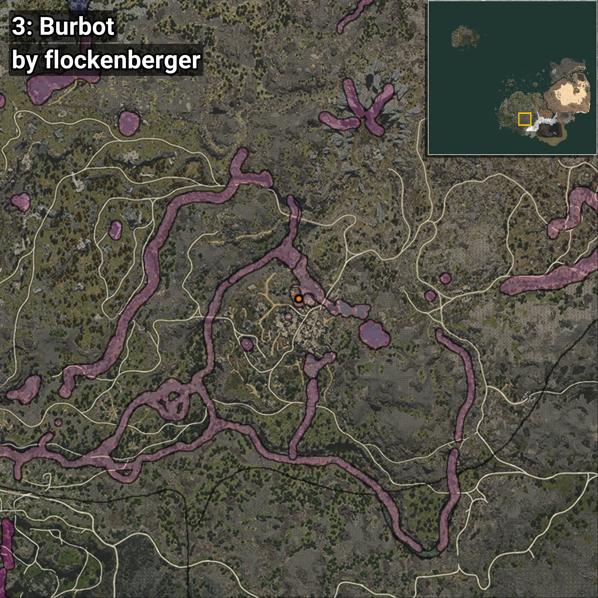
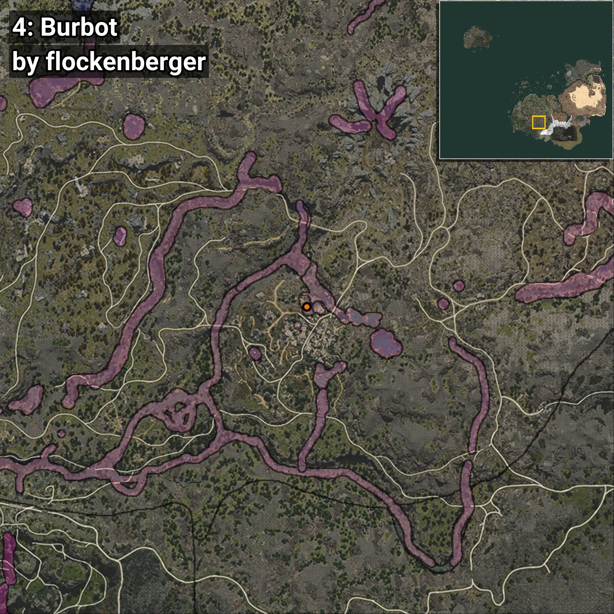

# Mokae
```xml
<!--
    Puntos de pesca para: Mokae
    Creado por: flockenberger
-->
<WorldmapBookMark>
    <BookMark BookMarkName="0: Mokae" PosX="-50564.0" PosY="20051.0" PosZ="-396678.0" />
    <BookMark BookMarkName="1: Mokae" PosX="-50565.0" PosY="19934.0" PosZ="-396498.0" />
    <BookMark BookMarkName="2: Mokae" PosX="-51121.0" PosY="20058.0" PosZ="-396565.0" />
    <BookMark BookMarkName="3: Mokae" PosX="-50535.0" PosY="19935.0" PosZ="-396452.0" />
    <BookMark BookMarkName="4: Mokae" PosX="-51136.0" PosY="20058.0" PosZ="-396647.0" />
</WorldmapBookMark>
```

## ⚠️ Advertencia:
Los puntos de pesca se generan según la __**posición de tu personaje**__ — __no__ donde cae el flotador.  
En el océano especialmente, la dirección en la que lances la caña puede colocar tu flotador en una **zona de pesca diferente**, lo que puede resultar en capturar el pez incorrecto.  
Presta atención a las vistas previas que muestran la ubicación en relación a las zonas marcadas.

- Para verificar la posición de tu flotador puedes usar la guía [AQUÍ](https://flockenberger.github.io/bdo-fish-position/)
- O ver la guía [AQUÍ](https://youtu.be/t-VXcRoNojk)

## Vistas Previas
      