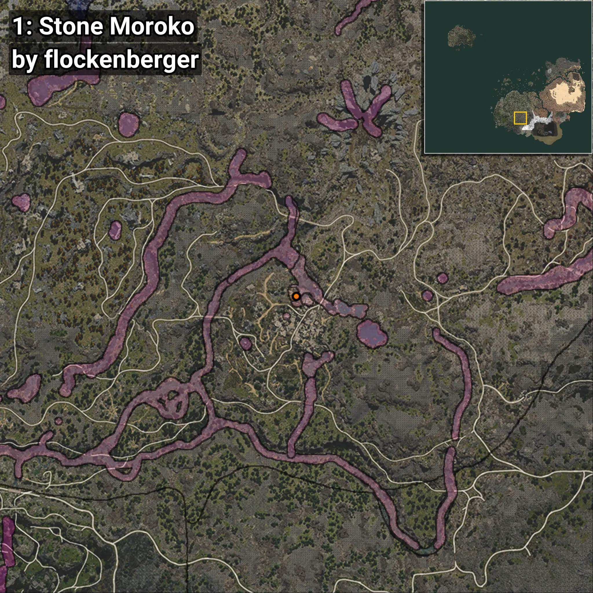
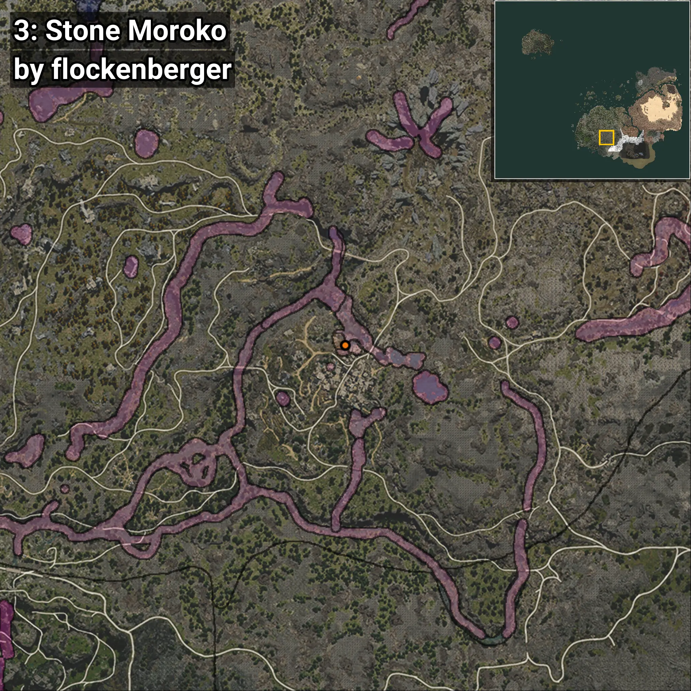
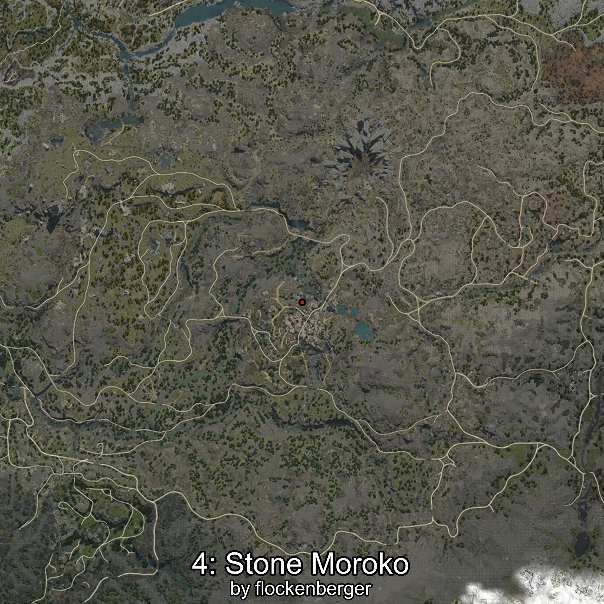

# Moroko
```xml
<!--
    Puntos de pesca para: Moroko
    Creado por: flockenberger
-->
<WorldmapBookMark>
    <BookMark BookMarkName="0: Moroko" PosX="-50964.223" PosY="19788.738" PosZ="-395794.8" />
    <BookMark BookMarkName="1: Moroko" PosX="-50835.0" PosY="19816.0" PosZ="-395660.0" />
    <BookMark BookMarkName="2: Moroko" PosX="-49771.0" PosY="19852.0" PosZ="-396351.0" />
    <BookMark BookMarkName="3: Moroko" PosX="-49609.94" PosY="19852.543" PosZ="-396280.28" />
    <BookMark BookMarkName="4: Moroko" PosX="-46509.0" PosY="17332.0" PosZ="-425577.0" />
</WorldmapBookMark>
```

## ⚠️ Advertencia:
Los puntos de pesca se generan según la __**posición de tu personaje**__ — __no__ donde cae el flotador.  
En el océano especialmente, la dirección en la que lances la caña puede colocar tu flotador en una **zona de pesca diferente**, lo que puede resultar en capturar el pez incorrecto.  
Presta atención a las vistas previas que muestran la ubicación en relación a las zonas marcadas.

- Para verificar la posición de tu flotador puedes usar la guía [AQUÍ](https://flockenberger.github.io/bdo-fish-position/)
- O ver la guía [AQUÍ](https://youtu.be/t-VXcRoNojk)

## Vistas Previas
      