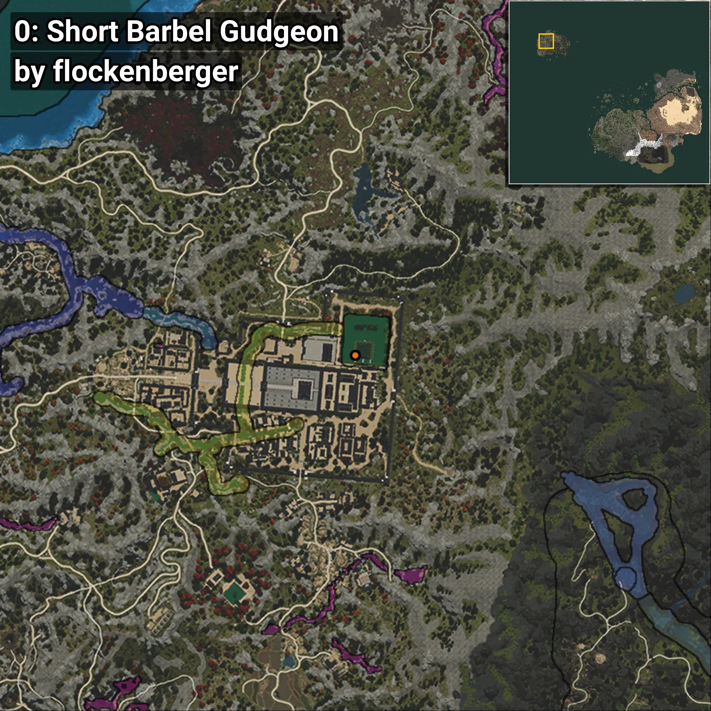
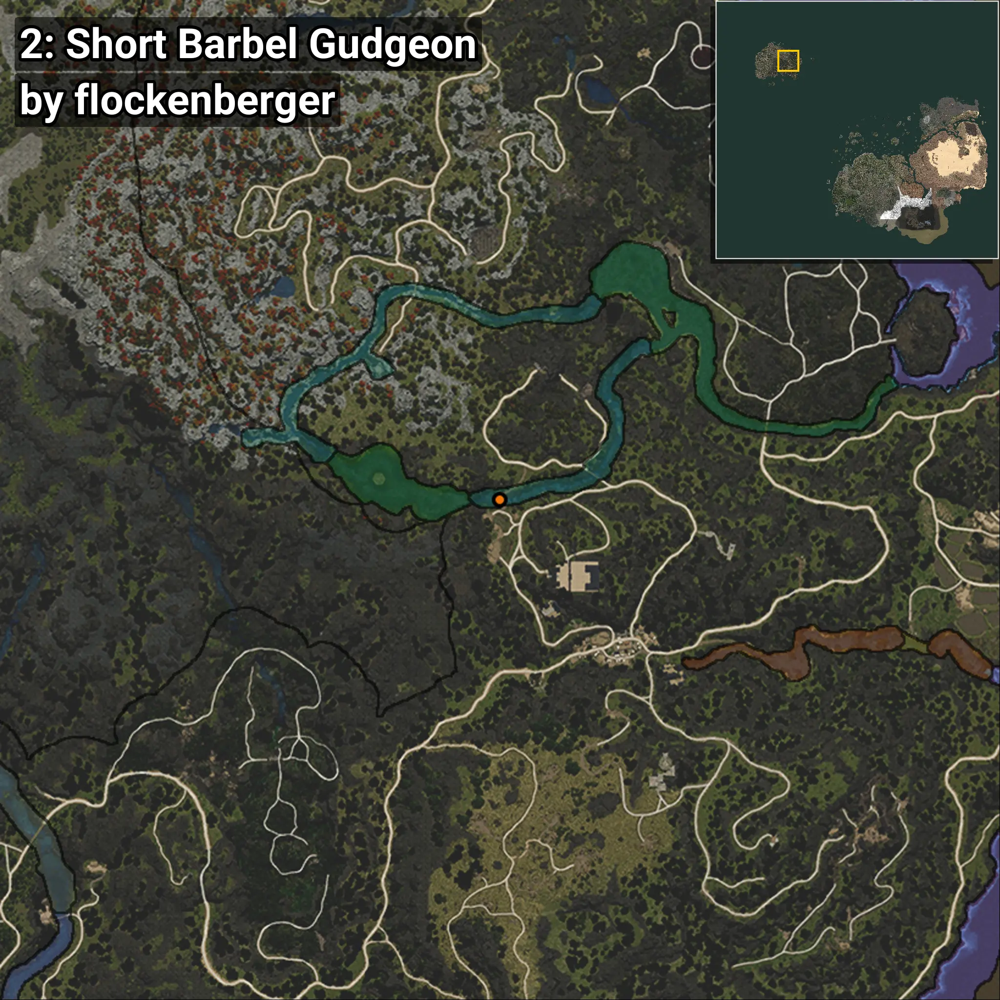
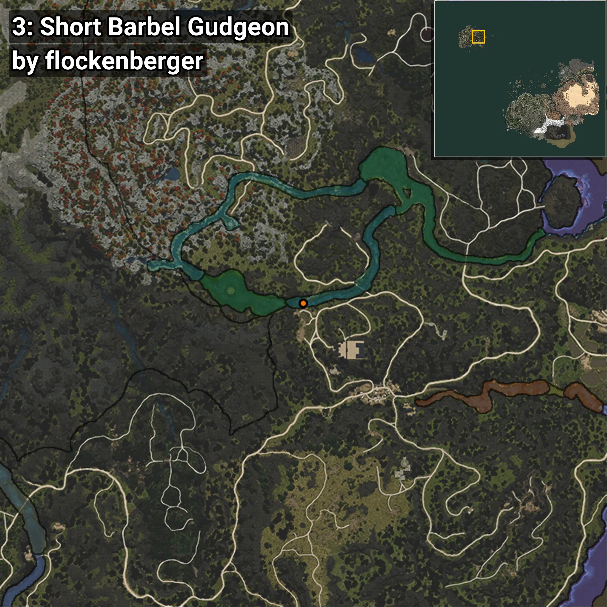
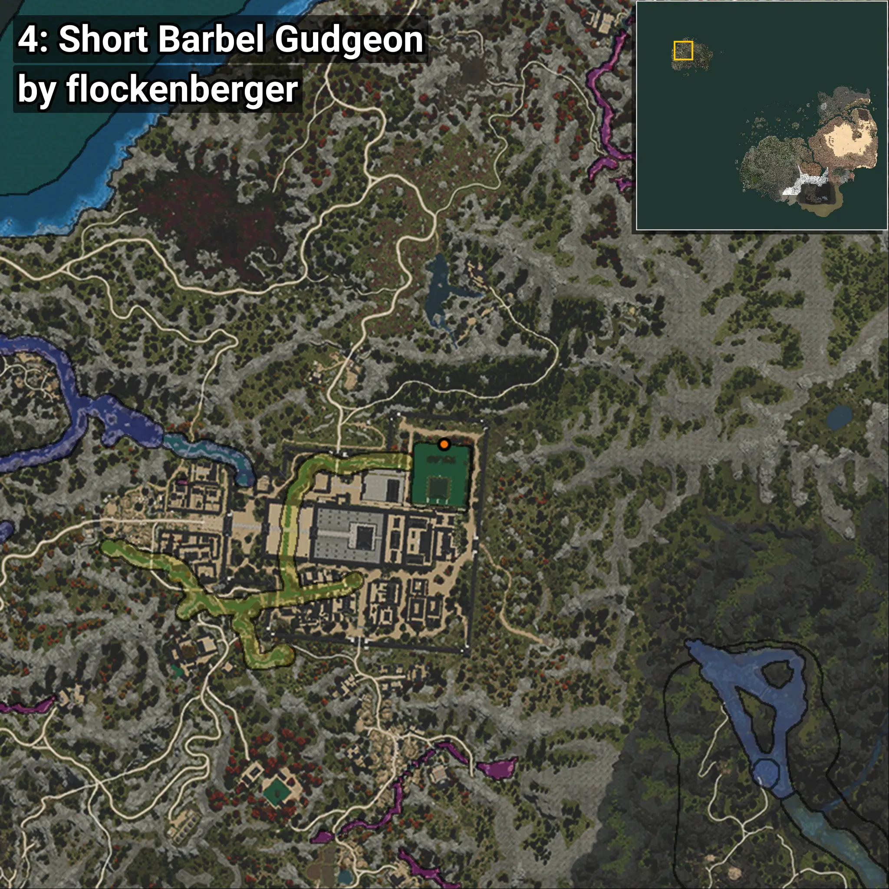

# Mulgae
```xml
<!--
    Puntos de pesca para: Mulgae
    Creado por: flockenberger
-->
<WorldmapBookMark>
    <BookMark BookMarkName="0: Mulgae" PosX="-1400127.4" PosY="13286.553" PosZ="1345266.2" />
    <BookMark BookMarkName="1: Mulgae" PosX="-1400076.0" PosY="13186.0" PosZ="1345486.0" />
    <BookMark BookMarkName="2: Mulgae" PosX="-1153593.0" PosY="18168.41" PosZ="1309000.6" />
    <BookMark BookMarkName="3: Mulgae" PosX="-1153996.0" PosY="18035.0" PosZ="1309107.0" />
    <BookMark BookMarkName="4: Mulgae" PosX="-1395645.0" PosY="13106.0" PosZ="1359094.0" />
</WorldmapBookMark>
```

## ⚠️ Advertencia:
Los puntos de pesca se generan según la __**posición de tu personaje**__ — __no__ donde cae el flotador.  
En el océano especialmente, la dirección en la que lances la caña puede colocar tu flotador en una **zona de pesca diferente**, lo que puede resultar en capturar el pez incorrecto.  
Presta atención a las vistas previas que muestran la ubicación en relación a las zonas marcadas.

- Para verificar la posición de tu flotador puedes usar la guía [AQUÍ](https://flockenberger.github.io/bdo-fish-position/)
- O ver la guía [AQUÍ](https://youtu.be/t-VXcRoNojk)

## Vistas Previas
      