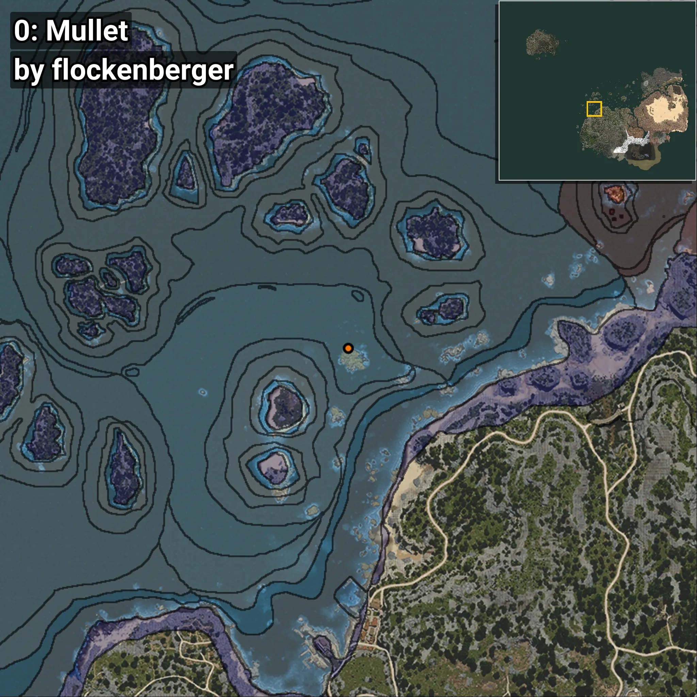
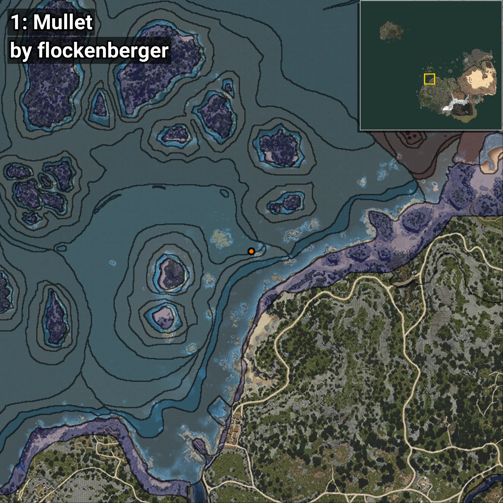
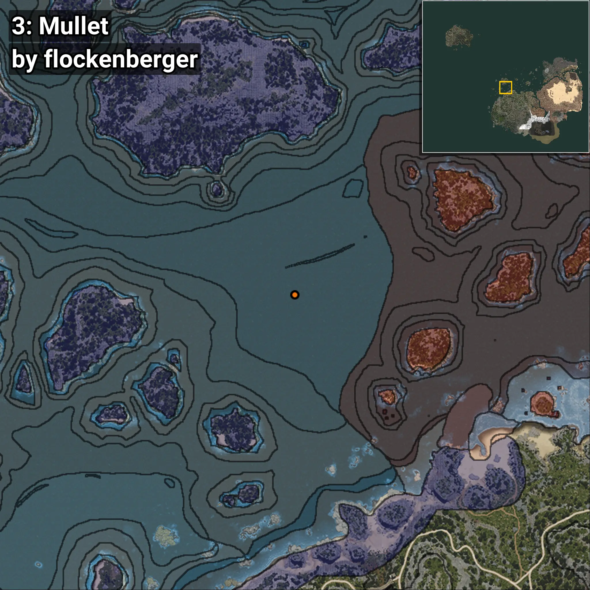

# Mújol
```xml
<!--
    Puntos de pesca para: Mújol
    Creado por: flockenberger
-->
<WorldmapBookMark>
    <BookMark BookMarkName="0: Mújol" PosX="-360068.0" PosY="-8061.0" PosZ="131706.0" />
    <BookMark BookMarkName="1: Mújol" PosX="-343459.84" PosY="-8035.418" PosZ="121783.555" />
    <BookMark BookMarkName="2: Mújol" PosX="-303935.34" PosY="-7584.9097" PosZ="224901.78" />
    <BookMark BookMarkName="3: Mújol" PosX="-304344.0" PosY="-7914.0" PosZ="228963.0" />
    <BookMark BookMarkName="4: Mújol" PosX="-544038.9" PosY="-7819.9233" PosZ="-619782.6" />
</WorldmapBookMark>
```

## ⚠️ Advertencia:
Los puntos de pesca se generan según la __**posición de tu personaje**__ — __no__ donde cae el flotador.  
En el océano especialmente, la dirección en la que lances la caña puede colocar tu flotador en una **zona de pesca diferente**, lo que puede resultar en capturar el pez incorrecto.  
Presta atención a las vistas previas que muestran la ubicación en relación a las zonas marcadas.

- Para verificar la posición de tu flotador puedes usar la guía [AQUÍ](https://flockenberger.github.io/bdo-fish-position/)
- O ver la guía [AQUÍ](https://youtu.be/t-VXcRoNojk)

## Vistas Previas
      