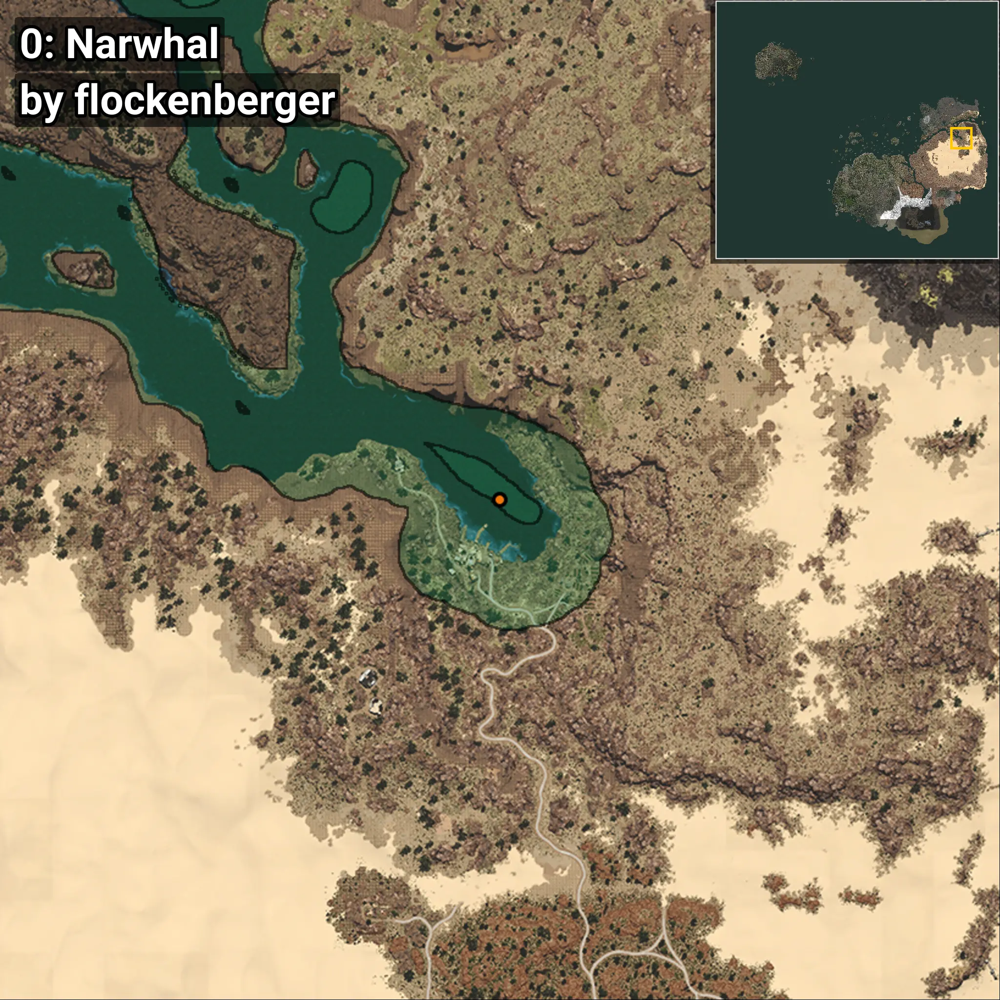
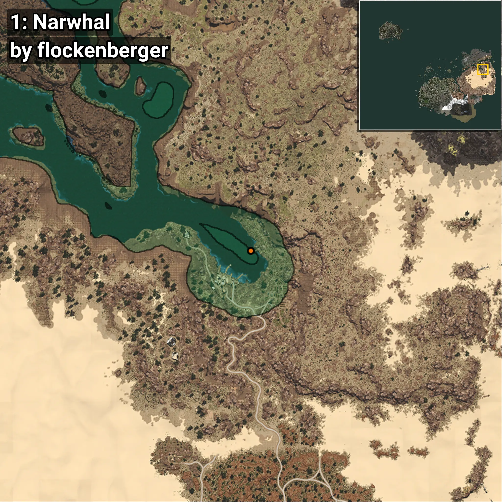
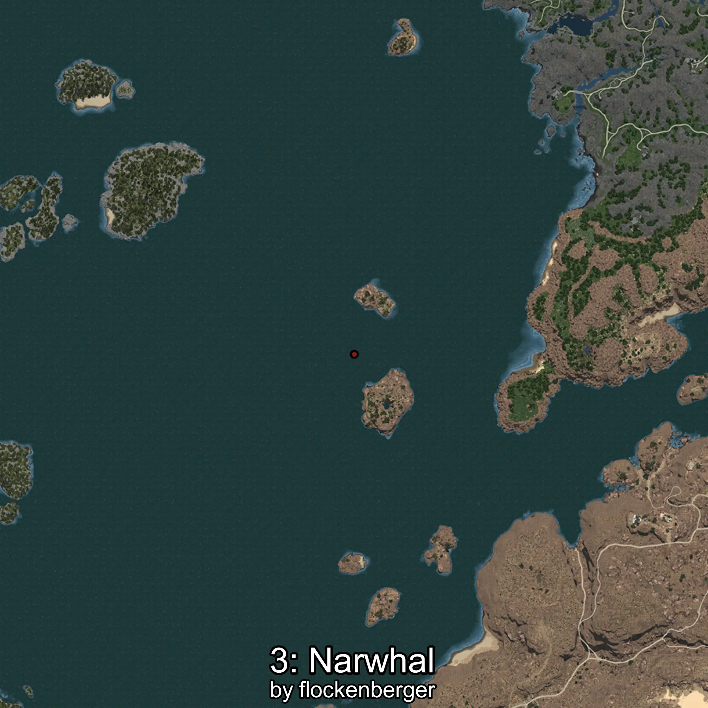

# Narval
```xml
<!--
    Puntos de pesca para: Narval
    Creado por: flockenberger
-->
<WorldmapBookMark>
    <BookMark BookMarkName="0: Narval" PosX="980418.0" PosY="-8188.0" PosZ="354199.0" />
    <BookMark BookMarkName="1: Narval" PosX="987252.0" PosY="-8196.0" PosZ="354795.0" />
    <BookMark BookMarkName="2: Narval" PosX="403518.0" PosY="-7893.0" PosZ="262092.0" />
    <BookMark BookMarkName="3: Narval" PosX="401938.75" PosY="-8010.8926" PosZ="260632.69" />
    <BookMark BookMarkName="4: Narval" PosX="1344802.0" PosY="-8112.0" PosZ="556771.0" />
</WorldmapBookMark>
```

## ⚠️ Advertencia:
Los puntos de pesca se generan según la __**posición de tu personaje**__ — __no__ donde cae el flotador.  
En el océano especialmente, la dirección en la que lances la caña puede colocar tu flotador en una **zona de pesca diferente**, lo que puede resultar en capturar el pez incorrecto.  
Presta atención a las vistas previas que muestran la ubicación en relación a las zonas marcadas.

- Para verificar la posición de tu flotador puedes usar la guía [AQUÍ](https://flockenberger.github.io/bdo-fish-position/)
- O ver la guía [AQUÍ](https://youtu.be/t-VXcRoNojk)

## Vistas Previas
      