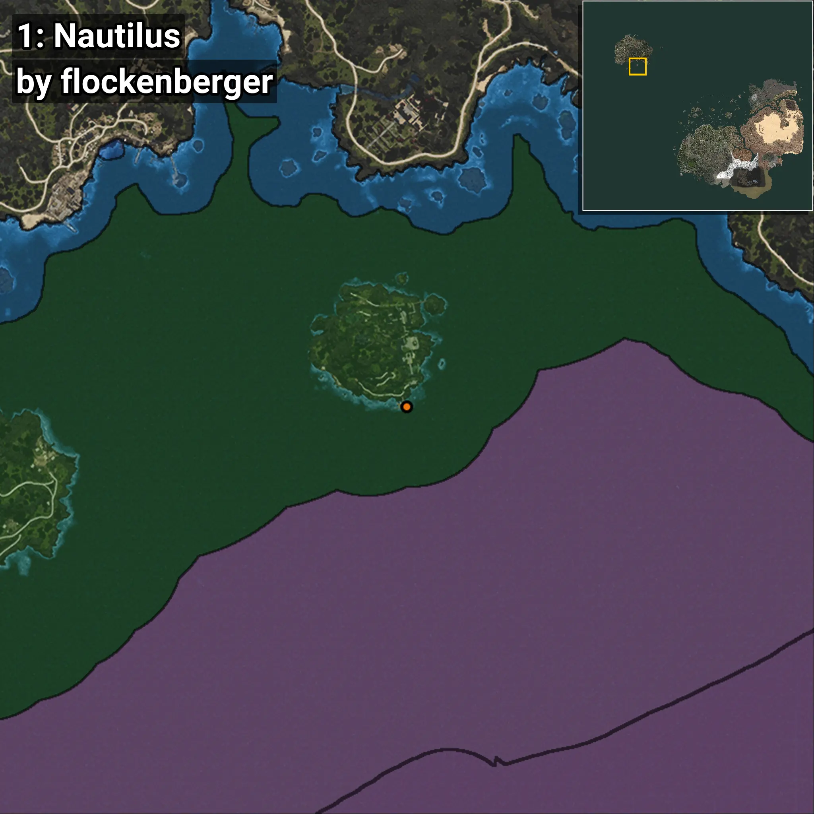
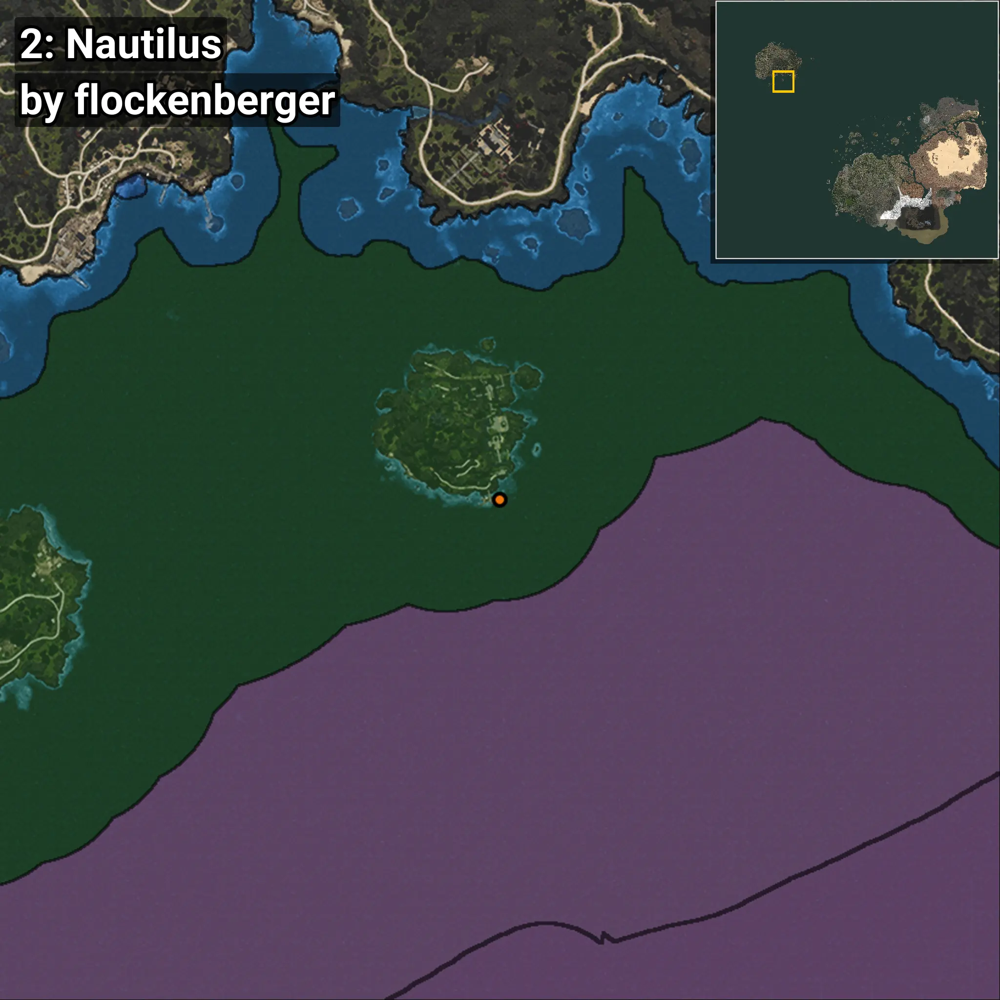

# Nautilina
```xml
<!--
    Puntos de pesca para: Nautilina
    Creado por: flockenberger
-->
<WorldmapBookMark>
    <BookMark BookMarkName="0: Nautilina" PosX="-1215274.4" PosY="-7759.0156" PosZ="1052570.0" />
    <BookMark BookMarkName="1: Nautilina" PosX="-1215208.0" PosY="-7758.9844" PosZ="1052595.8" />
    <BookMark BookMarkName="2: Nautilina" PosX="-1213707.8" PosY="-7759.5107" PosZ="1052985.2" />
    <BookMark BookMarkName="3: Nautilina" PosX="-1213694.9" PosY="-7759.5093" PosZ="1052961.4" />
    <BookMark BookMarkName="4: Nautilina" PosX="-1213784.0" PosY="-7730.0" PosZ="1053106.0" />
</WorldmapBookMark>
```

## ⚠️ Advertencia:
Los puntos de pesca se generan según la __**posición de tu personaje**__ — __no__ donde cae el flotador.  
En el océano especialmente, la dirección en la que lances la caña puede colocar tu flotador en una **zona de pesca diferente**, lo que puede resultar en capturar el pez incorrecto.  
Presta atención a las vistas previas que muestran la ubicación en relación a las zonas marcadas.

- Para verificar la posición de tu flotador puedes usar la guía [AQUÍ](https://flockenberger.github.io/bdo-fish-position/)
- O ver la guía [AQUÍ](https://youtu.be/t-VXcRoNojk)

## Vistas Previas
      