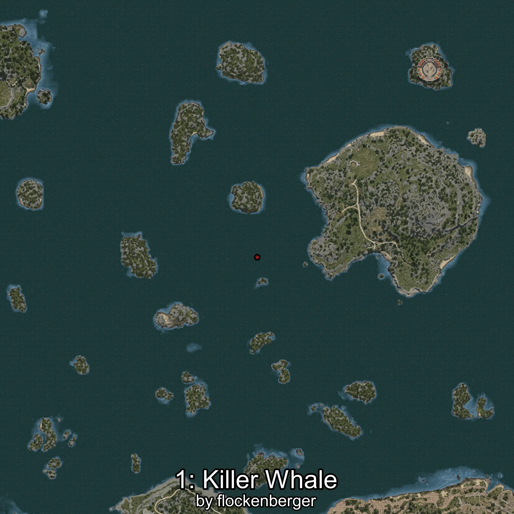
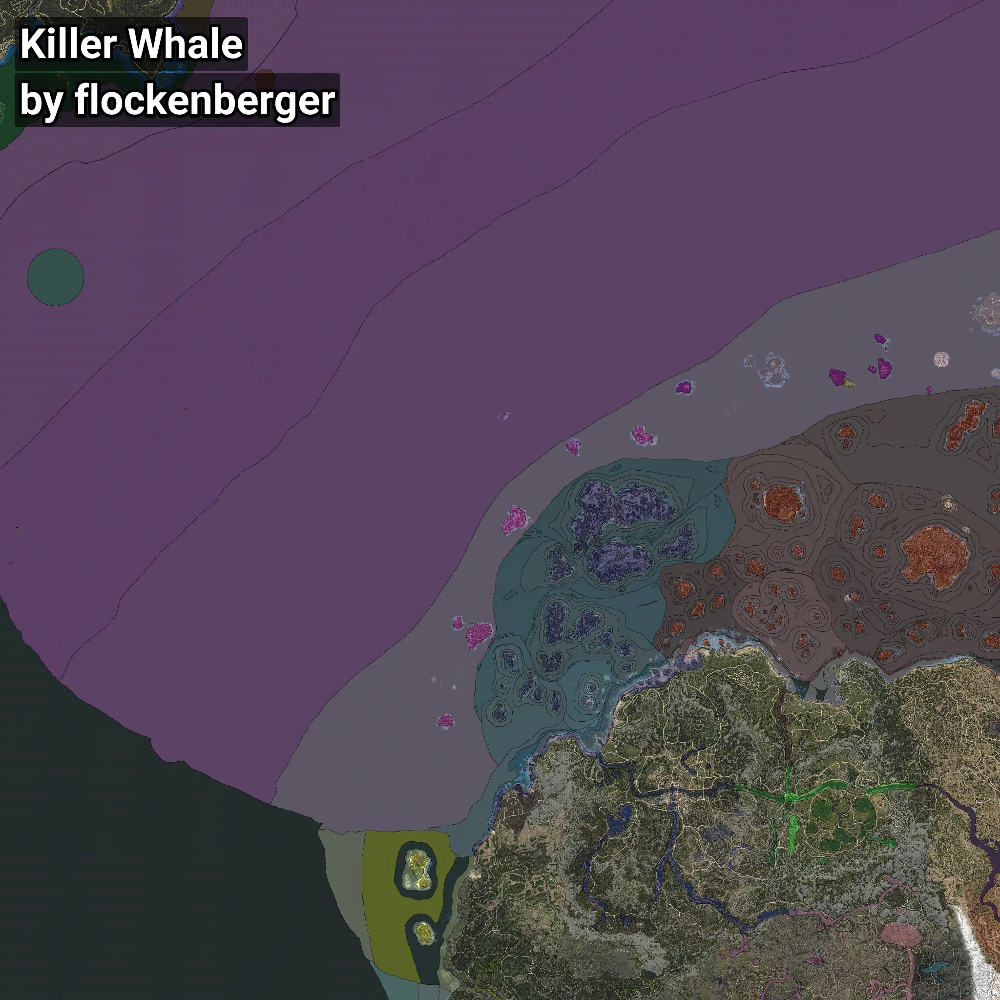

# Orca
```xml
<!--
    Puntos de pesca para: Orca
    Creado por: flockenberger
-->
<WorldmapBookMark>
    <BookMark BookMarkName="0: Orca" PosX="249213.0" PosY="-7898.0" PosZ="265144.0" />
    <BookMark BookMarkName="1: Orca" PosX="217596.0" PosY="-7691.0" PosZ="270237.0" />
    <BookMark BookMarkName="2: Orca" PosX="-1295324.0" PosY="-8169.0" PosZ="364750.0" />
    <BookMark BookMarkName="3: Orca" PosX="-1305415.0" PosY="-7830.0" PosZ="309533.0" />
    <BookMark BookMarkName="4: Orca" PosX="-1026464.0" PosY="-7995.0" PosZ="554332.0" />
</WorldmapBookMark>
```

## ⚠️ Advertencia:
Los puntos de pesca se generan según la __**posición de tu personaje**__ — __no__ donde cae el flotador.  
En el océano especialmente, la dirección en la que lances la caña puede colocar tu flotador en una **zona de pesca diferente**, lo que puede resultar en capturar el pez incorrecto.  
Presta atención a las vistas previas que muestran la ubicación en relación a las zonas marcadas.

- Para verificar la posición de tu flotador puedes usar la guía [AQUÍ](https://flockenberger.github.io/bdo-fish-position/)
- O ver la guía [AQUÍ](https://youtu.be/t-VXcRoNojk)

## Vistas Previas
      