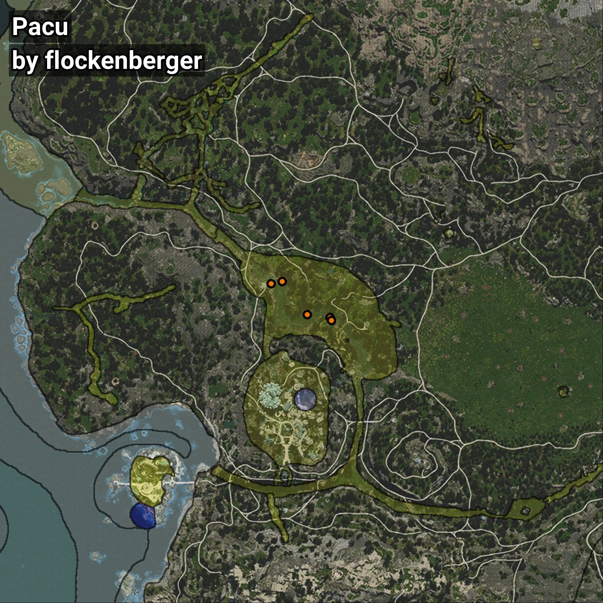

# Pacu
```xml
<!--
    Puntos de pesca para: Pacu
    Creado por: flockenberger
-->
<WorldmapBookMark>
    <BookMark BookMarkName="0: Pacu" PosX="-511579.0" PosY="-4911.0" PosZ="-399218.0" />
    <BookMark BookMarkName="1: Pacu" PosX="-507003.0" PosY="-4894.0" PosZ="-398235.0" />
    <BookMark BookMarkName="2: Pacu" PosX="-487525.0" PosY="-4777.0" PosZ="-413067.0" />
    <BookMark BookMarkName="3: Pacu" PosX="-486790.0" PosY="-4733.0" PosZ="-414298.0" />
    <BookMark BookMarkName="4: Pacu" PosX="-496879.0" PosY="-4824.0" PosZ="-411865.0" />
</WorldmapBookMark>
```

## ⚠️ Advertencia:
Los puntos de pesca se generan según la __**posición de tu personaje**__ — __no__ donde cae el flotador.  
En el océano especialmente, la dirección en la que lances la caña puede colocar tu flotador en una **zona de pesca diferente**, lo que puede resultar en capturar el pez incorrecto.  
Presta atención a las vistas previas que muestran la ubicación en relación a las zonas marcadas.

- Para verificar la posición de tu flotador puedes usar la guía [AQUÍ](https://flockenberger.github.io/bdo-fish-position/)
- O ver la guía [AQUÍ](https://youtu.be/t-VXcRoNojk)

## Vistas Previas
      