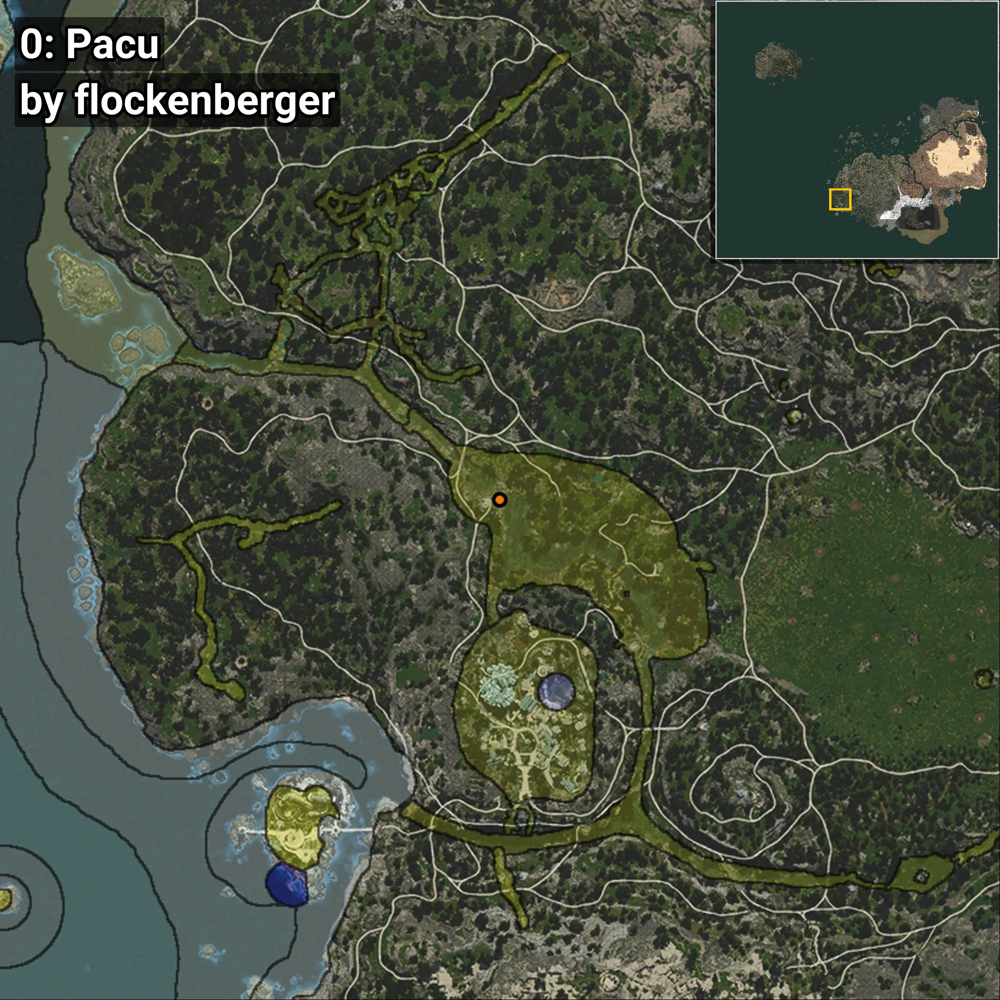

# Pacu
Creado por **flockenberger**

## ⚠️ Advertencia:
Los puntos de pesca se generan según la __**posición de tu personaje**__ — __no__ donde cae el flotador.  
En el océano especialmente, la dirección en la que lances la caña puede colocar tu flotador en una **zona de pesca diferente**, lo que puede resultar en capturar el pez incorrecto.  
Esto solo ocurre en raros casos — cuando la posición está justo en el **borde de una zona** y lanzas hacia el lado “equivocado”.

- Para verificar la posición puedes usar la guía [AQUÍ](https://flockenberger.github.io/bdo-fish-position/)
- O ver la guía [AQUÍ](https://youtu.be/t-VXcRoNojk)

## Waypoints
```xml
<!--
    Puntos de pesca para: Pacu
    Creado por: flockenberger
-->
<WorldmapBookMark>
    <BookMark BookMarkName="0: Pacu" PosX="-486790.0" PosY="-4733.0" PosZ="-414298.0" />
    <BookMark BookMarkName="1: Pacu" PosX="-485946.0" PosY="-4832.0" PosZ="-410846.0" />
    <BookMark BookMarkName="2: Pacu" PosX="-506311.0" PosY="5880.0" PosZ="-473695.0" />
    <BookMark BookMarkName="3: Pacu" PosX="-485642.0" PosY="-4757.0" PosZ="-410926.0" />
    <BookMark BookMarkName="4: Pacu" PosX="-485403.97" PosY="-4832.531" PosZ="-410605.56" />
</WorldmapBookMark>
```

     