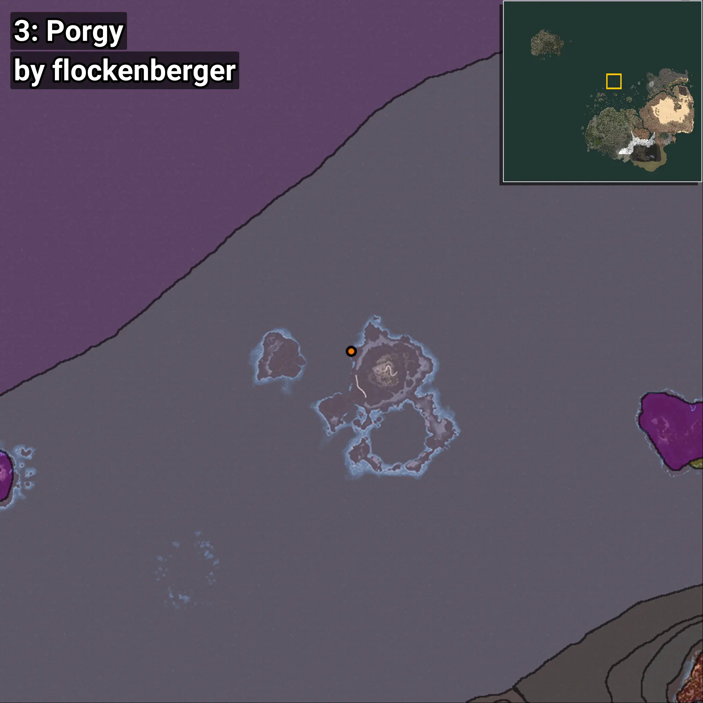
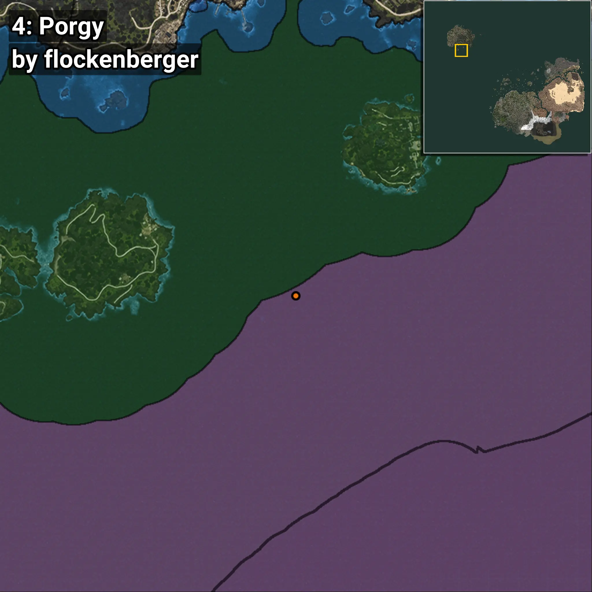

# Pargo
```xml
<!--
    Puntos de pesca para: Pargo
    Creado por: flockenberger
-->
<WorldmapBookMark>
    <BookMark BookMarkName="0: Pargo" PosX="-106109.0" PosY="-8133.0" PosZ="631999.0" />
    <BookMark BookMarkName="1: Pargo" PosX="-106059.0" PosY="-8128.0" PosZ="632063.0" />
    <BookMark BookMarkName="2: Pargo" PosX="-419542.0" PosY="-7923.0" PosZ="121650.0" />
    <BookMark BookMarkName="3: Pargo" PosX="-106292.0" PosY="-8224.0" PosZ="632234.0" />
    <BookMark BookMarkName="4: Pargo" PosX="-1264033.6" PosY="-8063.63" PosZ="1008967.0" />
</WorldmapBookMark>
```

## ⚠️ Advertencia:
Los puntos de pesca se generan según la __**posición de tu personaje**__ — __no__ donde cae el flotador.  
En el océano especialmente, la dirección en la que lances la caña puede colocar tu flotador en una **zona de pesca diferente**, lo que puede resultar en capturar el pez incorrecto.  
Presta atención a las vistas previas que muestran la ubicación en relación a las zonas marcadas.

- Para verificar la posición de tu flotador puedes usar la guía [AQUÍ](https://flockenberger.github.io/bdo-fish-position/)
- O ver la guía [AQUÍ](https://youtu.be/t-VXcRoNojk)

## Vistas Previas
      