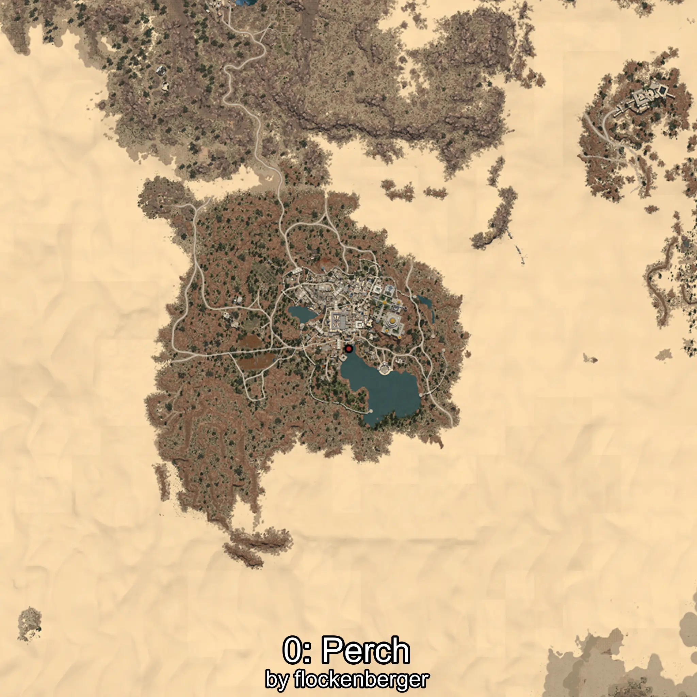
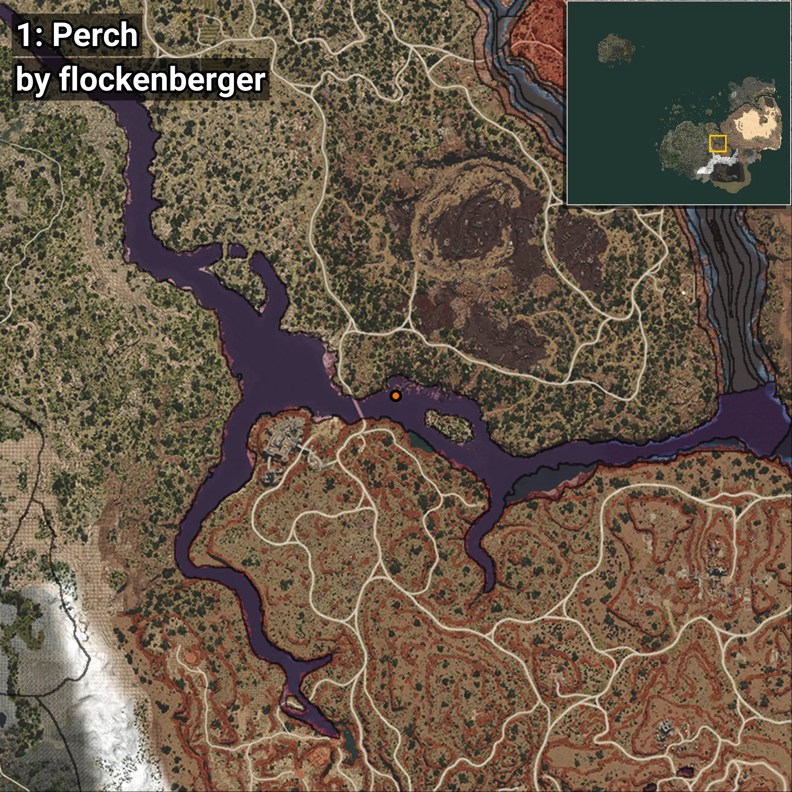
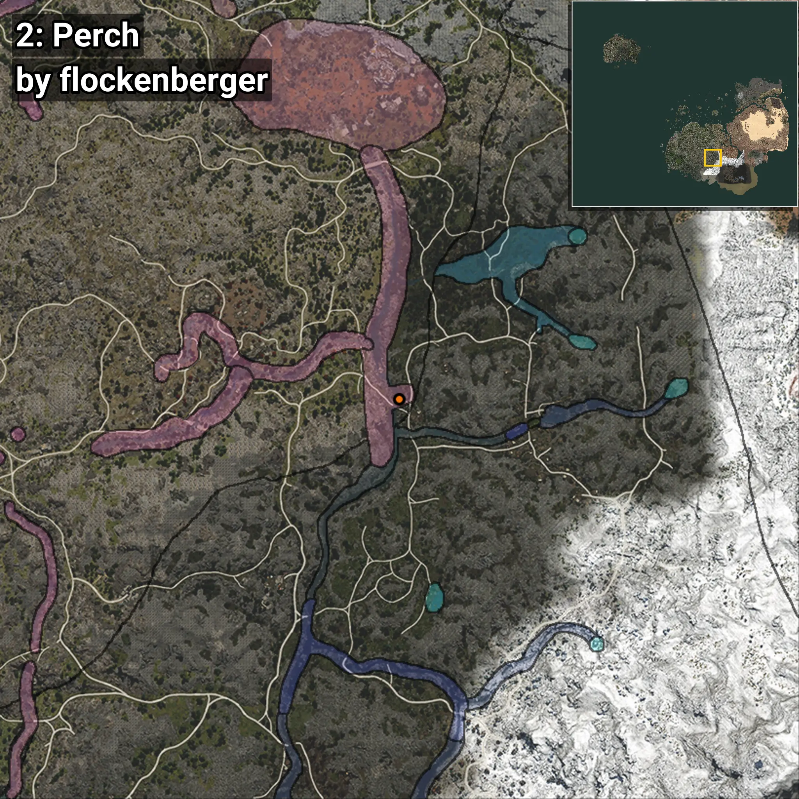

# Perca
```xml
<!--
    Puntos de pesca para: Perca
    Creado por: flockenberger
-->
<WorldmapBookMark>
    <BookMark BookMarkName="0: Perca" PosX="302777.22" PosY="-7156.569" PosZ="-176461.12" />
    <BookMark BookMarkName="1: Perca" PosX="302761.0" PosY="-7156.0" PosZ="-176436.0" />
    <BookMark BookMarkName="2: Perca" PosX="127771.0" PosY="12475.0" PosZ="-377087.0" />
    <BookMark BookMarkName="3: Perca" PosX="127645.0" PosY="12475.0" PosZ="-377084.0" />
    <BookMark BookMarkName="4: Perca" PosX="127189.0" PosY="12346.0" PosZ="-374227.0" />
</WorldmapBookMark>
```

## ⚠️ Advertencia:
Los puntos de pesca se generan según la __**posición de tu personaje**__ — __no__ donde cae el flotador.  
En el océano especialmente, la dirección en la que lances la caña puede colocar tu flotador en una **zona de pesca diferente**, lo que puede resultar en capturar el pez incorrecto.  
Presta atención a las vistas previas que muestran la ubicación en relación a las zonas marcadas.

- Para verificar la posición de tu flotador puedes usar la guía [AQUÍ](https://flockenberger.github.io/bdo-fish-position/)
- O ver la guía [AQUÍ](https://youtu.be/t-VXcRoNojk)

## Vistas Previas
      