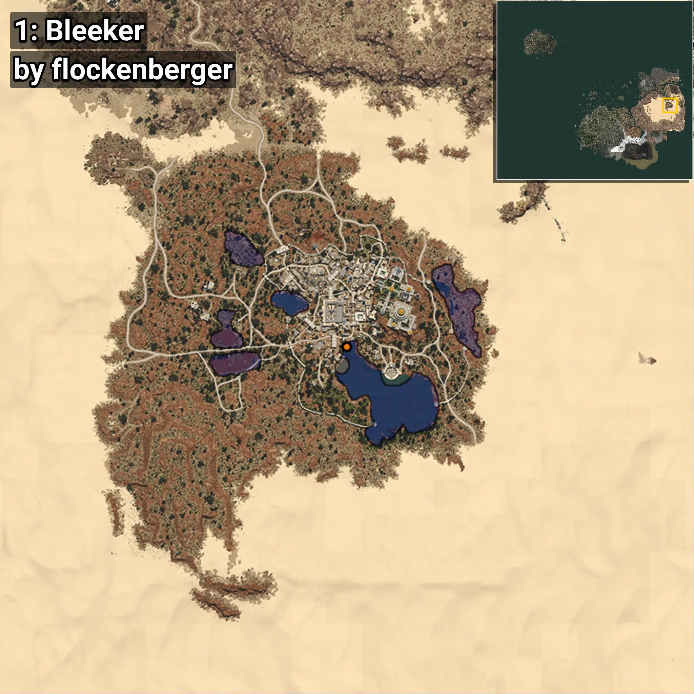
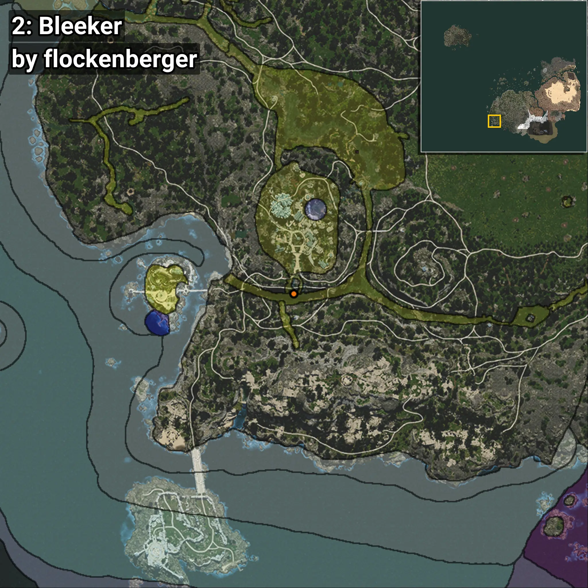
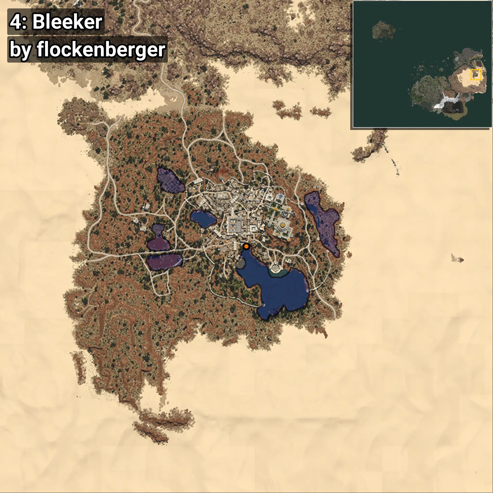

# Phoxinus
```xml
<!--
    Puntos de pesca para: Phoxinus
    Creado por: flockenberger
-->
<WorldmapBookMark>
    <BookMark BookMarkName="0: Phoxinus" PosX="1031135.0" PosY="10493.0" PosZ="187129.0" />
    <BookMark BookMarkName="1: Phoxinus" PosX="1031140.0" PosY="10500.0" PosZ="187143.0" />
    <BookMark BookMarkName="2: Phoxinus" PosX="-506714.0" PosY="-6191.0" PosZ="-481983.0" />
    <BookMark BookMarkName="3: Phoxinus" PosX="1031120.8" PosY="10480.733" PosZ="187126.6" />
    <BookMark BookMarkName="4: Phoxinus" PosX="1032299.0" PosY="10619.0" PosZ="188995.0" />
</WorldmapBookMark>
```

## ⚠️ Advertencia:
Los puntos de pesca se generan según la __**posición de tu personaje**__ — __no__ donde cae el flotador.  
En el océano especialmente, la dirección en la que lances la caña puede colocar tu flotador en una **zona de pesca diferente**, lo que puede resultar en capturar el pez incorrecto.  
Presta atención a las vistas previas que muestran la ubicación en relación a las zonas marcadas.

- Para verificar la posición de tu flotador puedes usar la guía [AQUÍ](https://flockenberger.github.io/bdo-fish-position/)
- O ver la guía [AQUÍ](https://youtu.be/t-VXcRoNojk)

## Vistas Previas
      