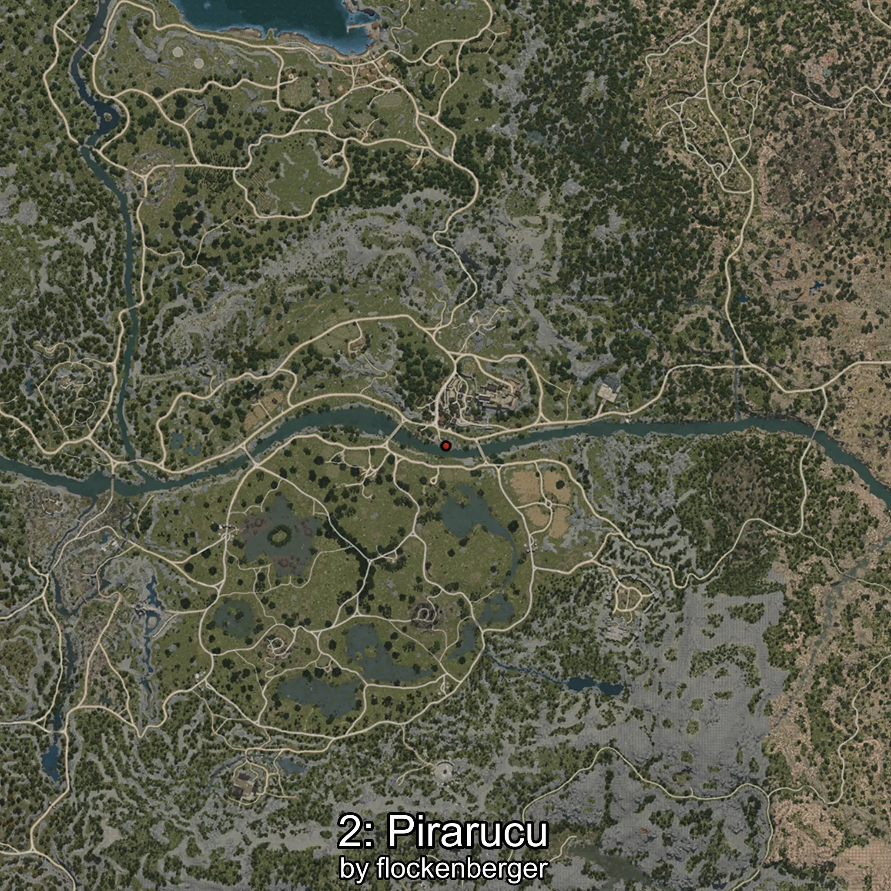
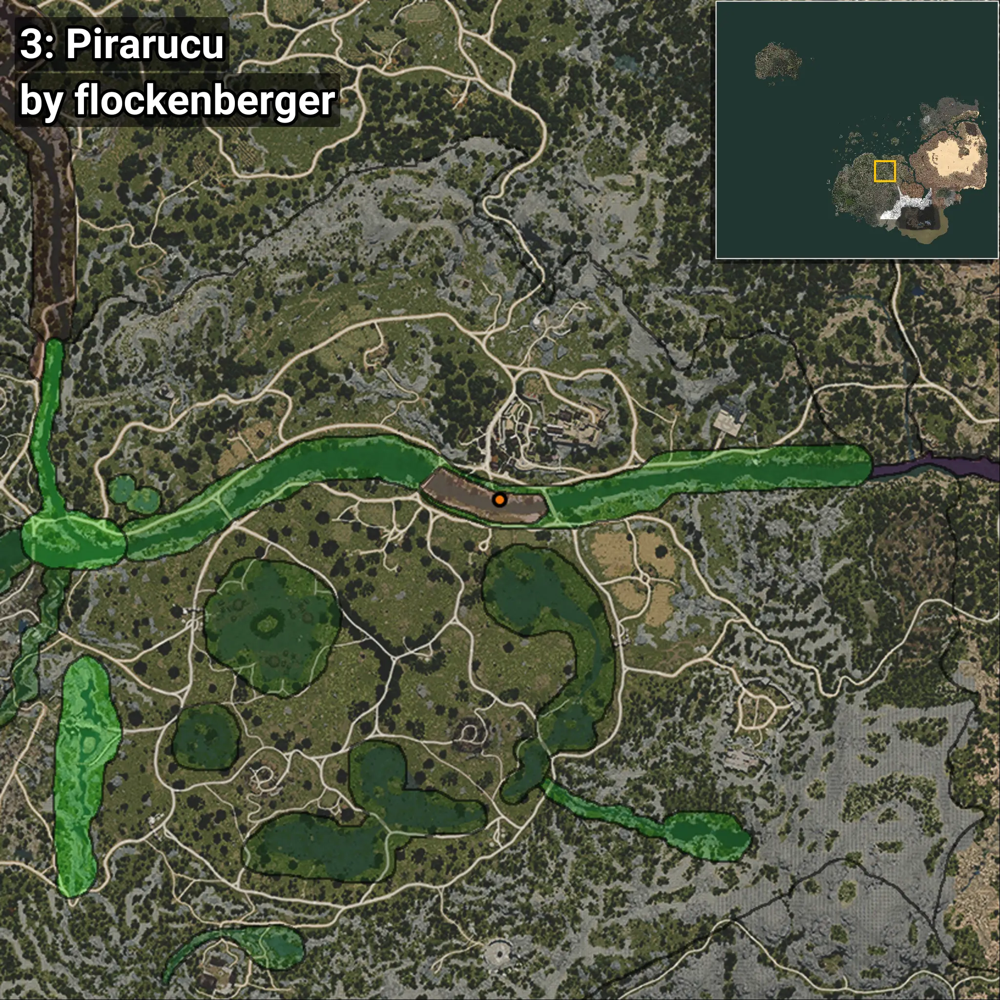

# Pirarucú
```xml
<!--
    Puntos de pesca para: Pirarucú
    Creado por: flockenberger
-->
<WorldmapBookMark>
    <BookMark BookMarkName="0: Pirarucú" PosX="40291.0" PosY="-3822.0" PosZ="-52373.0" />
    <BookMark BookMarkName="1: Pirarucú" PosX="40302.0" PosY="-3821.0" PosZ="-52382.0" />
    <BookMark BookMarkName="2: Pirarucú" PosX="38239.0" PosY="-3997.0" PosZ="-50669.0" />
    <BookMark BookMarkName="3: Pirarucú" PosX="40306.0" PosY="-3824.0" PosZ="-52356.0" />
    <BookMark BookMarkName="4: Pirarucú" PosX="38911.0" PosY="-4059.0" PosZ="-51044.0" />
</WorldmapBookMark>
```

## ⚠️ Advertencia:
Los puntos de pesca se generan según la __**posición de tu personaje**__ — __no__ donde cae el flotador.  
En el océano especialmente, la dirección en la que lances la caña puede colocar tu flotador en una **zona de pesca diferente**, lo que puede resultar en capturar el pez incorrecto.  
Presta atención a las vistas previas que muestran la ubicación en relación a las zonas marcadas.

- Para verificar la posición de tu flotador puedes usar la guía [AQUÍ](https://flockenberger.github.io/bdo-fish-position/)
- O ver la guía [AQUÍ](https://youtu.be/t-VXcRoNojk)

## Vistas Previas
      