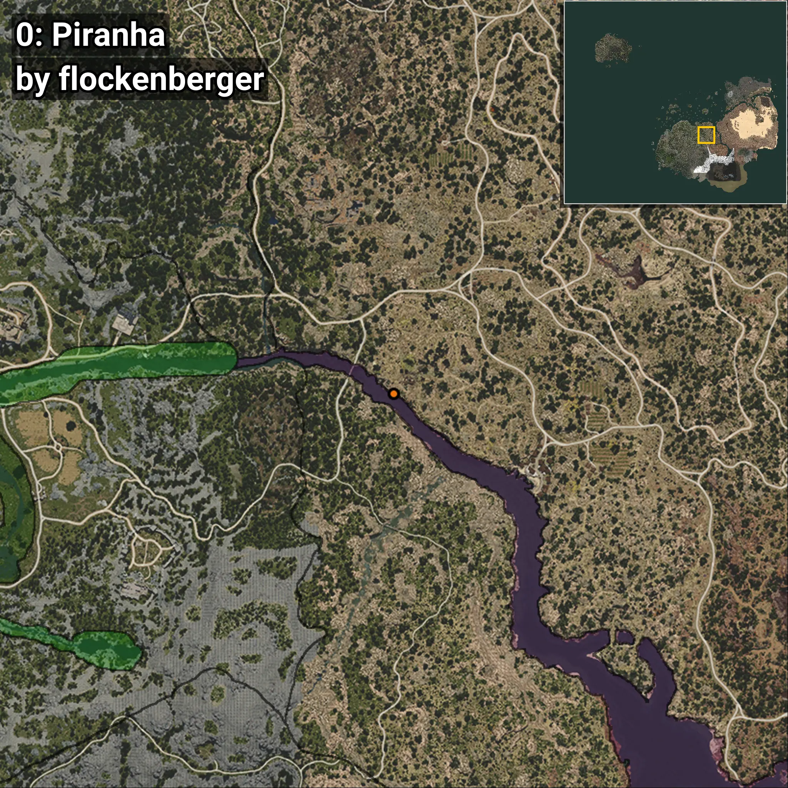
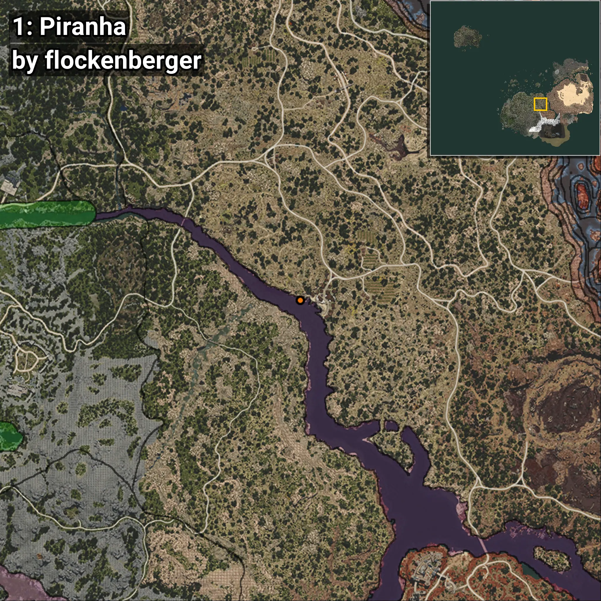

# Piraña
Creado por **flockenberger**

## ⚠️ Advertencia:
Los puntos de pesca se generan según la __**posición de tu personaje**__ — __no__ donde cae el flotador.  
En el océano especialmente, la dirección en la que lances la caña puede colocar tu flotador en una **zona de pesca diferente**, lo que puede resultar en capturar el pez incorrecto.  
Esto solo ocurre en raros casos — cuando la posición está justo en el **borde de una zona** y lanzas hacia el lado “equivocado”.

- Para verificar la posición puedes usar la guía [AQUÍ](https://flockenberger.github.io/bdo-fish-position/)
- O ver la guía [AQUÍ](https://youtu.be/t-VXcRoNojk)

## Waypoints
```xml
<!--
    Puntos de pesca para: Piraña
    Creado por: flockenberger
-->
<WorldmapBookMark>
    <BookMark BookMarkName="0: Piraña" PosX="222612.0" PosY="-5258.0" PosZ="-84827.0" />
    <BookMark BookMarkName="1: Piraña" PosX="219546.0" PosY="-5430.0" PosZ="-130440.0" />
    <BookMark BookMarkName="2: Piraña" PosX="302741.0" PosY="-7217.0" PosZ="-177460.0" />
    <BookMark BookMarkName="3: Piraña" PosX="219392.0" PosY="-5161.0" PosZ="-81295.0" />
    <BookMark BookMarkName="4: Piraña" PosX="219257.0" PosY="-5161.0" PosZ="-81270.0" />
</WorldmapBookMark>
```

     