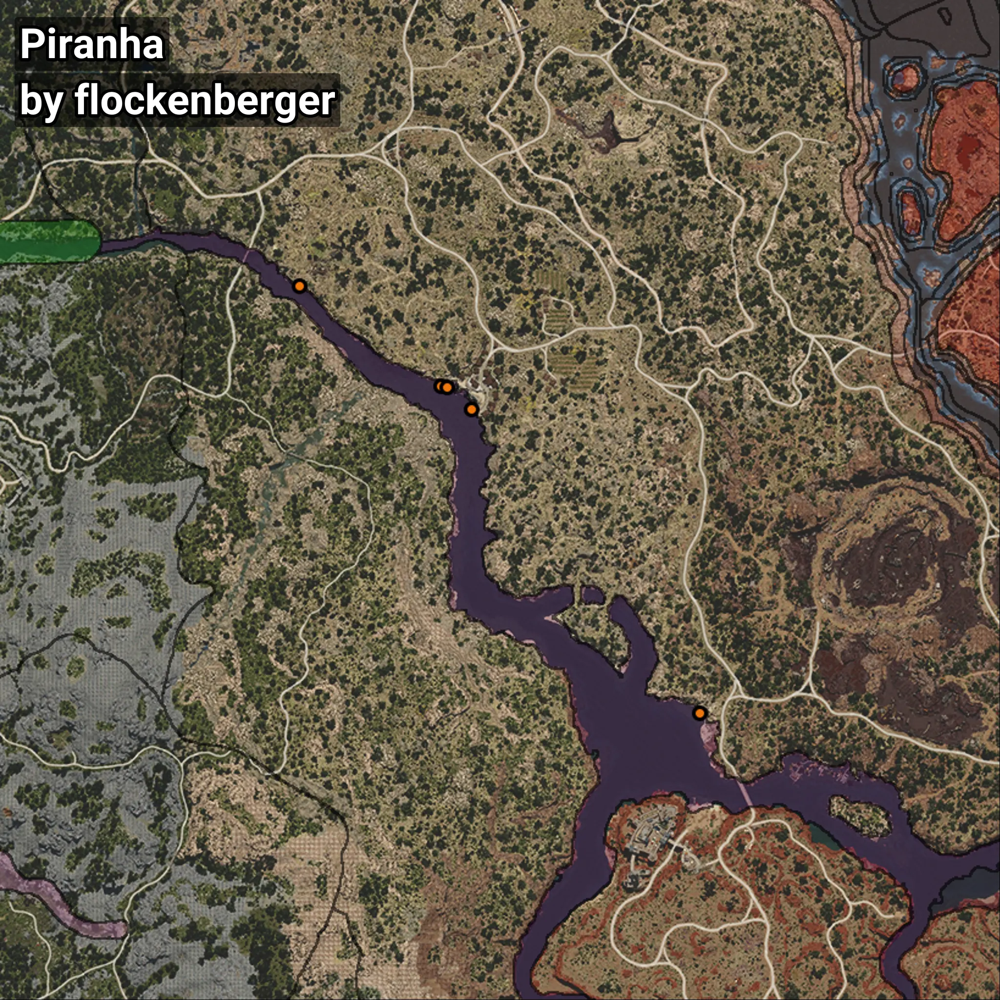

# Piraña
```xml
<!--
    Puntos de pesca para: Piraña
    Creado por: flockenberger
-->
<WorldmapBookMark>
    <BookMark BookMarkName="0: Piraña" PosX="181183.0" PosY="-4541.0" PosZ="-54908.0" />
    <BookMark BookMarkName="1: Piraña" PosX="216155.0" PosY="-5079.0" PosZ="-79712.0" />
    <BookMark BookMarkName="2: Piraña" PosX="279919.0" PosY="-7271.0" PosZ="-160480.0" />
    <BookMark BookMarkName="3: Piraña" PosX="217475.0" PosY="-5093.0" PosZ="-79954.0" />
    <BookMark BookMarkName="4: Piraña" PosX="223623.27" PosY="-5090.926" PosZ="-85495.266" />
</WorldmapBookMark>
```

## ⚠️ Advertencia:
Los puntos de pesca se generan según la __**posición de tu personaje**__ — __no__ donde cae el flotador.  
En el océano especialmente, la dirección en la que lances la caña puede colocar tu flotador en una **zona de pesca diferente**, lo que puede resultar en capturar el pez incorrecto.  
Presta atención a las vistas previas que muestran la ubicación en relación a las zonas marcadas.

- Para verificar la posición de tu flotador puedes usar la guía [AQUÍ](https://flockenberger.github.io/bdo-fish-position/)
- O ver la guía [AQUÍ](https://youtu.be/t-VXcRoNojk)

## Vistas Previas
      