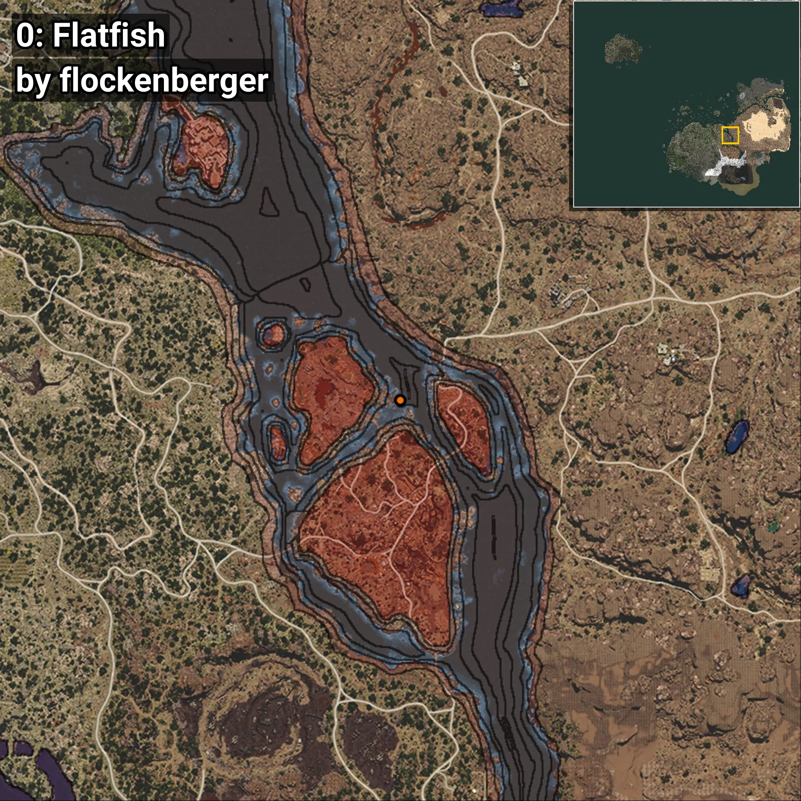

# Platija
```xml
<!--
    Puntos de pesca para: Platija
    Creado por: flockenberger
-->
<WorldmapBookMark>
    <BookMark BookMarkName="0: Platija" PosX="369728.0" PosY="-8205.0" PosZ="-23864.0" />
    <BookMark BookMarkName="1: Platija" PosX="369776.72" PosY="-8211.535" PosZ="-23856.268" />
    <BookMark BookMarkName="2: Platija" PosX="369798.0" PosY="-8206.0" PosZ="-23955.0" />
    <BookMark BookMarkName="3: Platija" PosX="369775.44" PosY="-8208.921" PosZ="-23891.365" />
    <BookMark BookMarkName="4: Platija" PosX="369873.0" PosY="-8231.0" PosZ="-23862.0" />
</WorldmapBookMark>
```

## ⚠️ Advertencia:
Los puntos de pesca se generan según la __**posición de tu personaje**__ — __no__ donde cae el flotador.  
En el océano especialmente, la dirección en la que lances la caña puede colocar tu flotador en una **zona de pesca diferente**, lo que puede resultar en capturar el pez incorrecto.  
Presta atención a las vistas previas que muestran la ubicación en relación a las zonas marcadas.

- Para verificar la posición de tu flotador puedes usar la guía [AQUÍ](https://flockenberger.github.io/bdo-fish-position/)
- O ver la guía [AQUÍ](https://youtu.be/t-VXcRoNojk)

## Vistas Previas
      