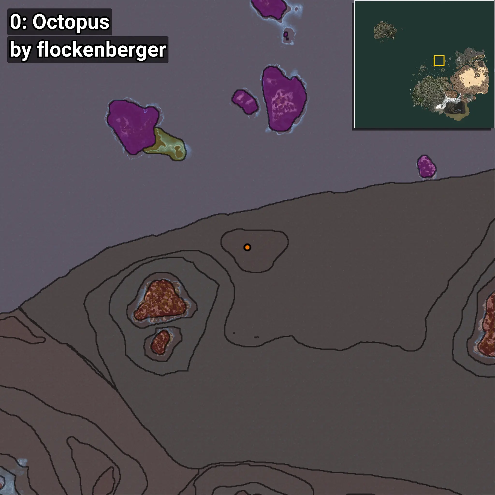
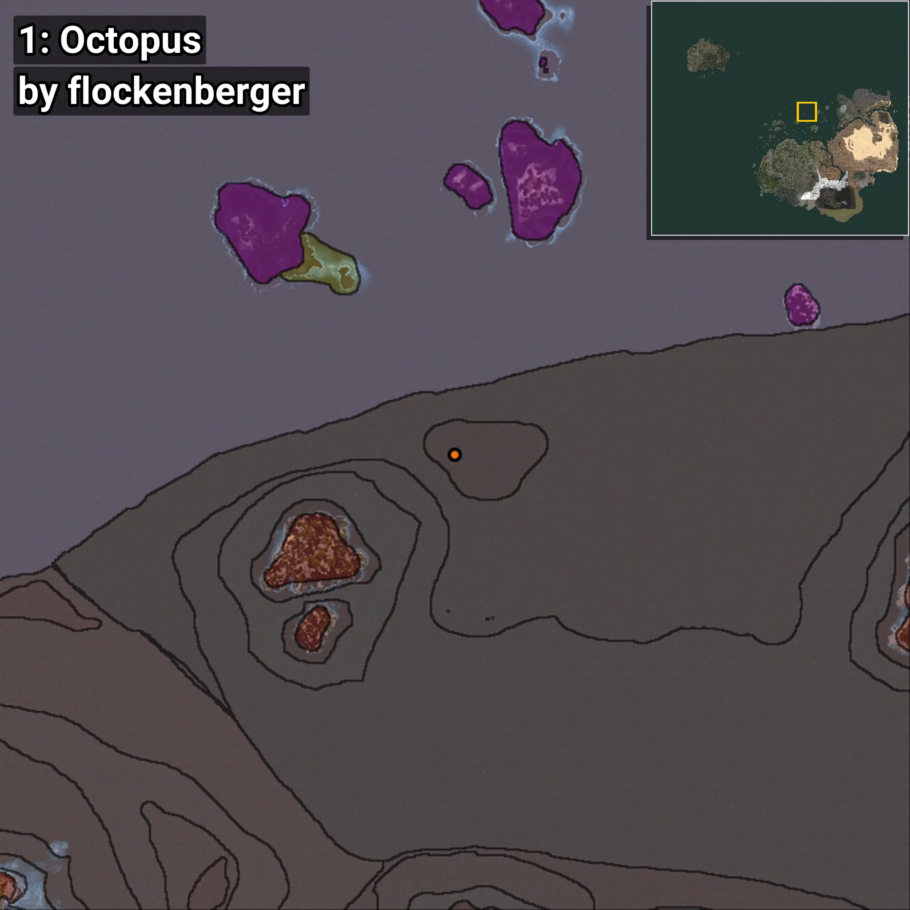
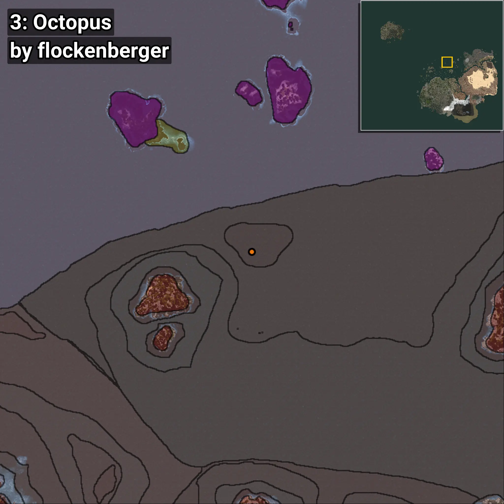

# Pulpo
```xml
<!--
    Puntos de pesca para: Pulpo
    Creado por: flockenberger
-->
<WorldmapBookMark>
    <BookMark BookMarkName="0: Pulpo" PosX="64539.0" PosY="-7555.0" PosZ="544443.0" />
    <BookMark BookMarkName="1: Pulpo" PosX="59639.0" PosY="-7769.0" PosZ="544116.0" />
    <BookMark BookMarkName="2: Pulpo" PosX="61824.0" PosY="-7754.0" PosZ="540171.0" />
    <BookMark BookMarkName="3: Pulpo" PosX="64974.0" PosY="-7571.0" PosZ="539352.0" />
    <BookMark BookMarkName="4: Pulpo" PosX="106847.92" PosY="-7869.811" PosZ="548035.2" />
</WorldmapBookMark>
```

## ⚠️ Advertencia:
Los puntos de pesca se generan según la __**posición de tu personaje**__ — __no__ donde cae el flotador.  
En el océano especialmente, la dirección en la que lances la caña puede colocar tu flotador en una **zona de pesca diferente**, lo que puede resultar en capturar el pez incorrecto.  
Presta atención a las vistas previas que muestran la ubicación en relación a las zonas marcadas.

- Para verificar la posición de tu flotador puedes usar la guía [AQUÍ](https://flockenberger.github.io/bdo-fish-position/)
- O ver la guía [AQUÍ](https://youtu.be/t-VXcRoNojk)

## Vistas Previas
      