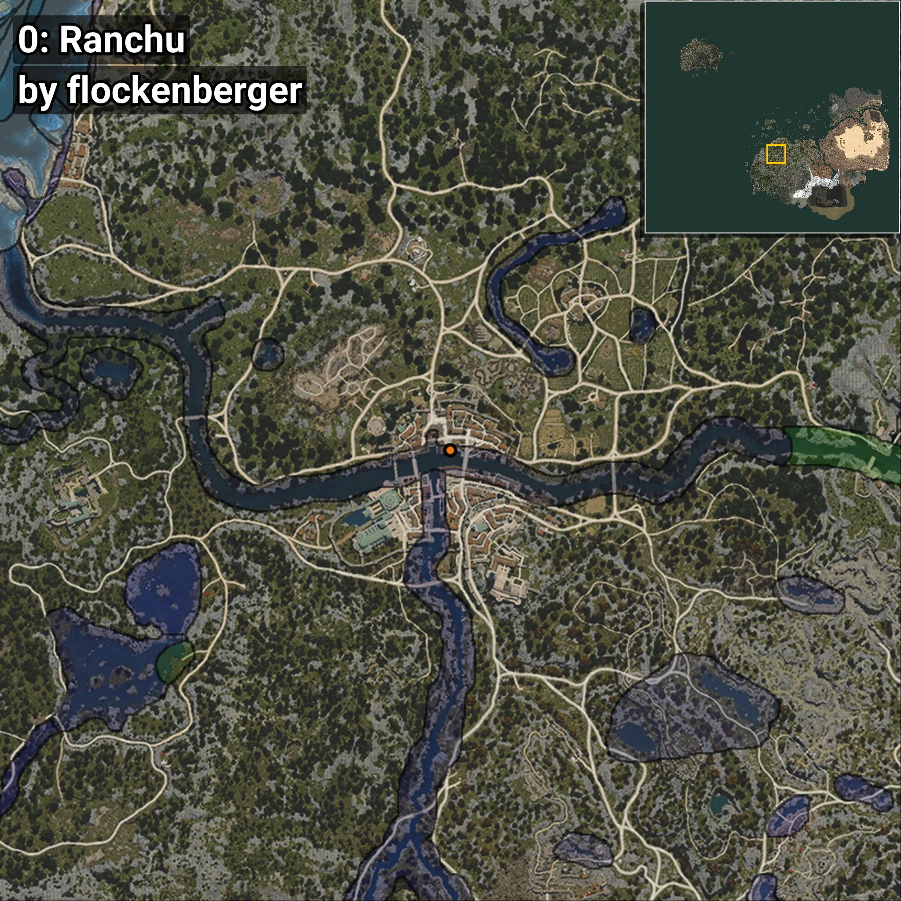
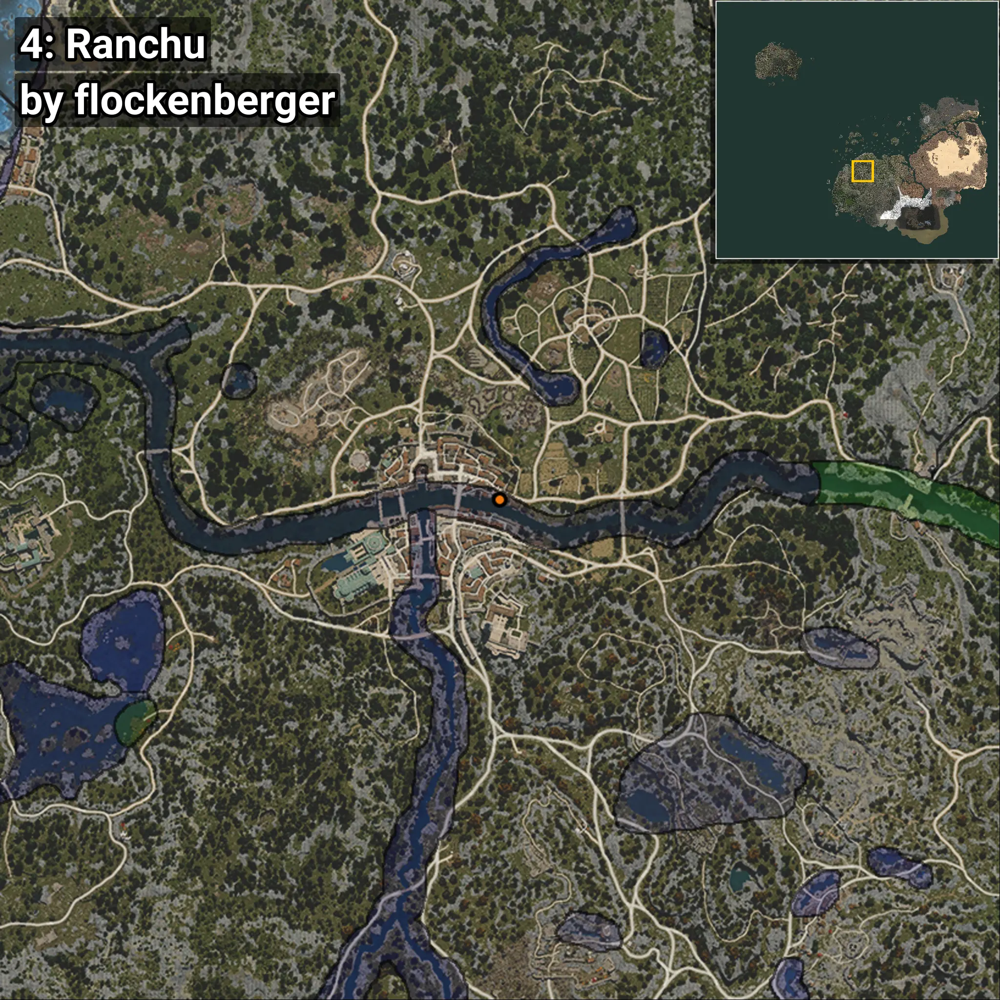

# Ranchu
Creado por **flockenberger**

## ⚠️ Advertencia:
Los puntos de pesca se generan según la __**posición de tu personaje**__ — __no__ donde cae el flotador.  
En el océano especialmente, la dirección en la que lances la caña puede colocar tu flotador en una **zona de pesca diferente**, lo que puede resultar en capturar el pez incorrecto.  
Esto solo ocurre en raros casos — cuando la posición está justo en el **borde de una zona** y lanzas hacia el lado “equivocado”.

- Para verificar la posición puedes usar la guía [AQUÍ](https://flockenberger.github.io/bdo-fish-position/)
- O ver la guía [AQUÍ](https://youtu.be/t-VXcRoNojk)

## Waypoints
```xml
<!--
    Puntos de pesca para: Ranchu
    Creado por: flockenberger
-->
<WorldmapBookMark>
    <BookMark BookMarkName="0: Ranchu" PosX="-332479.0" PosY="-1787.0" PosZ="-100192.0" />
    <BookMark BookMarkName="1: Ranchu" PosX="-244077.0" PosY="-4069.0" PosZ="-48820.0" />
    <BookMark BookMarkName="2: Ranchu" PosX="-74153.0" PosY="-4383.0" PosZ="38977.0" />
    <BookMark BookMarkName="3: Ranchu" PosX="-247364.0" PosY="-3940.0" PosZ="-48512.0" />
    <BookMark BookMarkName="4: Ranchu" PosX="-249698.0" PosY="-3939.0" PosZ="-46982.0" />
</WorldmapBookMark>
```

     