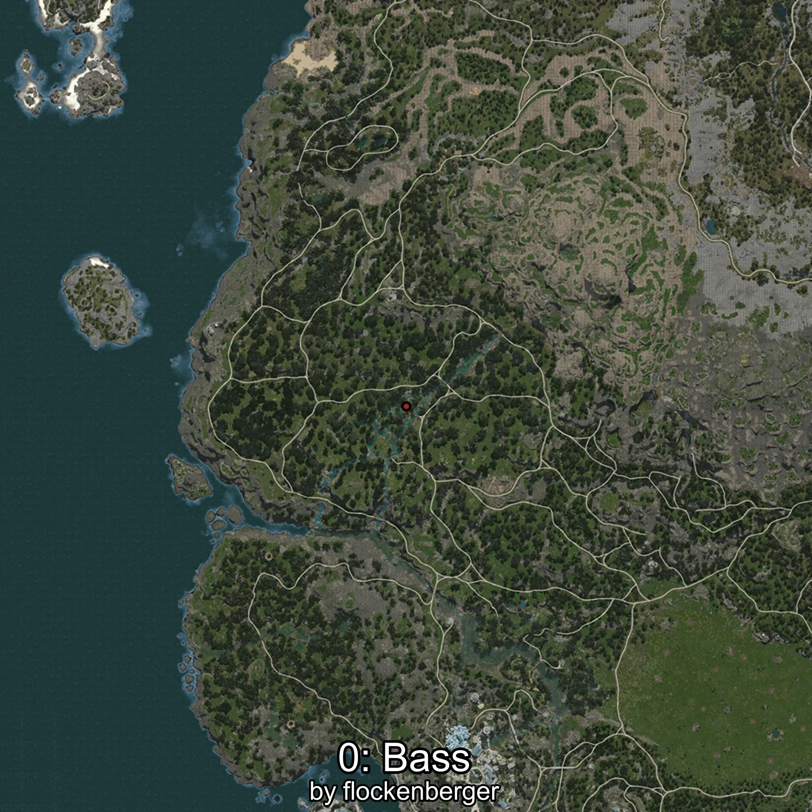
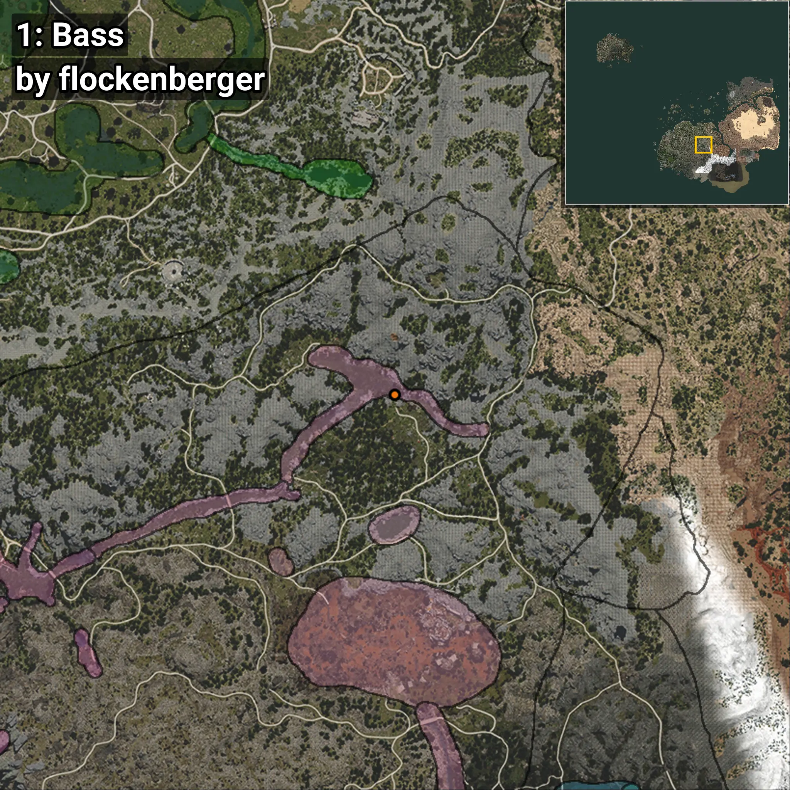

# Robalo
```xml
<!--
    Puntos de pesca para: Robalo
    Creado por: flockenberger
-->
<WorldmapBookMark>
    <BookMark BookMarkName="0: Robalo" PosX="109174.0" PosY="10237.0" PosZ="-202711.0" />
    <BookMark BookMarkName="1: Robalo" PosX="109145.0" PosY="10233.0" PosZ="-202751.0" />
    <BookMark BookMarkName="2: Robalo" PosX="127565.0" PosY="12475.0" PosZ="-377266.0" />
    <BookMark BookMarkName="3: Robalo" PosX="127630.31" PosY="12475.668" PosZ="-377229.84" />
    <BookMark BookMarkName="4: Robalo" PosX="127609.0" PosY="12475.0" PosZ="-377193.0" />
</WorldmapBookMark>
```

## ⚠️ Advertencia:
Los puntos de pesca se generan según la __**posición de tu personaje**__ — __no__ donde cae el flotador.  
En el océano especialmente, la dirección en la que lances la caña puede colocar tu flotador en una **zona de pesca diferente**, lo que puede resultar en capturar el pez incorrecto.  
Presta atención a las vistas previas que muestran la ubicación en relación a las zonas marcadas.

- Para verificar la posición de tu flotador puedes usar la guía [AQUÍ](https://flockenberger.github.io/bdo-fish-position/)
- O ver la guía [AQUÍ](https://youtu.be/t-VXcRoNojk)

## Vistas Previas
      