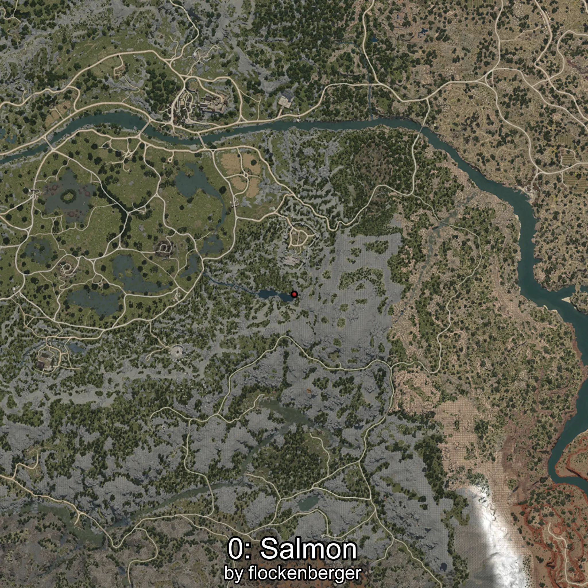
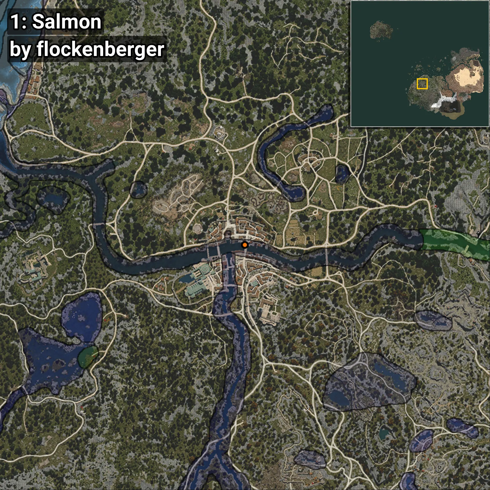
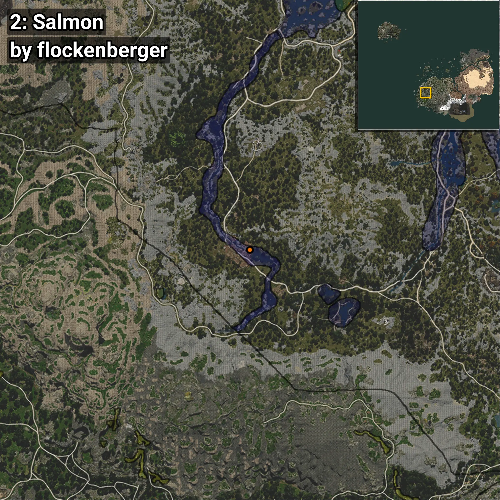

# Salmón
```xml
<!--
    Puntos de pesca para: Salmón
    Creado por: flockenberger
-->
<WorldmapBookMark>
    <BookMark BookMarkName="0: Salmón" PosX="-246071.8" PosY="-3814.816" PosZ="-48676.1" />
    <BookMark BookMarkName="1: Salmón" PosX="-246095.0" PosY="-3814.0" PosZ="-48668.0" />
    <BookMark BookMarkName="2: Salmón" PosX="-372321.03" PosY="11000.338" PosZ="-228620.14" />
    <BookMark BookMarkName="3: Salmón" PosX="-246109.77" PosY="-3814.7612" PosZ="-48657.8" />
    <BookMark BookMarkName="4: Salmón" PosX="-249851.7" PosY="-4059.836" PosZ="-47171.22" />
</WorldmapBookMark>
```

## ⚠️ Advertencia:
Los puntos de pesca se generan según la __**posición de tu personaje**__ — __no__ donde cae el flotador.  
En el océano especialmente, la dirección en la que lances la caña puede colocar tu flotador en una **zona de pesca diferente**, lo que puede resultar en capturar el pez incorrecto.  
Presta atención a las vistas previas que muestran la ubicación en relación a las zonas marcadas.

- Para verificar la posición de tu flotador puedes usar la guía [AQUÍ](https://flockenberger.github.io/bdo-fish-position/)
- O ver la guía [AQUÍ](https://youtu.be/t-VXcRoNojk)

## Vistas Previas
      