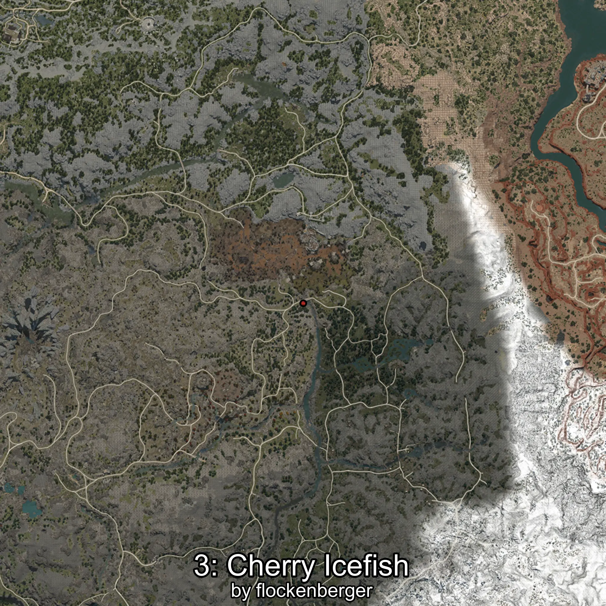
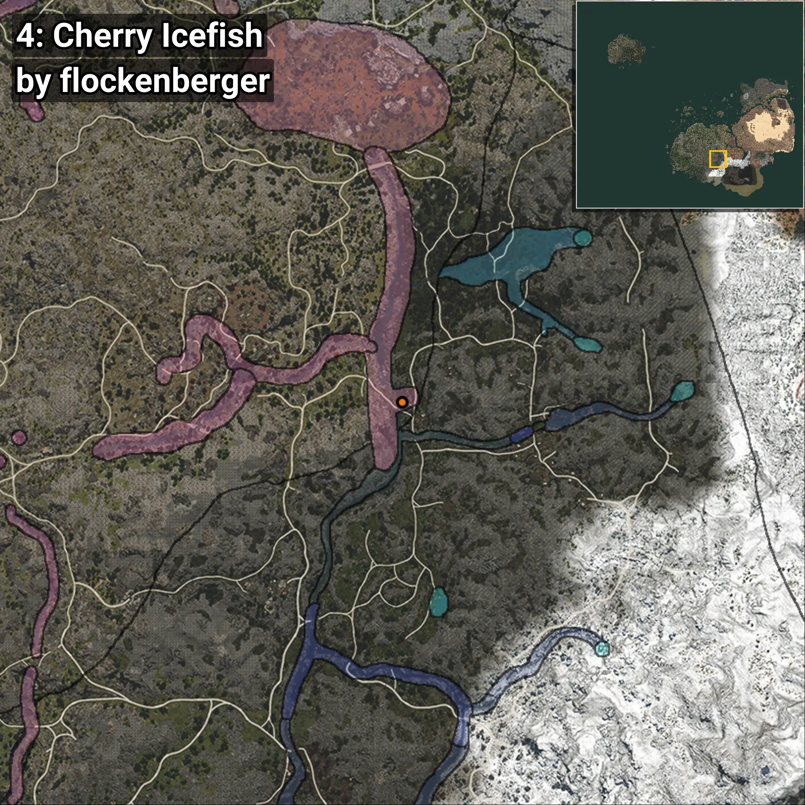

# Salángido
```xml
<!--
    Puntos de pesca para: Salángido
    Creado por: flockenberger
-->
<WorldmapBookMark>
    <BookMark BookMarkName="0: Salángido" PosX="127628.73" PosY="12475.667" PosZ="-377232.4" />
    <BookMark BookMarkName="1: Salángido" PosX="127612.0" PosY="12475.0" PosZ="-377230.0" />
    <BookMark BookMarkName="2: Salángido" PosX="108104.945" PosY="6173.3877" PosZ="-240651.86" />
    <BookMark BookMarkName="3: Salángido" PosX="127609.0" PosY="12475.0" PosZ="-377250.0" />
    <BookMark BookMarkName="4: Salángido" PosX="127586.52" PosY="12475.675" PosZ="-377123.72" />
</WorldmapBookMark>
```

## ⚠️ Advertencia:
Los puntos de pesca se generan según la __**posición de tu personaje**__ — __no__ donde cae el flotador.  
En el océano especialmente, la dirección en la que lances la caña puede colocar tu flotador en una **zona de pesca diferente**, lo que puede resultar en capturar el pez incorrecto.  
Presta atención a las vistas previas que muestran la ubicación en relación a las zonas marcadas.

- Para verificar la posición de tu flotador puedes usar la guía [AQUÍ](https://flockenberger.github.io/bdo-fish-position/)
- O ver la guía [AQUÍ](https://youtu.be/t-VXcRoNojk)

## Vistas Previas
      