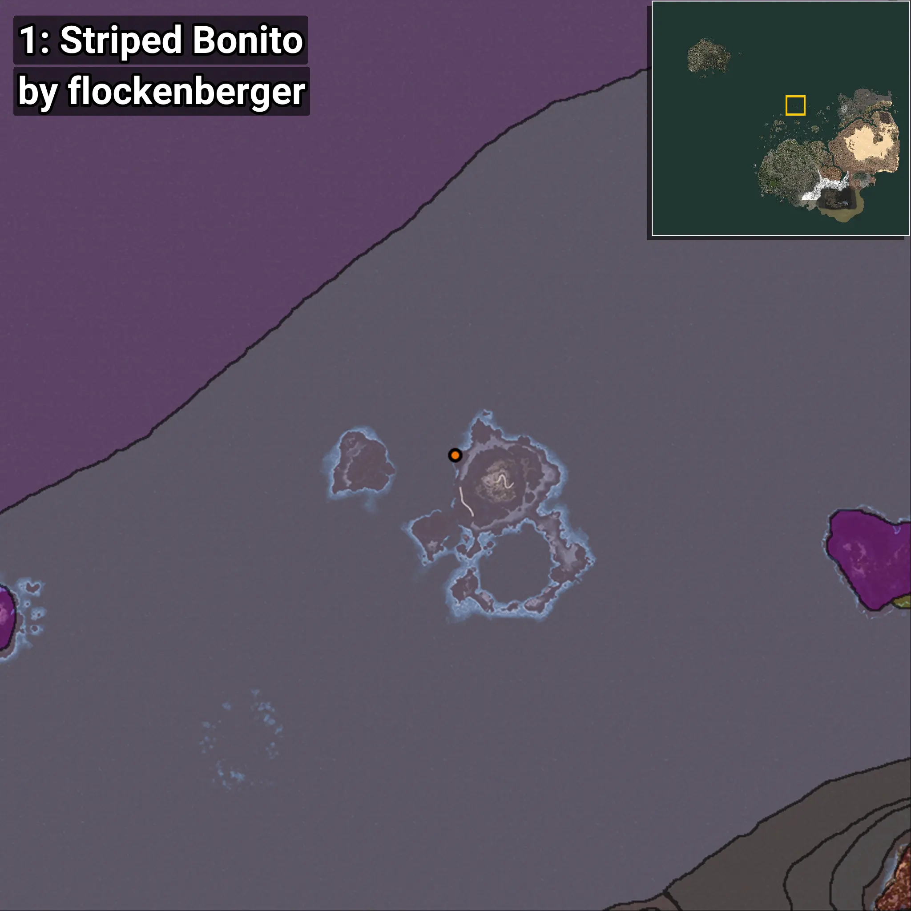
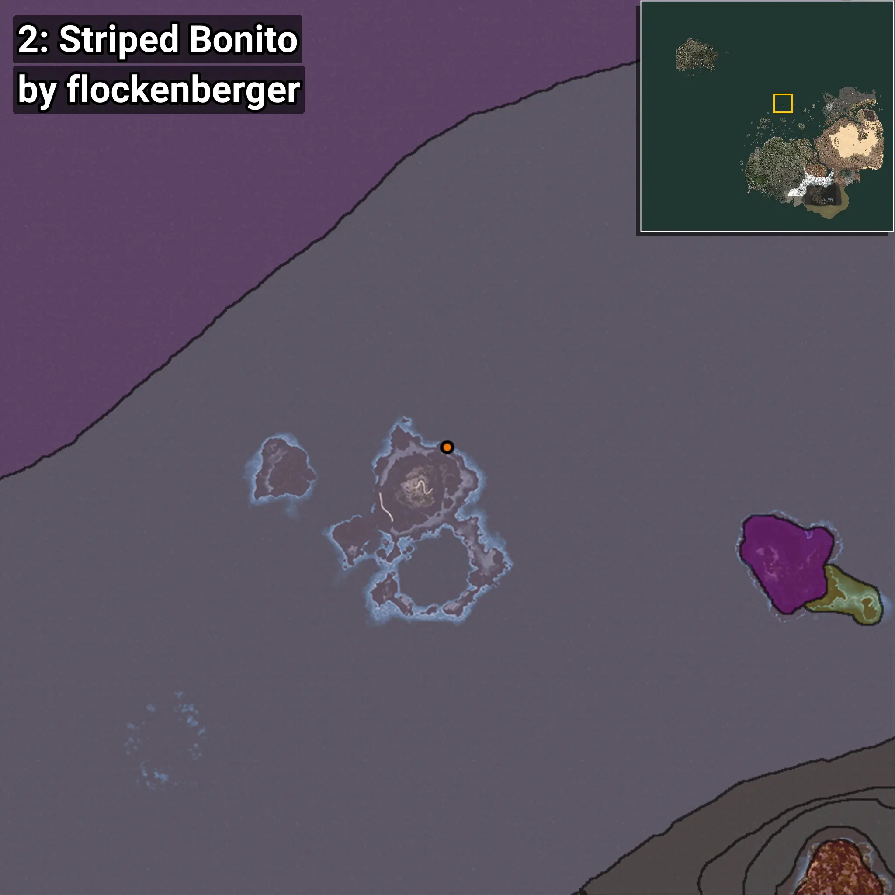

# Sarda
```xml
<!--
    Puntos de pesca para: Sarda
    Creado por: flockenberger
-->
<WorldmapBookMark>
    <BookMark BookMarkName="0: Sarda" PosX="-106053.0" PosY="-8122.0" PosZ="632053.0" />
    <BookMark BookMarkName="1: Sarda" PosX="-105888.16" PosY="-7941.4077" PosZ="632504.94" />
    <BookMark BookMarkName="2: Sarda" PosX="-85955.0" PosY="-8221.0" PosZ="636676.0" />
    <BookMark BookMarkName="3: Sarda" PosX="-105813.98" PosY="-7922.4883" PosZ="632659.5" />
    <BookMark BookMarkName="4: Sarda" PosX="-106756.25" PosY="-7959.41" PosZ="626201.44" />
</WorldmapBookMark>
```

## ⚠️ Advertencia:
Los puntos de pesca se generan según la __**posición de tu personaje**__ — __no__ donde cae el flotador.  
En el océano especialmente, la dirección en la que lances la caña puede colocar tu flotador en una **zona de pesca diferente**, lo que puede resultar en capturar el pez incorrecto.  
Presta atención a las vistas previas que muestran la ubicación en relación a las zonas marcadas.

- Para verificar la posición de tu flotador puedes usar la guía [AQUÍ](https://flockenberger.github.io/bdo-fish-position/)
- O ver la guía [AQUÍ](https://youtu.be/t-VXcRoNojk)

## Vistas Previas
      