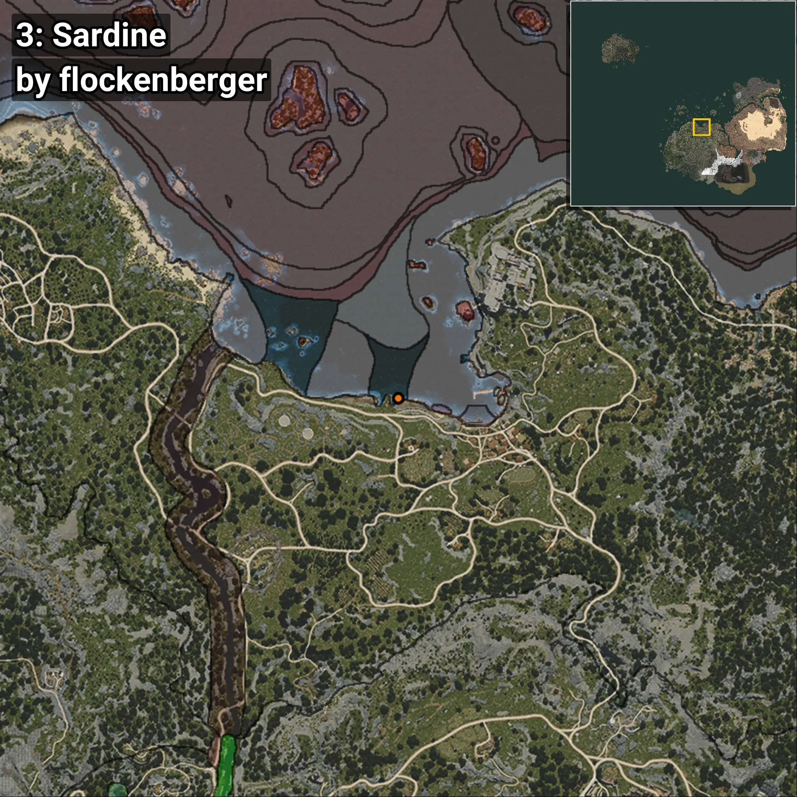
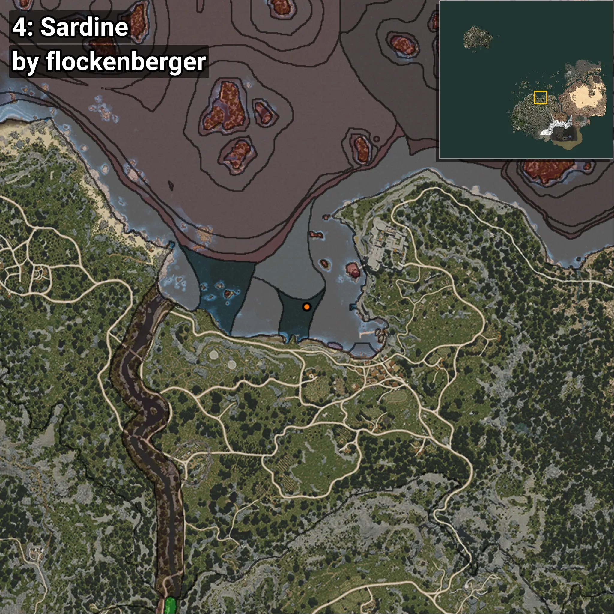

# Sardina
```xml
<!--
    Puntos de pesca para: Sardina
    Creado por: flockenberger
-->
<WorldmapBookMark>
    <BookMark BookMarkName="0: Sardina" PosX="-16918.484" PosY="-8167.174" PosZ="91998.62" />
    <BookMark BookMarkName="1: Sardina" PosX="-16795.014" PosY="-7966.482" PosZ="91708.96" />
    <BookMark BookMarkName="2: Sardina" PosX="-23932.0" PosY="-8207.0" PosZ="92543.0" />
    <BookMark BookMarkName="3: Sardina" PosX="-17043.0" PosY="-7962.0" PosZ="91646.0" />
    <BookMark BookMarkName="4: Sardina" PosX="-14953.0" PosY="-7761.0" PosZ="104156.0" />
</WorldmapBookMark>
```

## ⚠️ Advertencia:
Los puntos de pesca se generan según la __**posición de tu personaje**__ — __no__ donde cae el flotador.  
En el océano especialmente, la dirección en la que lances la caña puede colocar tu flotador en una **zona de pesca diferente**, lo que puede resultar en capturar el pez incorrecto.  
Presta atención a las vistas previas que muestran la ubicación en relación a las zonas marcadas.

- Para verificar la posición de tu flotador puedes usar la guía [AQUÍ](https://flockenberger.github.io/bdo-fish-position/)
- O ver la guía [AQUÍ](https://youtu.be/t-VXcRoNojk)

## Vistas Previas
      