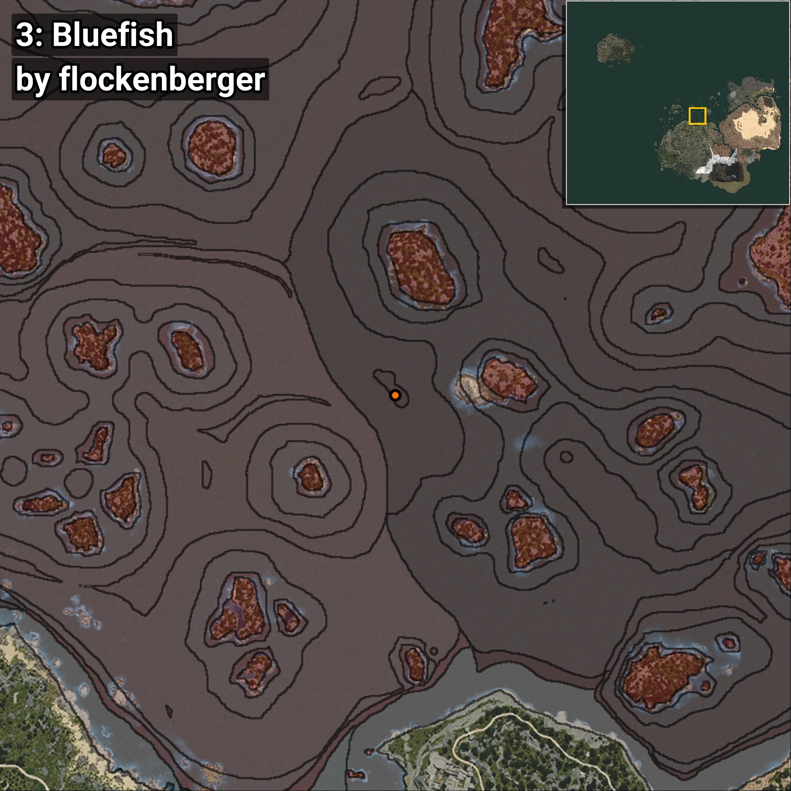
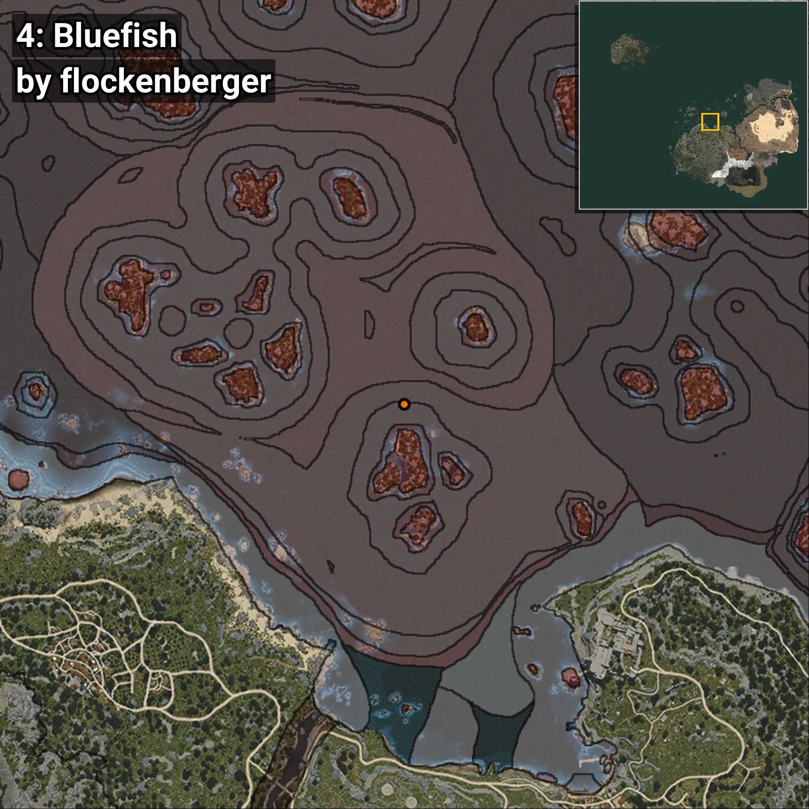

# Scombrops
```xml
<!--
    Puntos de pesca para: Scombrops
    Creado por: flockenberger
-->
<WorldmapBookMark>
    <BookMark BookMarkName="0: Scombrops" PosX="36.74298" PosY="-7790.6064" PosZ="251600.75" />
    <BookMark BookMarkName="1: Scombrops" PosX="764.5027" PosY="-7559.614" PosZ="251034.55" />
    <BookMark BookMarkName="2: Scombrops" PosX="166281.28" PosY="-7626.554" PosZ="227912.16" />
    <BookMark BookMarkName="3: Scombrops" PosX="952.0896" PosY="-7542.6943" PosZ="251242.88" />
    <BookMark BookMarkName="4: Scombrops" PosX="-47276.0" PosY="-8208.0" PosZ="202207.0" />
</WorldmapBookMark>
```

## ⚠️ Advertencia:
Los puntos de pesca se generan según la __**posición de tu personaje**__ — __no__ donde cae el flotador.  
En el océano especialmente, la dirección en la que lances la caña puede colocar tu flotador en una **zona de pesca diferente**, lo que puede resultar en capturar el pez incorrecto.  
Presta atención a las vistas previas que muestran la ubicación en relación a las zonas marcadas.

- Para verificar la posición de tu flotador puedes usar la guía [AQUÍ](https://flockenberger.github.io/bdo-fish-position/)
- O ver la guía [AQUÍ](https://youtu.be/t-VXcRoNojk)

## Vistas Previas
      