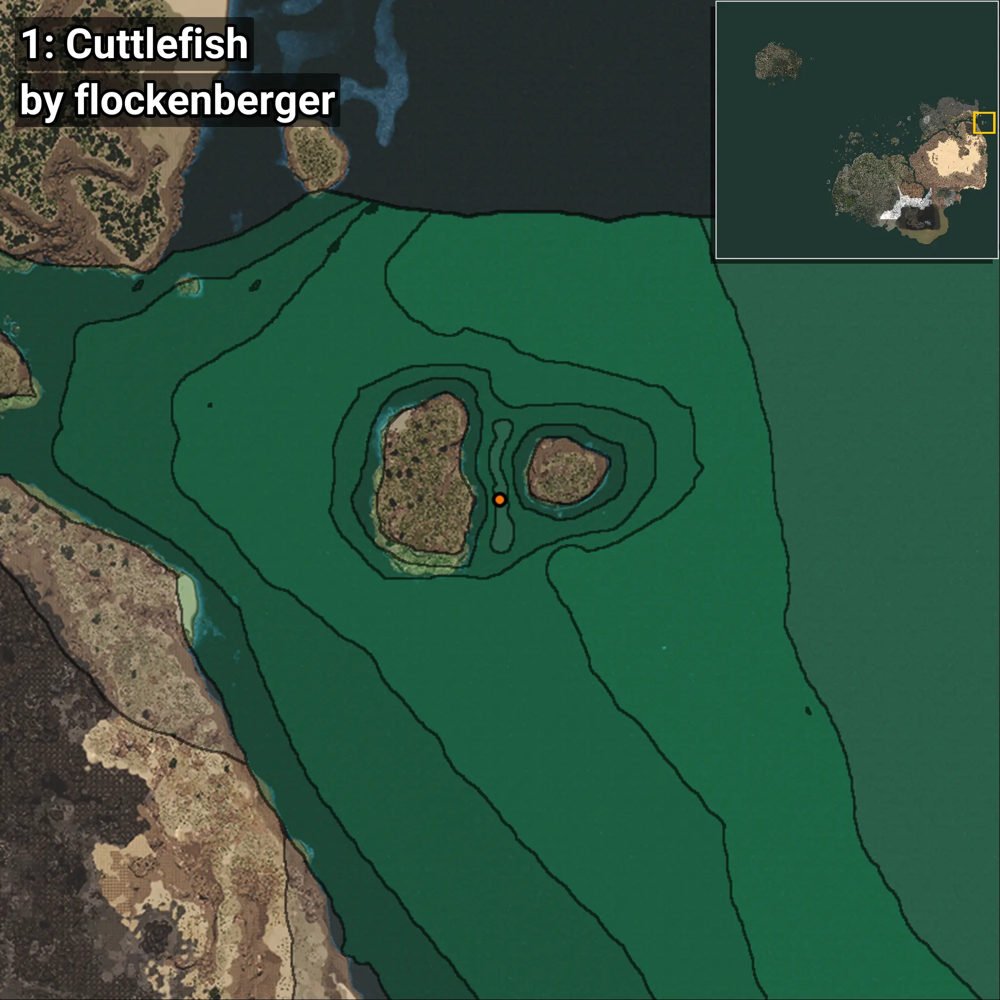
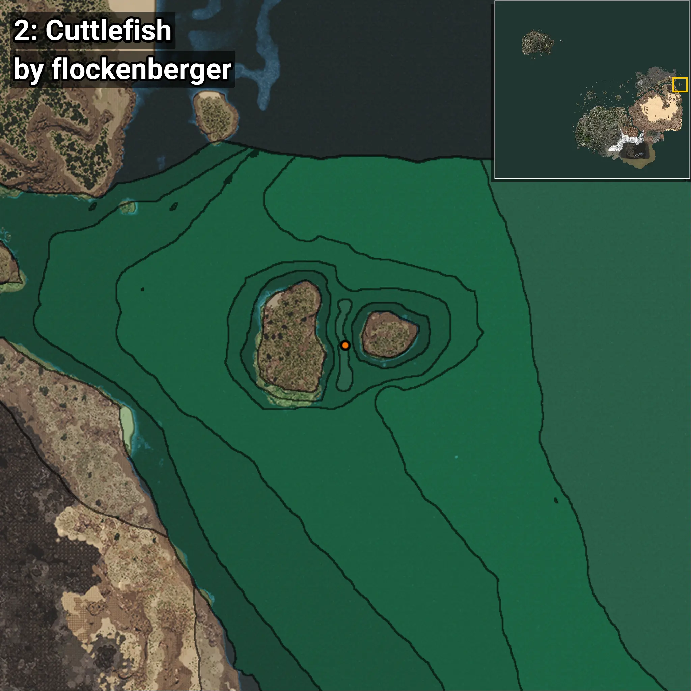
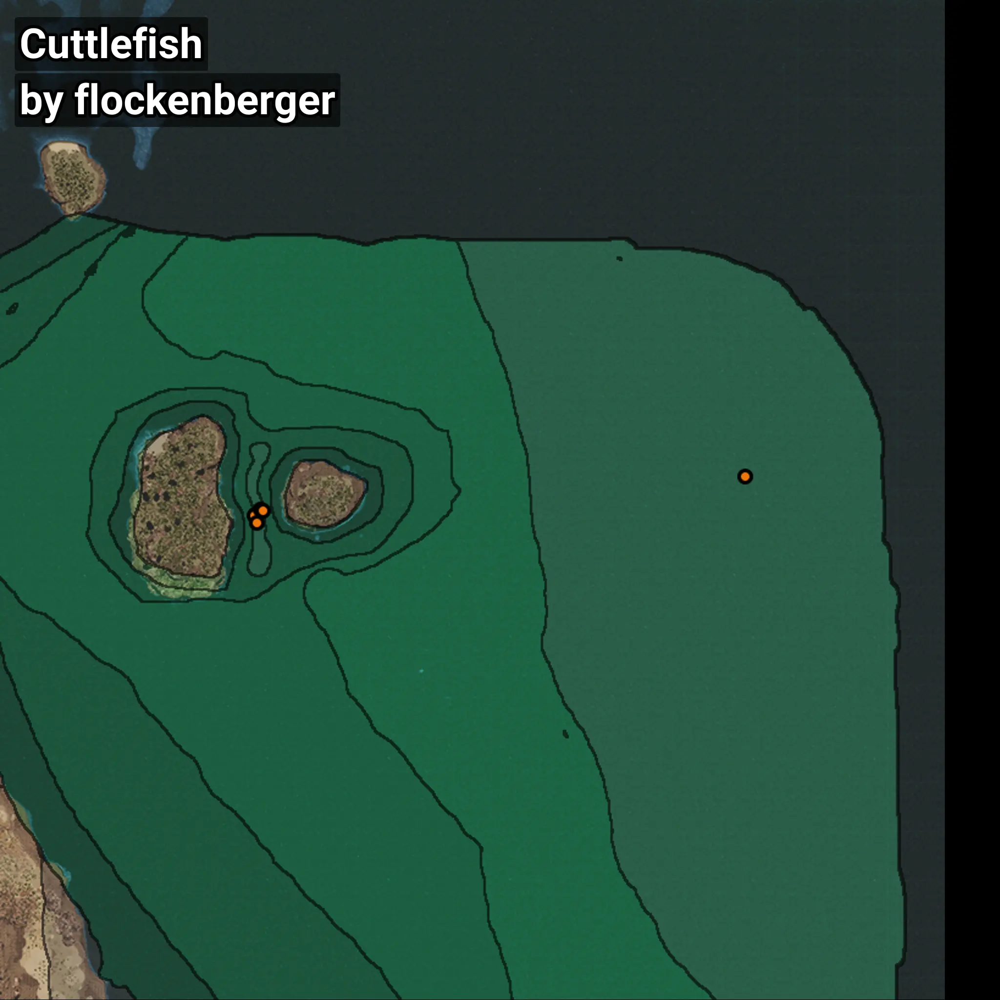

# Sepia
```xml
<!--
    Puntos de pesca para: Sepia
    Creado por: flockenberger
-->
<WorldmapBookMark>
    <BookMark BookMarkName="0: Sepia" PosX="1263288.6" PosY="-7700.3647" PosZ="547364.06" />
    <BookMark BookMarkName="1: Sepia" PosX="1263752.0" PosY="-7751.0" PosZ="545551.0" />
    <BookMark BookMarkName="2: Sepia" PosX="1264646.0" PosY="-7764.3286" PosZ="548950.5" />
    <BookMark BookMarkName="3: Sepia" PosX="1265430.0" PosY="-7870.0" PosZ="548467.0" />
    <BookMark BookMarkName="4: Sepia" PosX="1384405.0" PosY="-8158.0" PosZ="557105.0" />
</WorldmapBookMark>
```

## ⚠️ Advertencia:
Los puntos de pesca se generan según la __**posición de tu personaje**__ — __no__ donde cae el flotador.  
En el océano especialmente, la dirección en la que lances la caña puede colocar tu flotador en una **zona de pesca diferente**, lo que puede resultar en capturar el pez incorrecto.  
Presta atención a las vistas previas que muestran la ubicación en relación a las zonas marcadas.

- Para verificar la posición de tu flotador puedes usar la guía [AQUÍ](https://flockenberger.github.io/bdo-fish-position/)
- O ver la guía [AQUÍ](https://youtu.be/t-VXcRoNojk)

## Vistas Previas
      