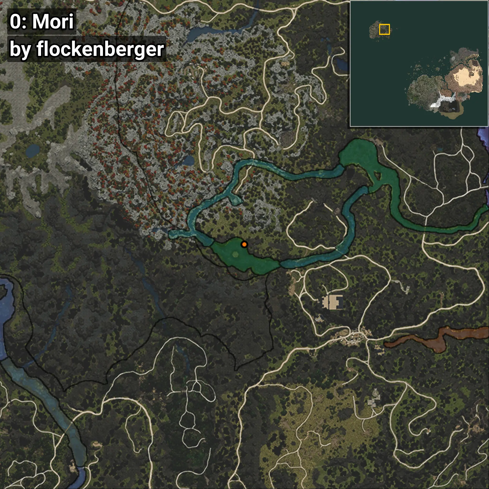
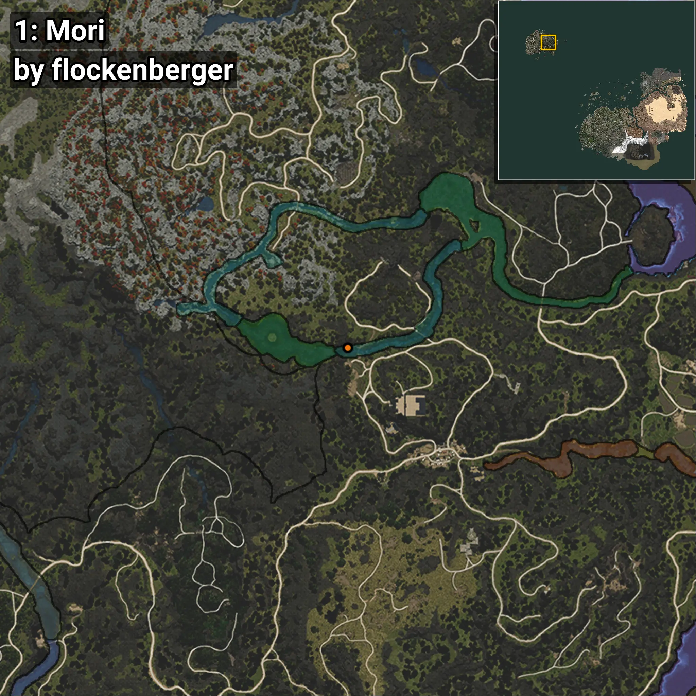
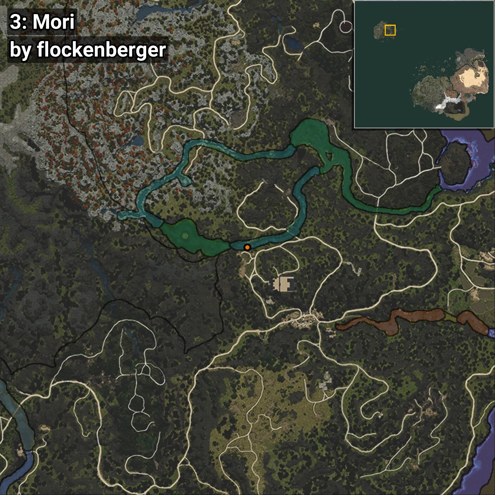
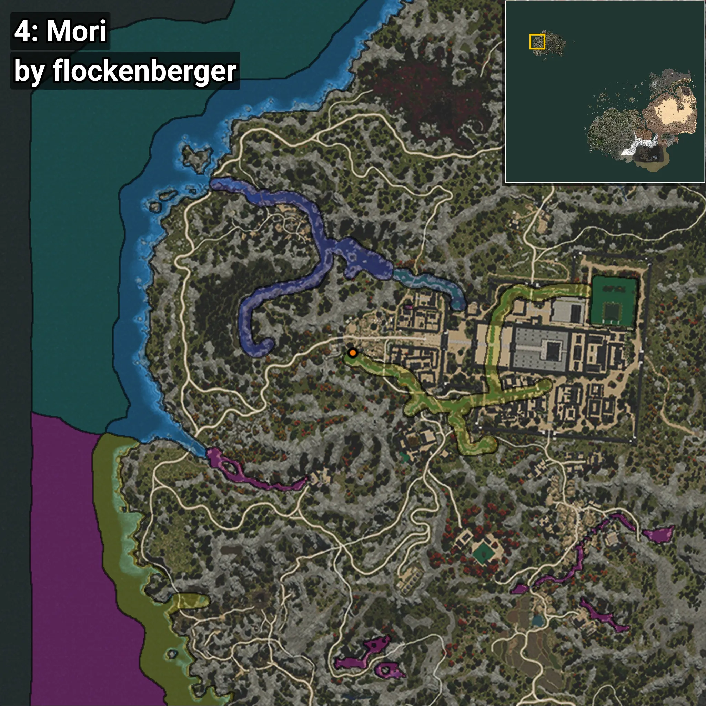

# Silurus
```xml
<!--
    Puntos de pesca para: Silurus
    Creado por: flockenberger
-->
<WorldmapBookMark>
    <BookMark BookMarkName="0: Silurus" PosX="-1179056.0" PosY="23065.0" PosZ="1319430.0" />
    <BookMark BookMarkName="1: Silurus" PosX="-1156816.0" PosY="18104.0" PosZ="1310528.0" />
    <BookMark BookMarkName="2: Silurus" PosX="86932.64" PosY="9753.457" PosZ="-190952.77" />
    <BookMark BookMarkName="3: Silurus" PosX="-1152324.0" PosY="18086.0" PosZ="1308583.0" />
    <BookMark BookMarkName="4: Silurus" PosX="-1487734.9" PosY="11180.324" PosZ="1332415.9" />
</WorldmapBookMark>
```

## ⚠️ Advertencia:
Los puntos de pesca se generan según la __**posición de tu personaje**__ — __no__ donde cae el flotador.  
En el océano especialmente, la dirección en la que lances la caña puede colocar tu flotador en una **zona de pesca diferente**, lo que puede resultar en capturar el pez incorrecto.  
Presta atención a las vistas previas que muestran la ubicación en relación a las zonas marcadas.

- Para verificar la posición de tu flotador puedes usar la guía [AQUÍ](https://flockenberger.github.io/bdo-fish-position/)
- O ver la guía [AQUÍ](https://youtu.be/t-VXcRoNojk)

## Vistas Previas
      