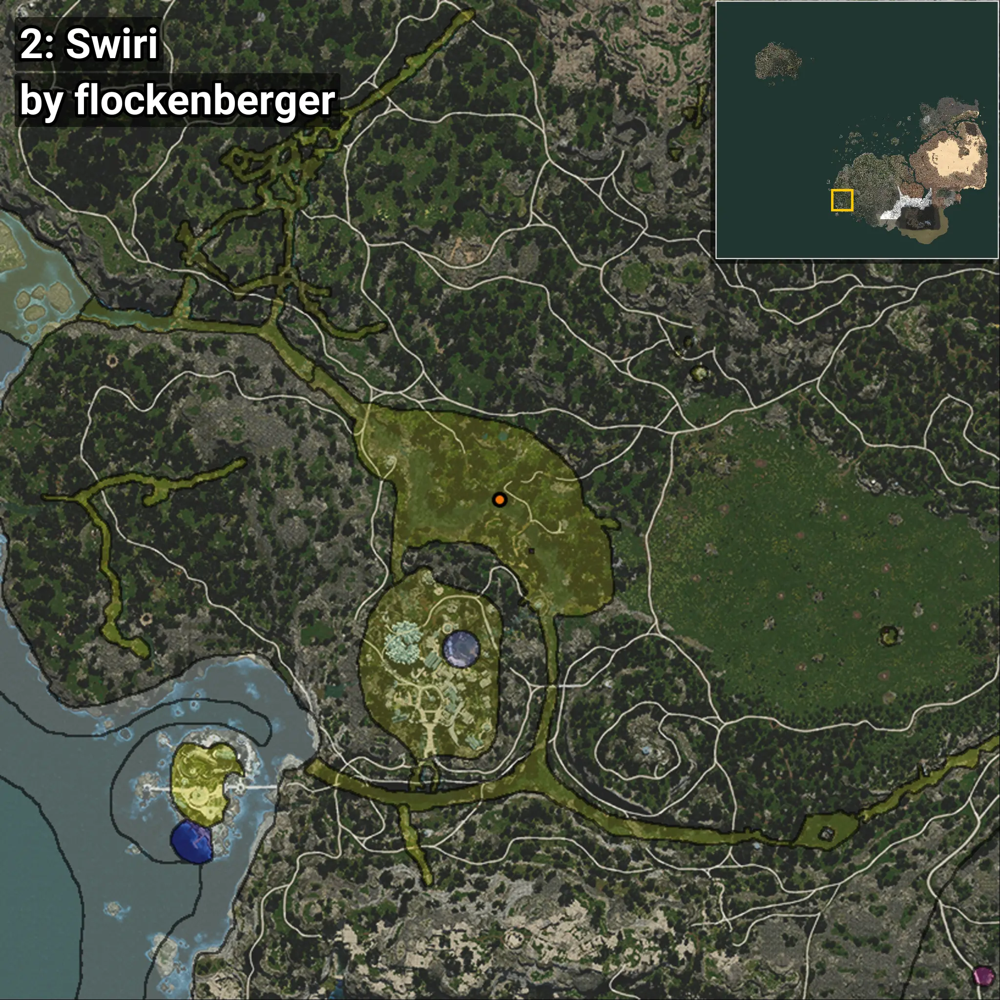
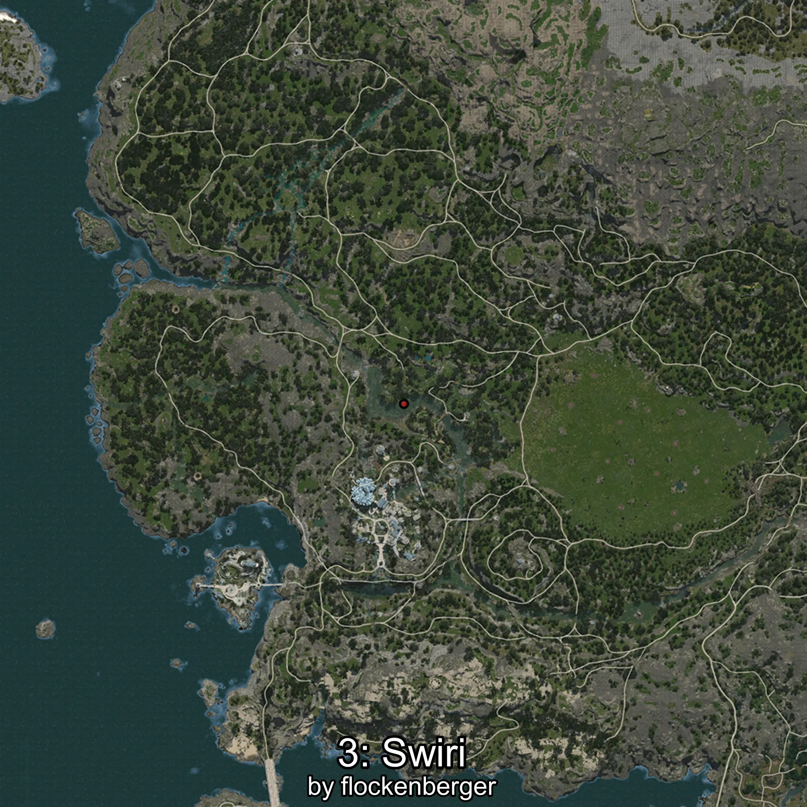
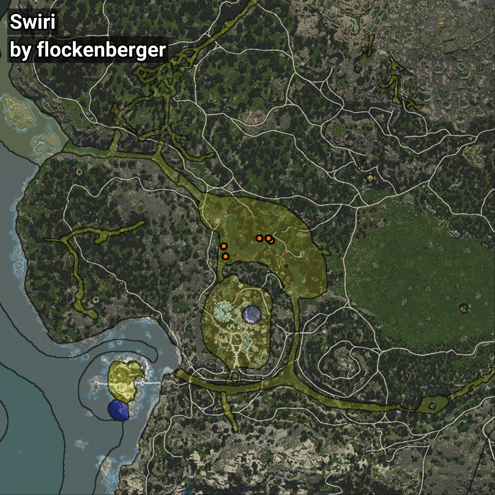

# Swiri
```xml
<!--
    Puntos de pesca para: Swiri
    Creado por: flockenberger
-->
<WorldmapBookMark>
    <BookMark BookMarkName="0: Swiri" PosX="-510628.66" PosY="-4565.7993" PosZ="-417589.6" />
    <BookMark BookMarkName="1: Swiri" PosX="-511650.0" PosY="-4802.0" PosZ="-412312.0" />
    <BookMark BookMarkName="2: Swiri" PosX="-488176.0" PosY="-4801.0" PosZ="-409685.0" />
    <BookMark BookMarkName="3: Swiri" PosX="-489161.0" PosY="-4752.0" PosZ="-408419.0" />
    <BookMark BookMarkName="4: Swiri" PosX="-493883.0" PosY="-4861.0" PosZ="-408435.0" />
</WorldmapBookMark>
```

## ⚠️ Advertencia:
Los puntos de pesca se generan según la __**posición de tu personaje**__ — __no__ donde cae el flotador.  
En el océano especialmente, la dirección en la que lances la caña puede colocar tu flotador en una **zona de pesca diferente**, lo que puede resultar en capturar el pez incorrecto.  
Presta atención a las vistas previas que muestran la ubicación en relación a las zonas marcadas.

- Para verificar la posición de tu flotador puedes usar la guía [AQUÍ](https://flockenberger.github.io/bdo-fish-position/)
- O ver la guía [AQUÍ](https://youtu.be/t-VXcRoNojk)

## Vistas Previas
      