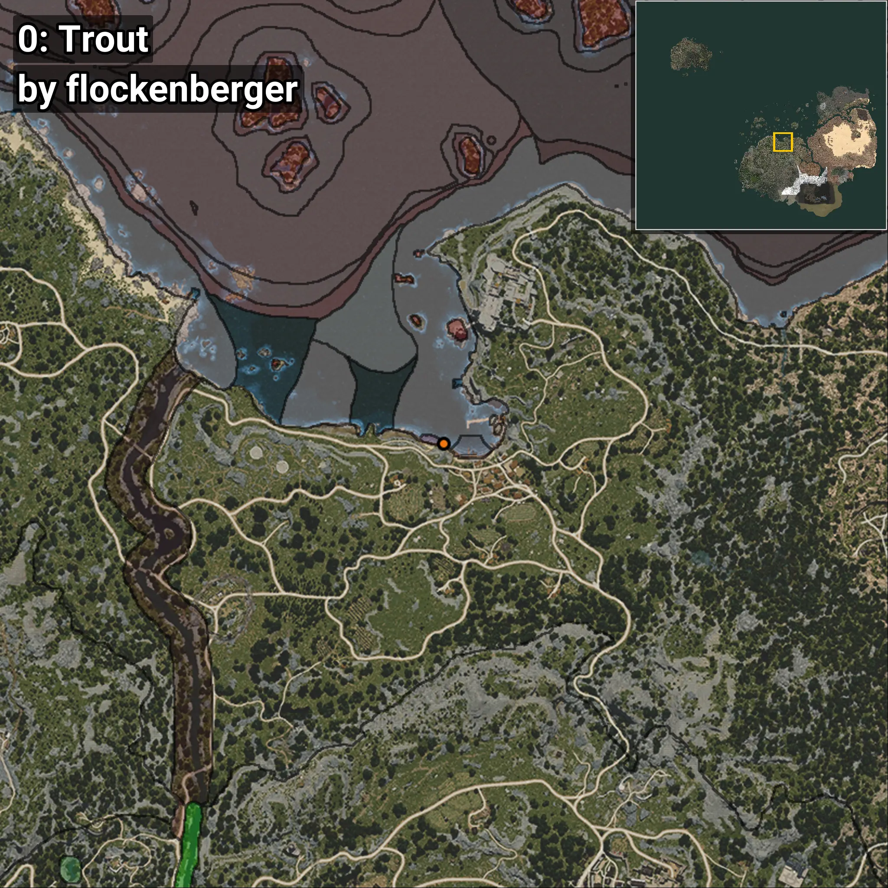
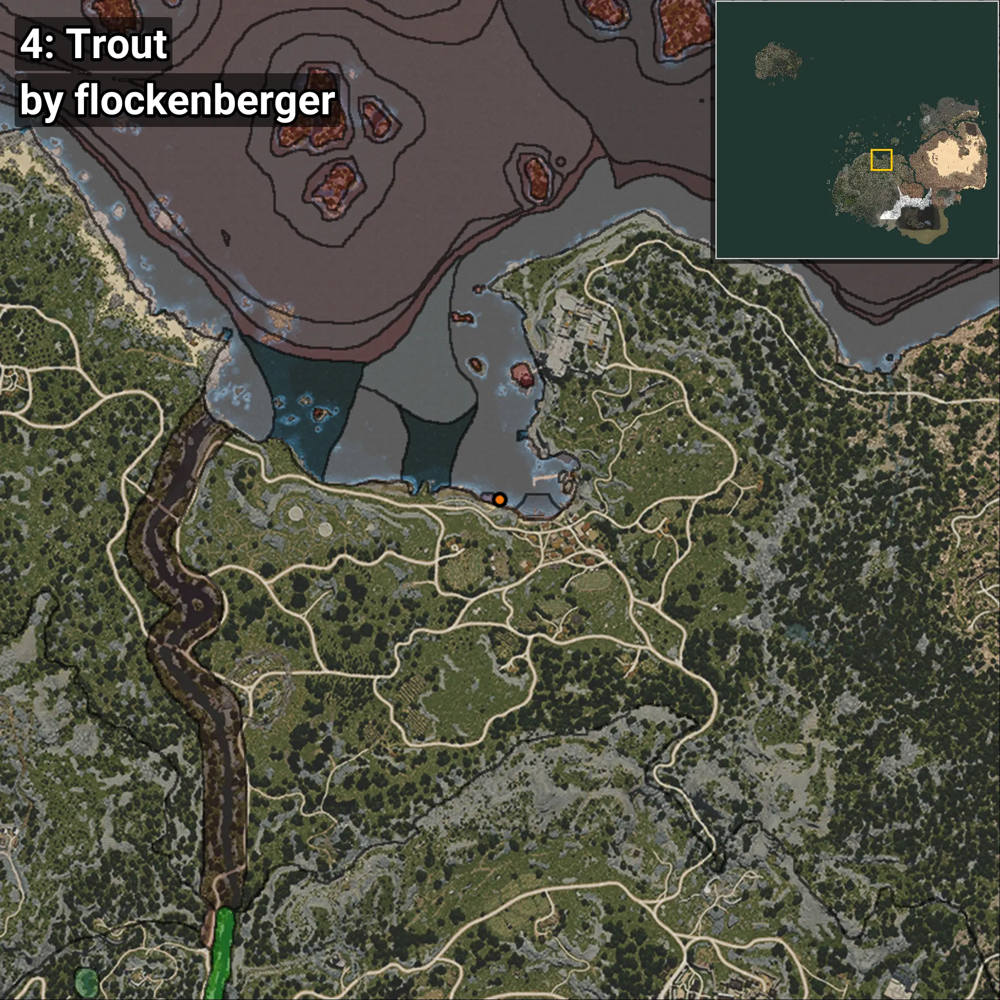

# Trucha
```xml
<!--
    Puntos de pesca para: Trucha
    Creado por: flockenberger
-->
<WorldmapBookMark>
    <BookMark BookMarkName="0: Trucha" PosX="-195.0" PosY="-8178.0" PosZ="87209.0" />
    <BookMark BookMarkName="1: Trucha" PosX="-262.38174" PosY="-8154.9346" PosZ="87125.46" />
    <BookMark BookMarkName="2: Trucha" PosX="-3782.0" PosY="-8193.0" PosZ="88052.0" />
    <BookMark BookMarkName="3: Trucha" PosX="-272.80365" PosY="-8153.312" PosZ="87119.91" />
    <BookMark BookMarkName="4: Trucha" PosX="-1908.2161" PosY="-8207.413" PosZ="87978.69" />
</WorldmapBookMark>
```

## ⚠️ Advertencia:
Los puntos de pesca se generan según la __**posición de tu personaje**__ — __no__ donde cae el flotador.  
En el océano especialmente, la dirección en la que lances la caña puede colocar tu flotador en una **zona de pesca diferente**, lo que puede resultar en capturar el pez incorrecto.  
Presta atención a las vistas previas que muestran la ubicación en relación a las zonas marcadas.

- Para verificar la posición de tu flotador puedes usar la guía [AQUÍ](https://flockenberger.github.io/bdo-fish-position/)
- O ver la guía [AQUÍ](https://youtu.be/t-VXcRoNojk)

## Vistas Previas
      