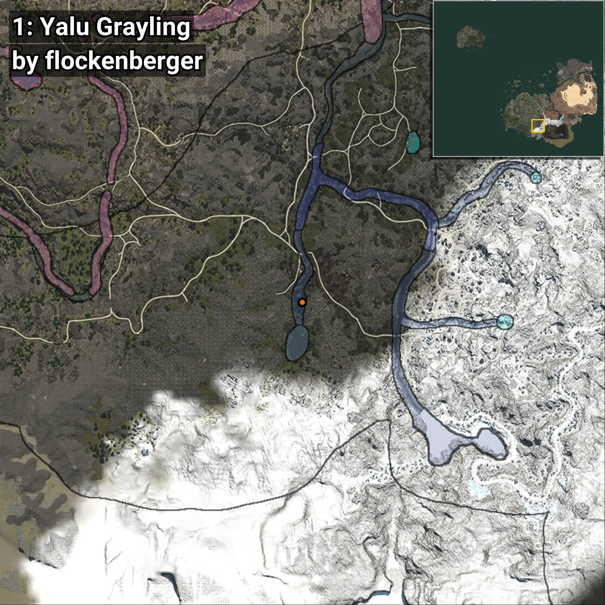

# Tímalo
```xml
<!--
    Puntos de pesca para: Tímalo
    Creado por: flockenberger
-->
<WorldmapBookMark>
    <BookMark BookMarkName="0: Tímalo" PosX="135017.0" PosY="13730.0" PosZ="-510420.0" />
    <BookMark BookMarkName="1: Tímalo" PosX="93568.0" PosY="18118.0" PosZ="-503705.0" />
    <BookMark BookMarkName="2: Tímalo" PosX="164022.0" PosY="15942.0" PosZ="-386608.0" />
    <BookMark BookMarkName="3: Tímalo" PosX="163990.0" PosY="15942.0" PosZ="-386655.0" />
    <BookMark BookMarkName="4: Tímalo" PosX="166063.0" PosY="16303.0" PosZ="-387243.0" />
</WorldmapBookMark>
```

## ⚠️ Advertencia:
Los puntos de pesca se generan según la __**posición de tu personaje**__ — __no__ donde cae el flotador.  
En el océano especialmente, la dirección en la que lances la caña puede colocar tu flotador en una **zona de pesca diferente**, lo que puede resultar en capturar el pez incorrecto.  
Presta atención a las vistas previas que muestran la ubicación en relación a las zonas marcadas.

- Para verificar la posición de tu flotador puedes usar la guía [AQUÍ](https://flockenberger.github.io/bdo-fish-position/)
- O ver la guía [AQUÍ](https://youtu.be/t-VXcRoNojk)

## Vistas Previas
      