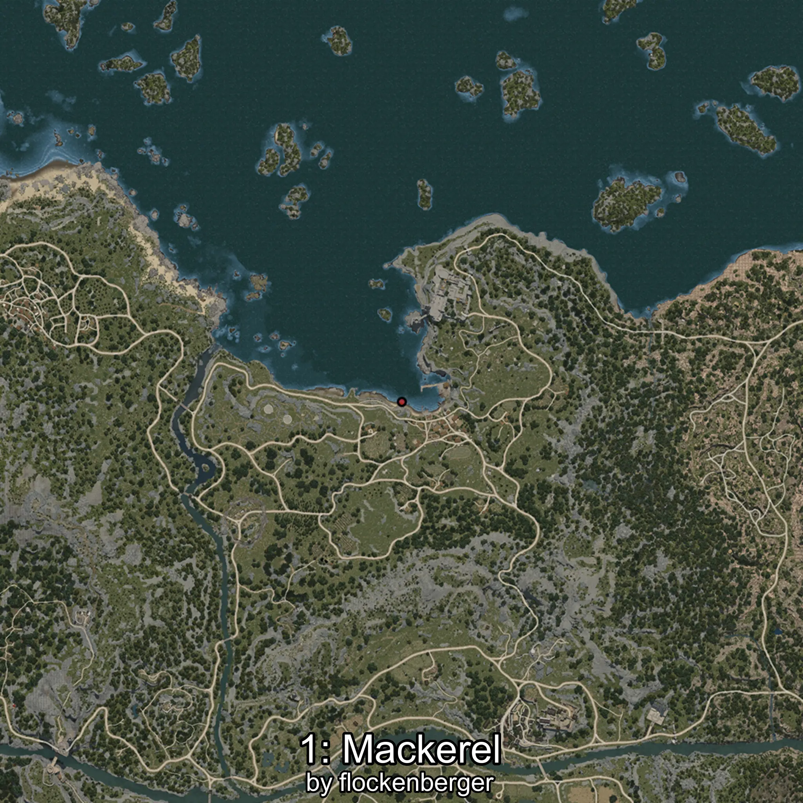
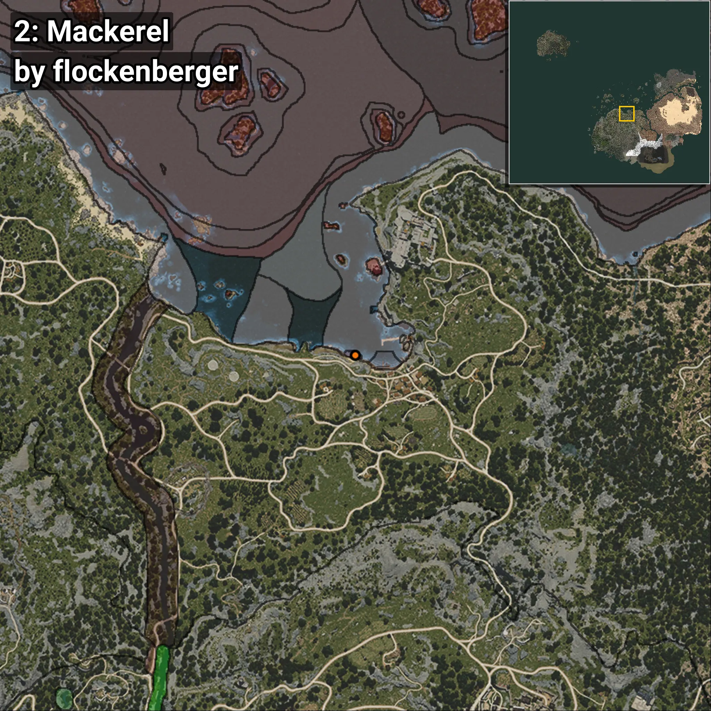
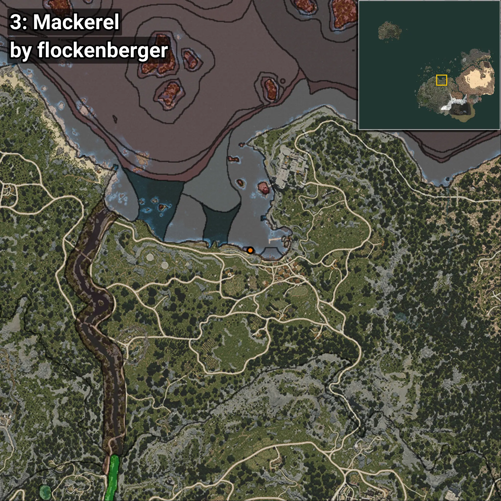
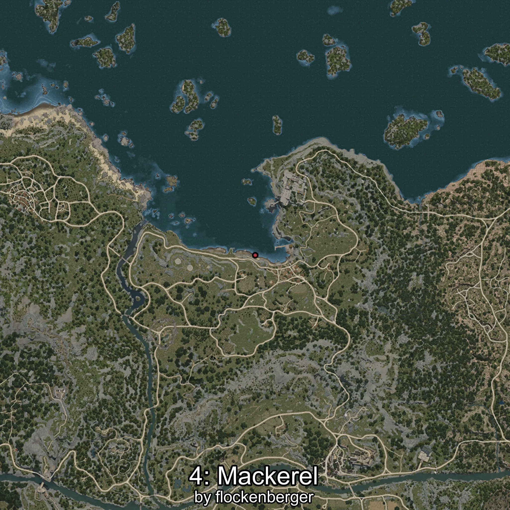
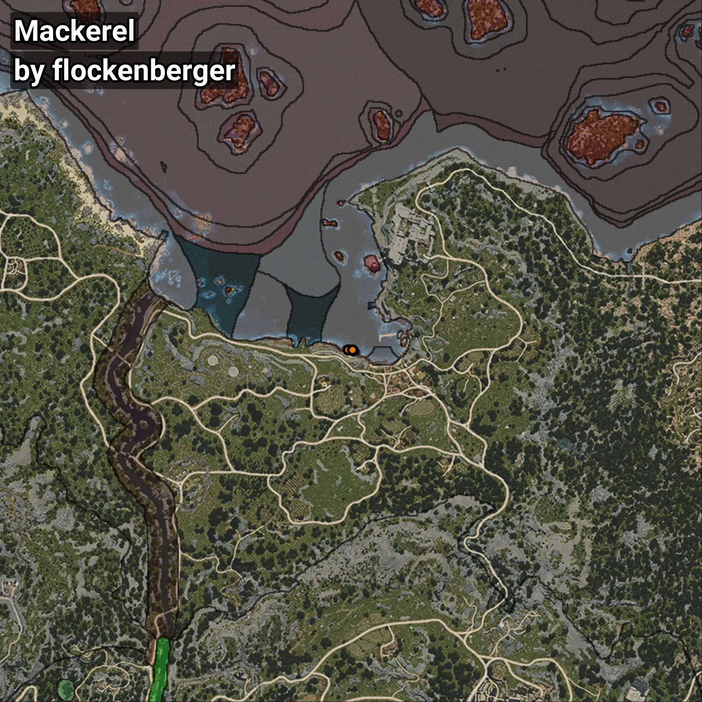

# Verdel
```xml
<!--
    Puntos de pesca para: Verdel
    Creado por: flockenberger
-->
<WorldmapBookMark>
    <BookMark BookMarkName="0: Verdel" PosX="-4502.0" PosY="-8242.0" PosZ="88403.0" />
    <BookMark BookMarkName="1: Verdel" PosX="-4526.5703" PosY="-8256.327" PosZ="88480.31" />
    <BookMark BookMarkName="2: Verdel" PosX="-2735.992" PosY="-8193.472" PosZ="87969.7" />
    <BookMark BookMarkName="3: Verdel" PosX="-2730.6006" PosY="-8194.088" PosZ="87972.68" />
    <BookMark BookMarkName="4: Verdel" PosX="-3048.0" PosY="-8297.0" PosZ="88426.0" />
</WorldmapBookMark>
```

## ⚠️ Advertencia:
Los puntos de pesca se generan según la __**posición de tu personaje**__ — __no__ donde cae el flotador.  
En el océano especialmente, la dirección en la que lances la caña puede colocar tu flotador en una **zona de pesca diferente**, lo que puede resultar en capturar el pez incorrecto.  
Presta atención a las vistas previas que muestran la ubicación en relación a las zonas marcadas.

- Para verificar la posición de tu flotador puedes usar la guía [AQUÍ](https://flockenberger.github.io/bdo-fish-position/)
- O ver la guía [AQUÍ](https://youtu.be/t-VXcRoNojk)

## Vistas Previas
      