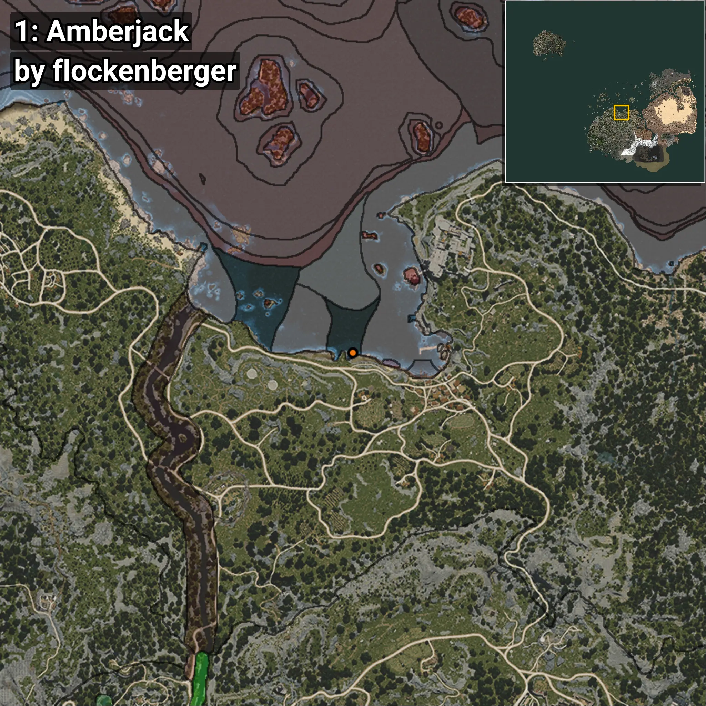
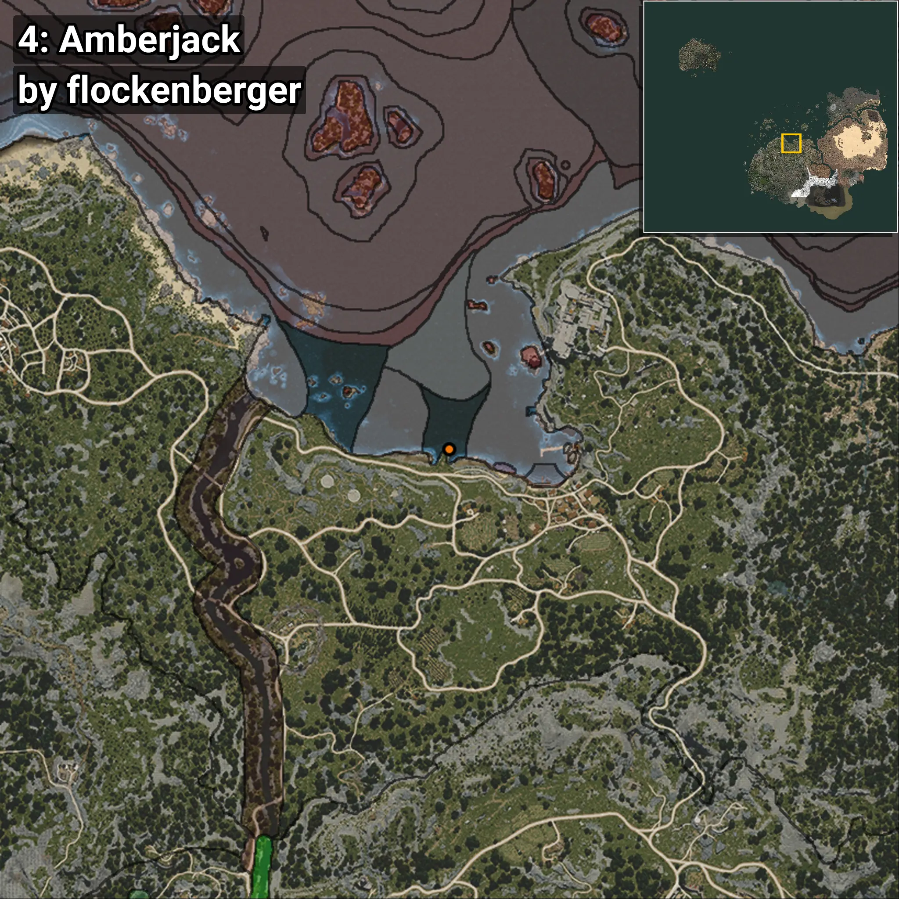
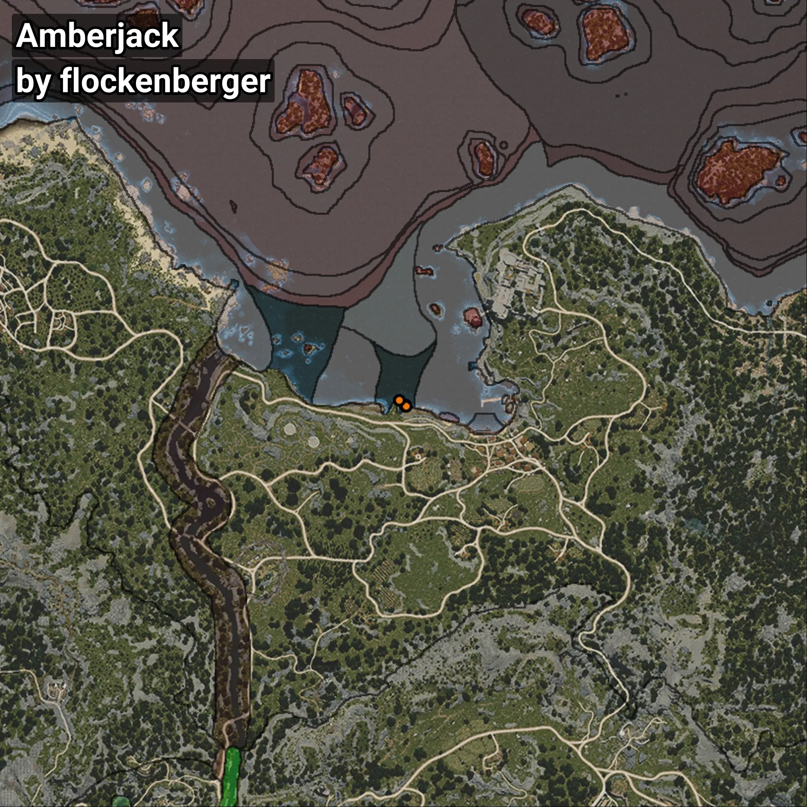

# Amberjack
```xml
<!--
    Waypoints for: Amberjack
    Created by: flockenberger
-->
<WorldmapBookMark>
    <BookMark BookMarkName="0: Amberjack" PosX="-16984.0" PosY="-8005.0" PosZ="91877.0" />
    <BookMark BookMarkName="1: Amberjack" PosX="-16965.0" PosY="-8005.0" PosZ="91905.0" />
    <BookMark BookMarkName="2: Amberjack" PosX="-17019.0" PosY="-8007.0" PosZ="91884.0" />
    <BookMark BookMarkName="3: Amberjack" PosX="-16853.0" PosY="-7998.6006" PosZ="91843.0" />
    <BookMark BookMarkName="4: Amberjack" PosX="-18740.0" PosY="-8099.0" PosZ="93465.0" />
</WorldmapBookMark>
```

## ⚠️ Disclaimer
Waypoints are generated based on the __**character’s position**__ — __not__ where the fishing float landed.
Fish are determined by where your **float** lands!
In ocean spots especially, the direction you cast your rod can place your float in a **different fishing zone**, which may result in catching the wrong type of fish.
Please pay attention to the preview images showing where each location is in relation to the outlined zones.

- You can verify your float’s position using the guide [**HERE**](https://flockenberger.github.io/bdo-fish-position/)
- Or watch the video guide [**HERE**](https://youtu.be/t-VXcRoNojk)

## Previews
      