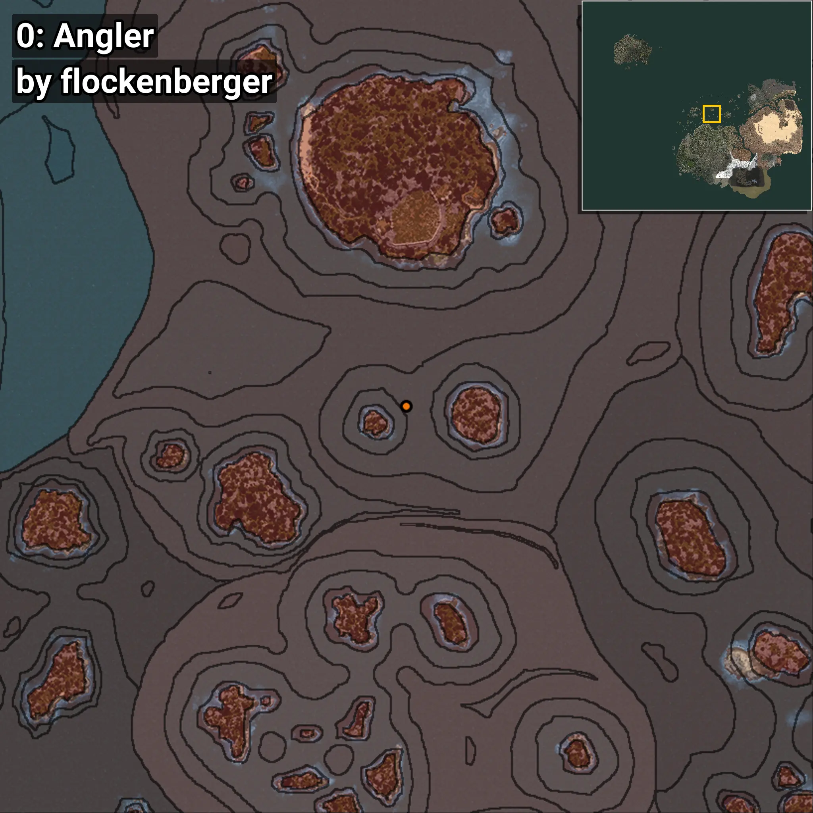
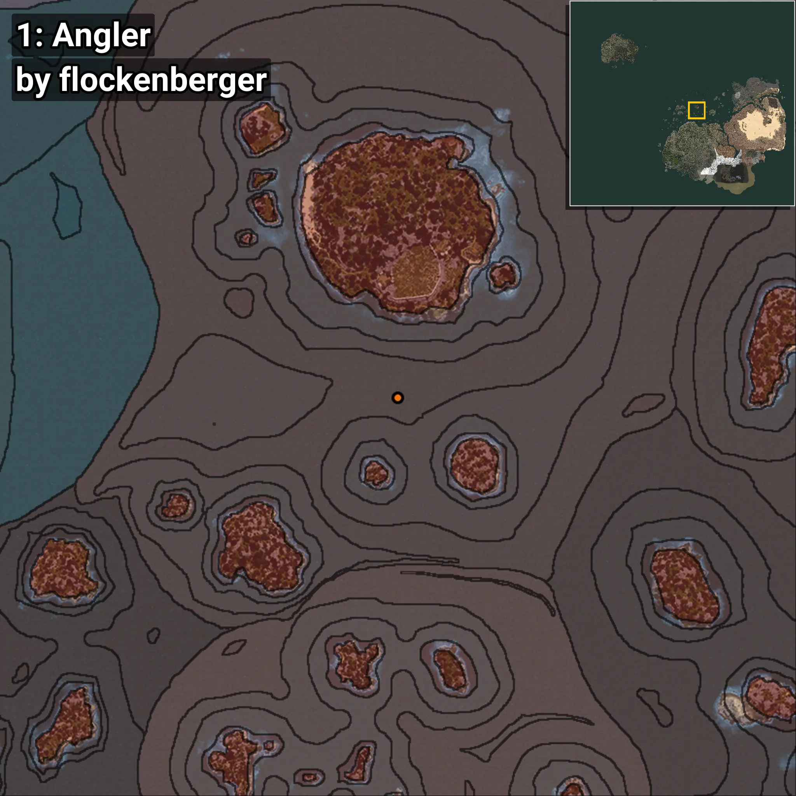
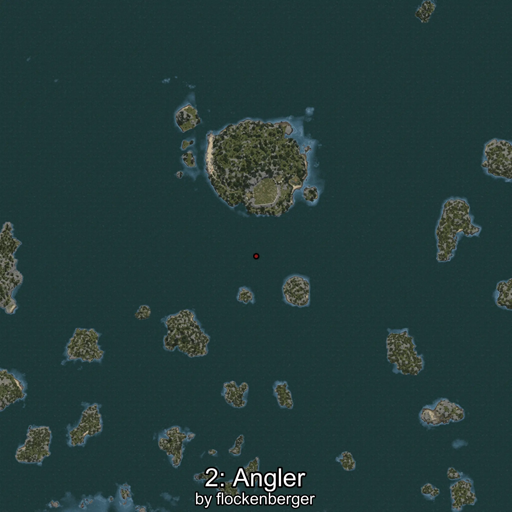
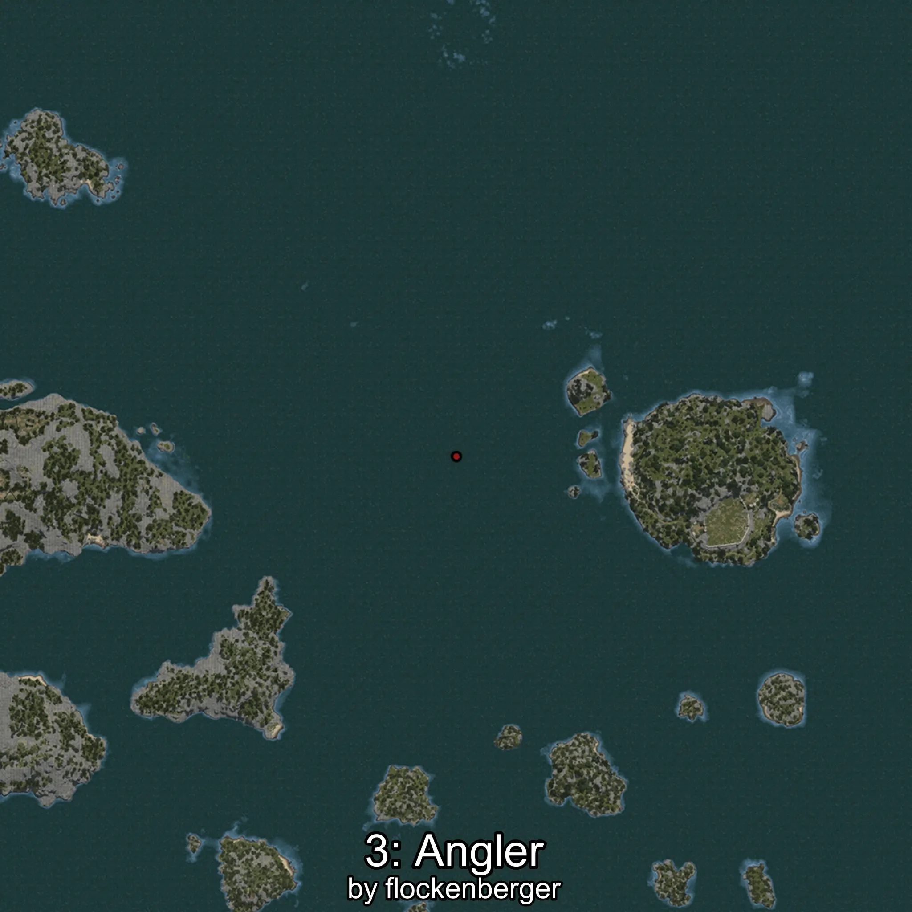
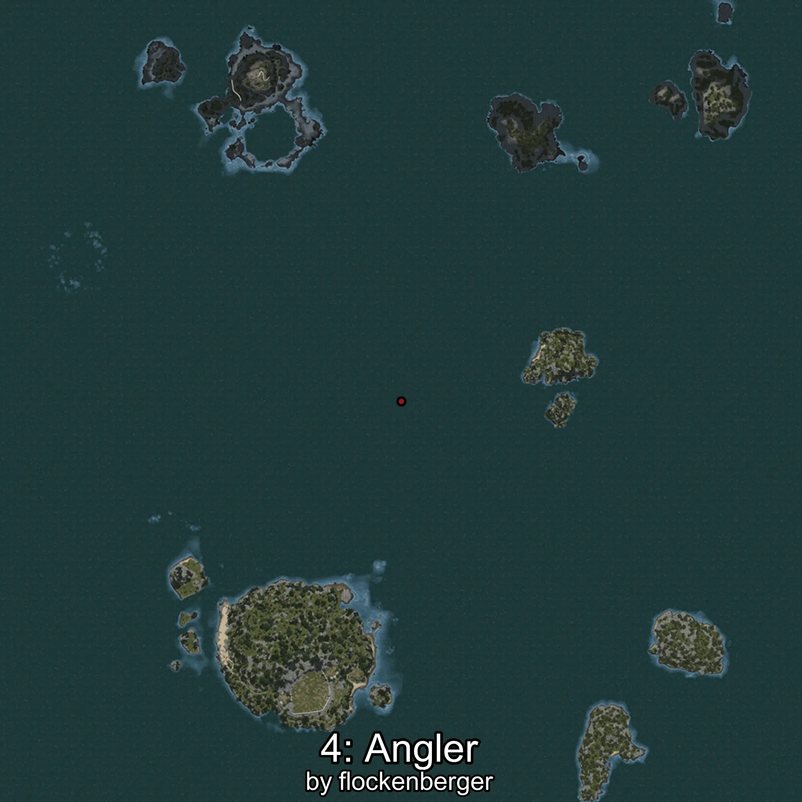

# Angler
```xml
<!--
    Waypoints for: Angler
    Created by: flockenberger
-->
<WorldmapBookMark>
    <BookMark BookMarkName="0: Angler" PosX="-77250.0" PosY="-7918.0" PosZ="331209.0" />
    <BookMark BookMarkName="1: Angler" PosX="-80106.5" PosY="-7604.826" PosZ="349622.5" />
    <BookMark BookMarkName="2: Angler" PosX="-128839.0" PosY="-7882.0" PosZ="382093.0" />
    <BookMark BookMarkName="3: Angler" PosX="-128538.0" PosY="-7749.0" PosZ="381280.0" />
    <BookMark BookMarkName="4: Angler" PosX="-37181.0" PosY="-7820.0" PosZ="357483.0" />
</WorldmapBookMark>
```

## ⚠️ Disclaimer
Waypoints are generated based on the __**character’s position**__ — __not__ where the fishing float landed.
Fish are determined by where your **float** lands!
In ocean spots especially, the direction you cast your rod can place your float in a **different fishing zone**, which may result in catching the wrong type of fish.
Please pay attention to the preview images showing where each location is in relation to the outlined zones.

- You can verify your float’s position using the guide [**HERE**](https://flockenberger.github.io/bdo-fish-position/)
- Or watch the video guide [**HERE**](https://youtu.be/t-VXcRoNojk)

## Previews
      