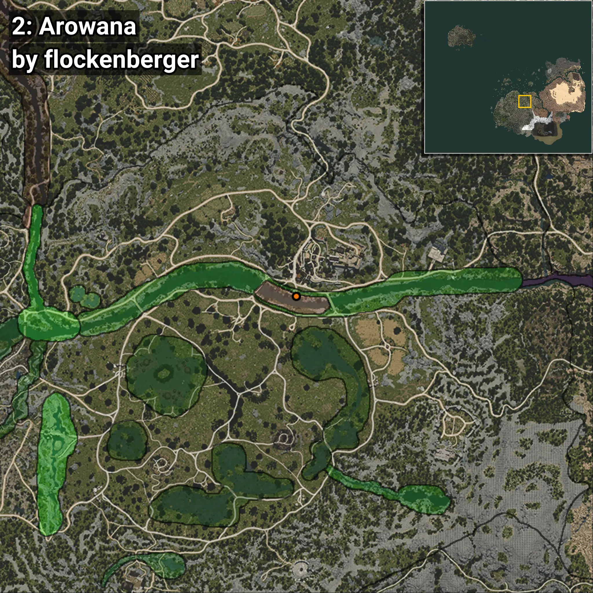

# Arowana
```xml
<!--
    Waypoints for: Arowana
    Created by: flockenberger
-->
<WorldmapBookMark>
    <BookMark BookMarkName="0: Arowana" PosX="39139.125" PosY="-4078.7185" PosZ="-51164.07" />
    <BookMark BookMarkName="1: Arowana" PosX="39224.0" PosY="-4056.0" PosZ="-51140.0" />
    <BookMark BookMarkName="2: Arowana" PosX="38128.0" PosY="-3991.0" PosZ="-50608.0" />
    <BookMark BookMarkName="3: Arowana" PosX="38169.0" PosY="-4011.0" PosZ="-50709.0" />
    <BookMark BookMarkName="4: Arowana" PosX="37364.0" PosY="-3816.0" PosZ="-50763.0" />
</WorldmapBookMark>
```

## ⚠️ Disclaimer
Waypoints are generated based on the __**character’s position**__ — __not__ where the fishing float landed.
Fish are determined by where your **float** lands!
In ocean spots especially, the direction you cast your rod can place your float in a **different fishing zone**, which may result in catching the wrong type of fish.
Please pay attention to the preview images showing where each location is in relation to the outlined zones.

- You can verify your float’s position using the guide [**HERE**](https://flockenberger.github.io/bdo-fish-position/)
- Or watch the video guide [**HERE**](https://youtu.be/t-VXcRoNojk)

## Previews
      