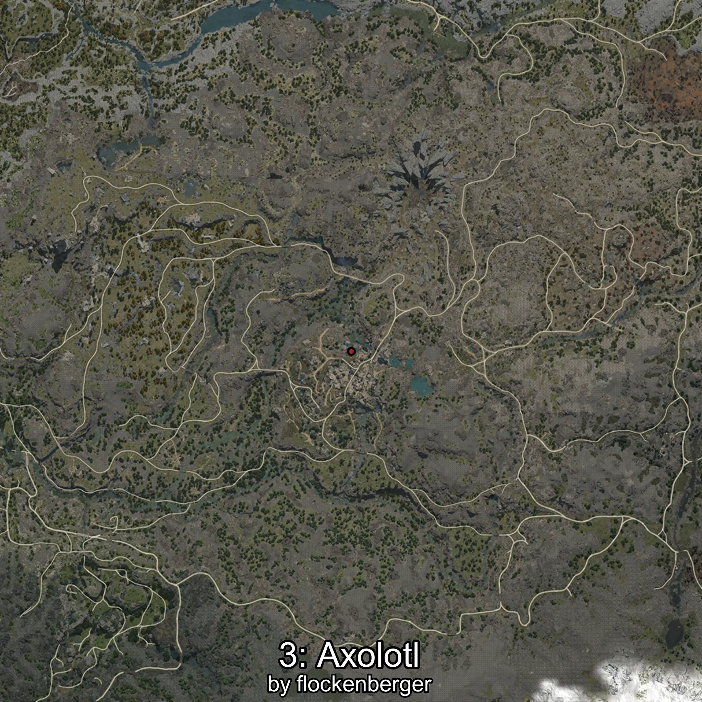
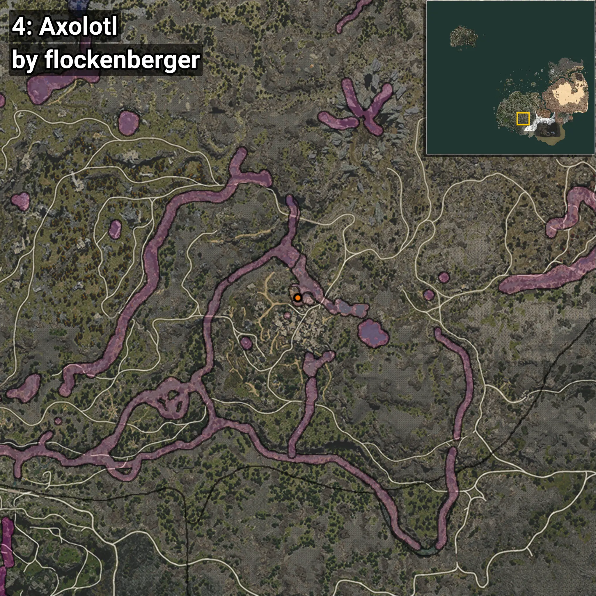

# Axolotl
```xml
<!--
    Waypoints for: Axolotl
    Created by: flockenberger
-->
<WorldmapBookMark>
    <BookMark BookMarkName="0: Axolotl" PosX="-50650.0" PosY="20042.0" PosZ="-396672.0" />
    <BookMark BookMarkName="1: Axolotl" PosX="-50557.0" PosY="20049.0" PosZ="-396718.0" />
    <BookMark BookMarkName="2: Axolotl" PosX="-51828.223" PosY="19916.752" PosZ="-396234.88" />
    <BookMark BookMarkName="3: Axolotl" PosX="-50554.0" PosY="20048.0" PosZ="-396753.0" />
    <BookMark BookMarkName="4: Axolotl" PosX="-50554.0" PosY="19937.0" PosZ="-396420.0" />
</WorldmapBookMark>
```

## ⚠️ Disclaimer
Waypoints are generated based on the __**character’s position**__ — __not__ where the fishing float landed.
Fish are determined by where your **float** lands!
In ocean spots especially, the direction you cast your rod can place your float in a **different fishing zone**, which may result in catching the wrong type of fish.
Please pay attention to the preview images showing where each location is in relation to the outlined zones.

- You can verify your float’s position using the guide [**HERE**](https://flockenberger.github.io/bdo-fish-position/)
- Or watch the video guide [**HERE**](https://youtu.be/t-VXcRoNojk)

## Previews
      