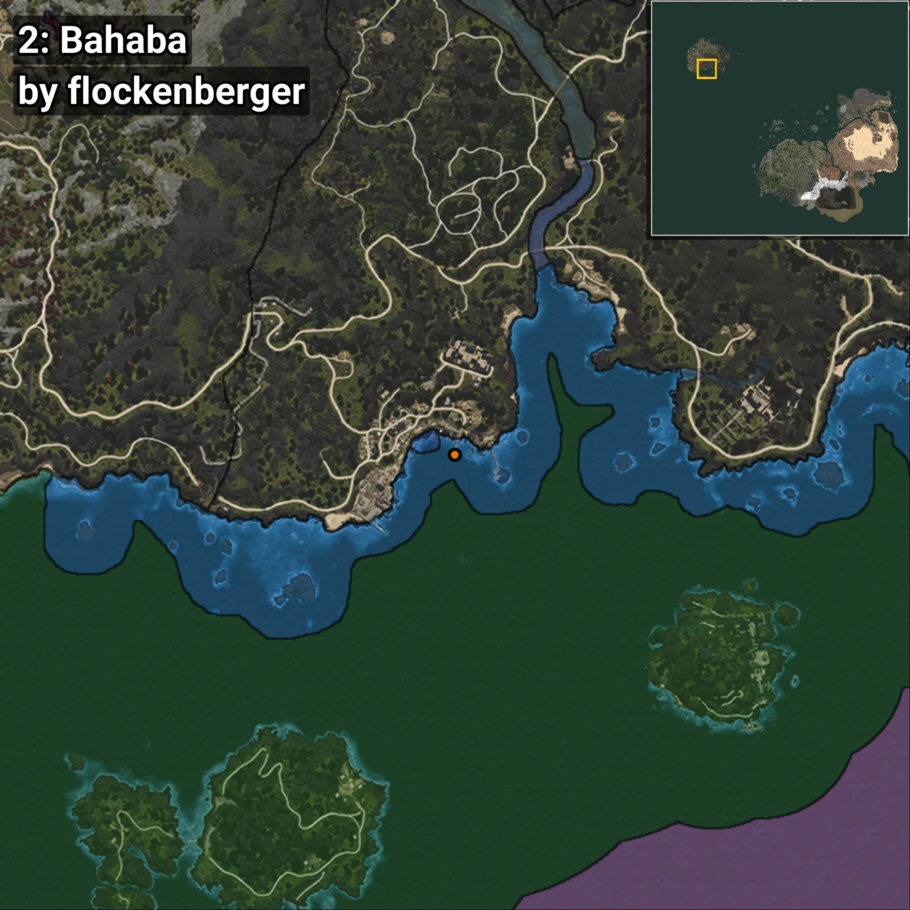
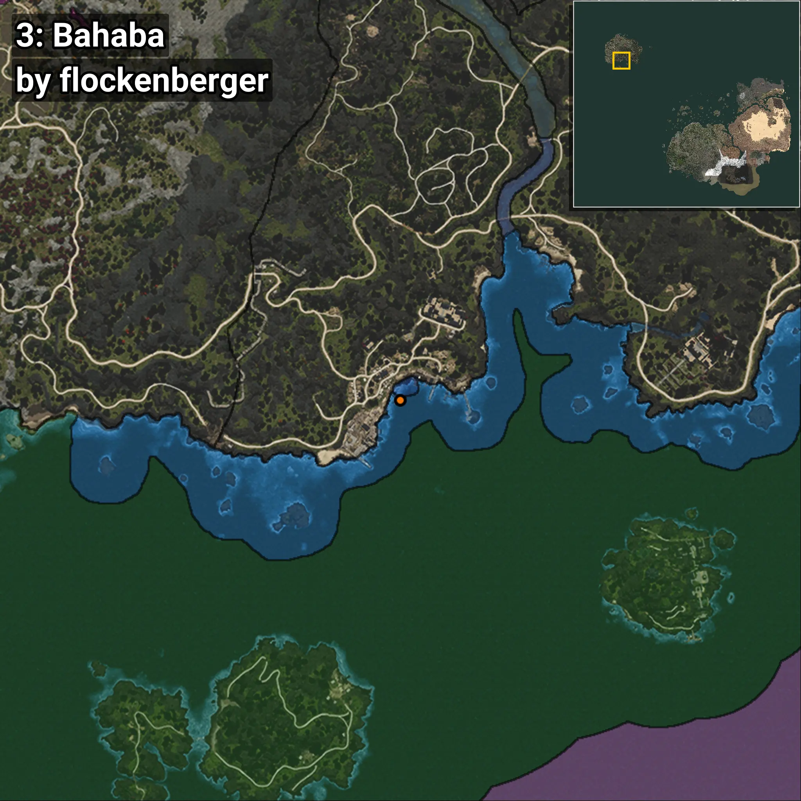

# Bahaba
```xml
<!--
    Waypoints for: Bahaba
    Created by: flockenberger
-->
<WorldmapBookMark>
    <BookMark BookMarkName="0: Bahaba" PosX="-1306424.0" PosY="-8135.0" PosZ="1126401.0" />
    <BookMark BookMarkName="1: Bahaba" PosX="-1306468.0" PosY="-8126.0" PosZ="1126370.0" />
    <BookMark BookMarkName="2: Bahaba" PosX="-1296859.0" PosY="-7887.0" PosZ="1126847.0" />
    <BookMark BookMarkName="3: Bahaba" PosX="-1306470.1" PosY="-8126.0186" PosZ="1126350.5" />
    <BookMark BookMarkName="4: Bahaba" PosX="-1213993.0" PosY="-7759.0" PosZ="1053136.0" />
</WorldmapBookMark>
```

## ⚠️ Disclaimer
Waypoints are generated based on the __**character’s position**__ — __not__ where the fishing float landed.
Fish are determined by where your **float** lands!
In ocean spots especially, the direction you cast your rod can place your float in a **different fishing zone**, which may result in catching the wrong type of fish.
Please pay attention to the preview images showing where each location is in relation to the outlined zones.

- You can verify your float’s position using the guide [**HERE**](https://flockenberger.github.io/bdo-fish-position/)
- Or watch the video guide [**HERE**](https://youtu.be/t-VXcRoNojk)

## Previews
      