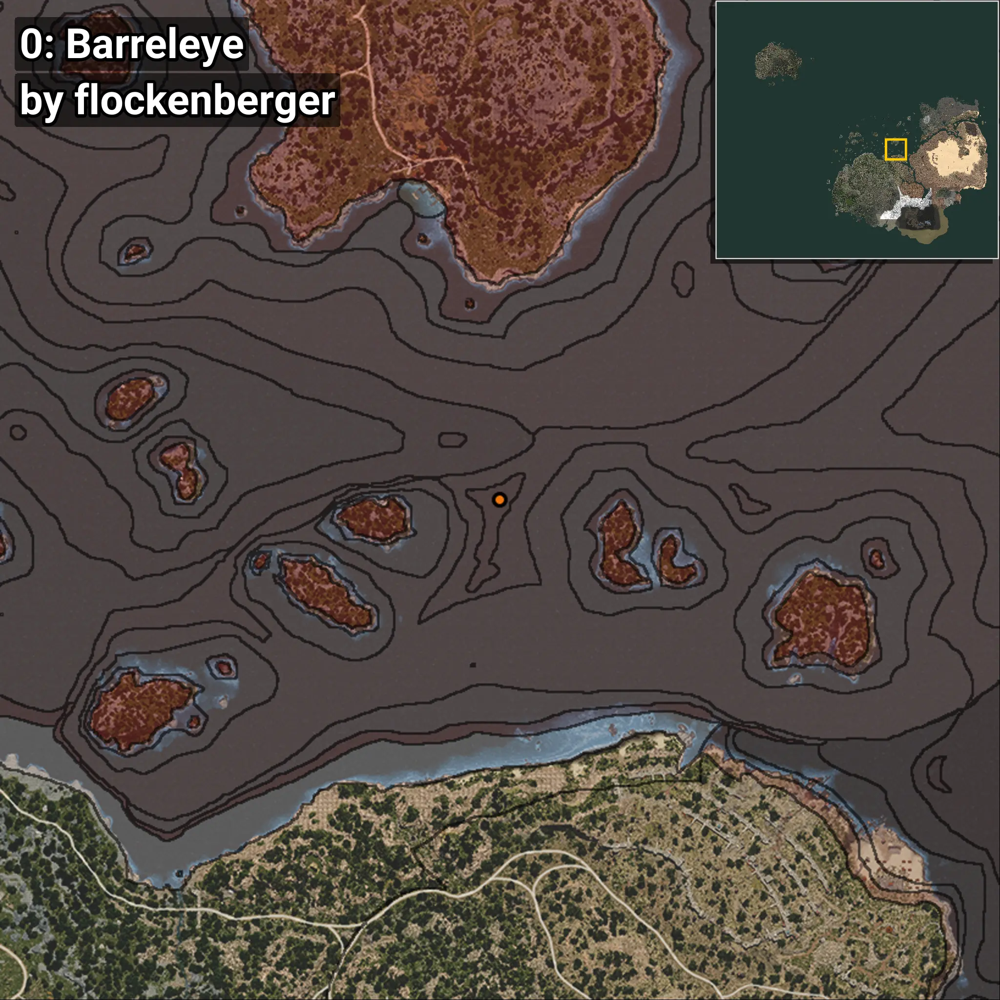
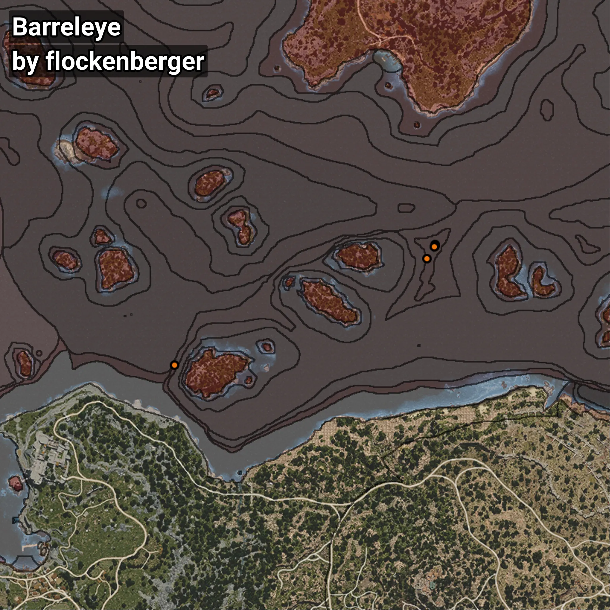

# Barreleye
```xml
<!--
    Waypoints for: Barreleye
    Created by: flockenberger
-->
<WorldmapBookMark>
    <BookMark BookMarkName="0: Barreleye" PosX="173296.69" PosY="-7770.235" PosZ="215614.58" />
    <BookMark BookMarkName="1: Barreleye" PosX="173226.0" PosY="-7734.0" PosZ="214785.0" />
    <BookMark BookMarkName="2: Barreleye" PosX="67924.516" PosY="-7918.667" PosZ="166667.7" />
    <BookMark BookMarkName="3: Barreleye" PosX="173092.0" PosY="-7707.0" PosZ="214617.0" />
    <BookMark BookMarkName="4: Barreleye" PosX="170021.0" PosY="-7903.0" PosZ="209733.0" />
</WorldmapBookMark>
```

## ⚠️ Disclaimer
Waypoints are generated based on the __**character’s position**__ — __not__ where the fishing float landed.
Fish are determined by where your **float** lands!
In ocean spots especially, the direction you cast your rod can place your float in a **different fishing zone**, which may result in catching the wrong type of fish.
Please pay attention to the preview images showing where each location is in relation to the outlined zones.

- You can verify your float’s position using the guide [**HERE**](https://flockenberger.github.io/bdo-fish-position/)
- Or watch the video guide [**HERE**](https://youtu.be/t-VXcRoNojk)

## Previews
      