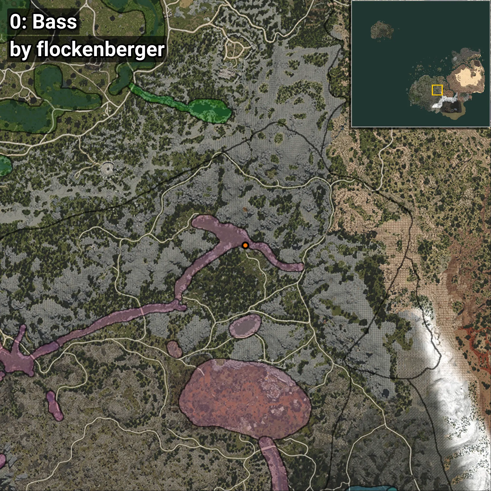
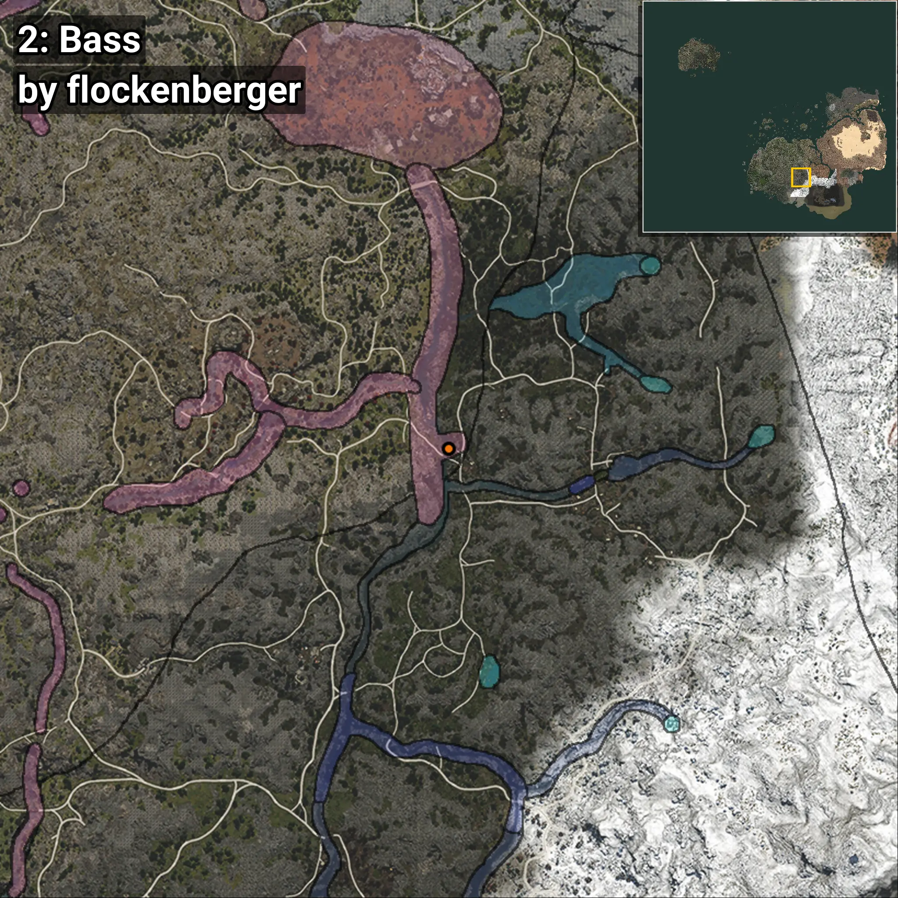
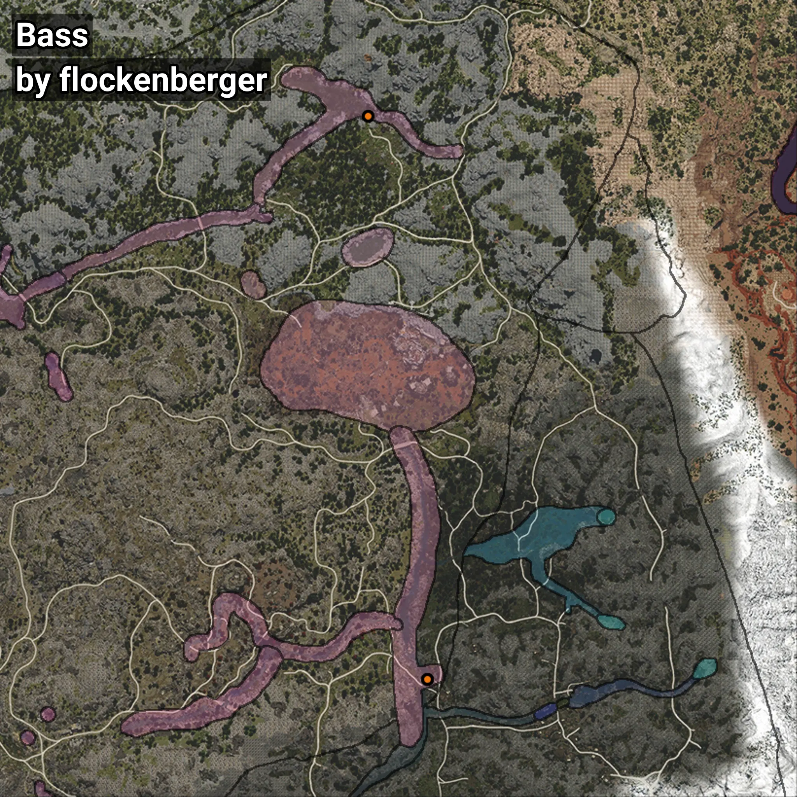

# Bass
```xml
<!--
    Waypoints for: Bass
    Created by: flockenberger
-->
<WorldmapBookMark>
    <BookMark BookMarkName="0: Bass" PosX="109174.0" PosY="10237.0" PosZ="-202711.0" />
    <BookMark BookMarkName="1: Bass" PosX="109145.0" PosY="10233.0" PosZ="-202751.0" />
    <BookMark BookMarkName="2: Bass" PosX="127565.0" PosY="12475.0" PosZ="-377266.0" />
    <BookMark BookMarkName="3: Bass" PosX="127630.31" PosY="12475.668" PosZ="-377229.84" />
    <BookMark BookMarkName="4: Bass" PosX="127609.0" PosY="12475.0" PosZ="-377193.0" />
</WorldmapBookMark>
```

## ⚠️ Disclaimer
Waypoints are generated based on the __**character’s position**__ — __not__ where the fishing float landed.
Fish are determined by where your **float** lands!
In ocean spots especially, the direction you cast your rod can place your float in a **different fishing zone**, which may result in catching the wrong type of fish.
Please pay attention to the preview images showing where each location is in relation to the outlined zones.

- You can verify your float’s position using the guide [**HERE**](https://flockenberger.github.io/bdo-fish-position/)
- Or watch the video guide [**HERE**](https://youtu.be/t-VXcRoNojk)

## Previews
      