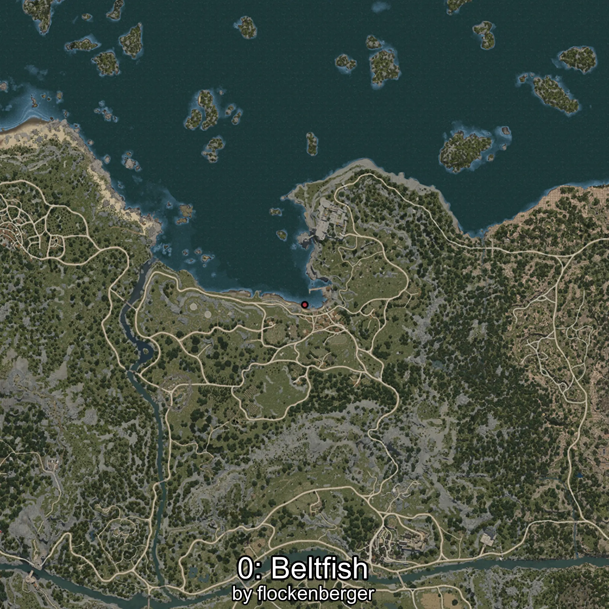
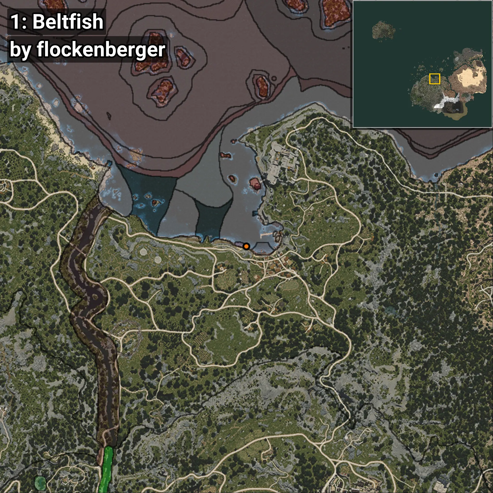
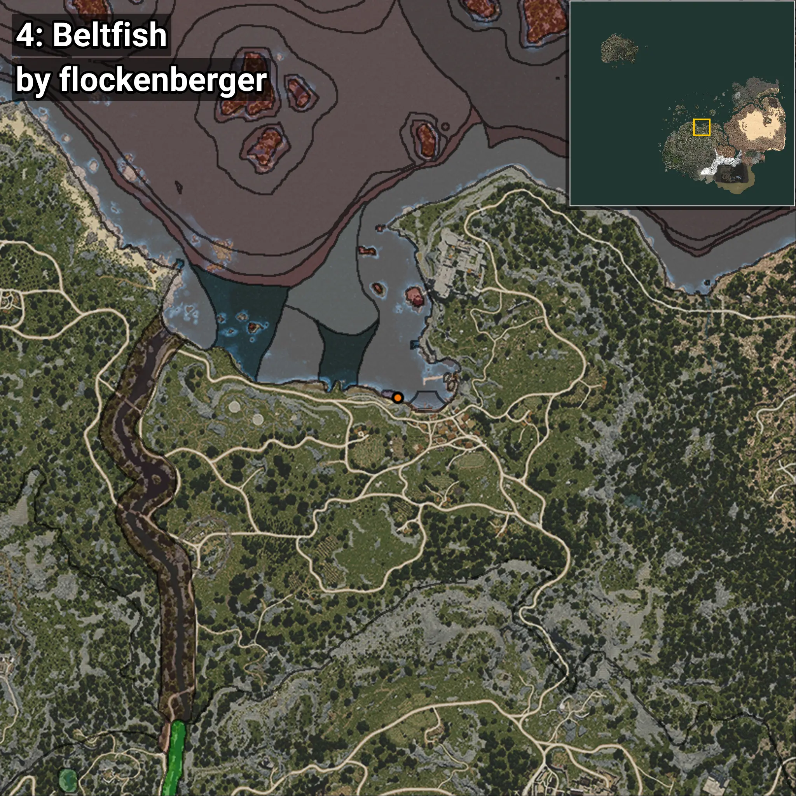

# Beltfish
```xml
<!--
    Waypoints for: Beltfish
    Created by: flockenberger
-->
<WorldmapBookMark>
    <BookMark BookMarkName="0: Beltfish" PosX="-851.0" PosY="-8180.0" PosZ="87424.0" />
    <BookMark BookMarkName="1: Beltfish" PosX="-781.12573" PosY="-8193.193" PosZ="87444.1" />
    <BookMark BookMarkName="2: Beltfish" PosX="-5295.0" PosY="-8265.0" PosZ="88721.0" />
    <BookMark BookMarkName="3: Beltfish" PosX="-679.0" PosY="-8217.0" PosZ="87496.0" />
    <BookMark BookMarkName="4: Beltfish" PosX="-1604.0" PosY="-8117.0" PosZ="87538.0" />
</WorldmapBookMark>
```

## ⚠️ Disclaimer
Waypoints are generated based on the __**character’s position**__ — __not__ where the fishing float landed.
Fish are determined by where your **float** lands!
In ocean spots especially, the direction you cast your rod can place your float in a **different fishing zone**, which may result in catching the wrong type of fish.
Please pay attention to the preview images showing where each location is in relation to the outlined zones.

- You can verify your float’s position using the guide [**HERE**](https://flockenberger.github.io/bdo-fish-position/)
- Or watch the video guide [**HERE**](https://youtu.be/t-VXcRoNojk)

## Previews
      