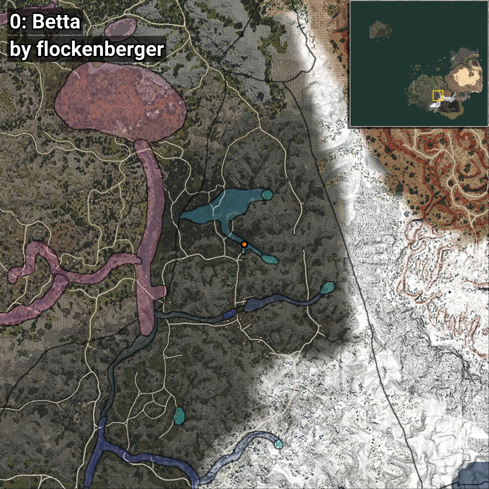
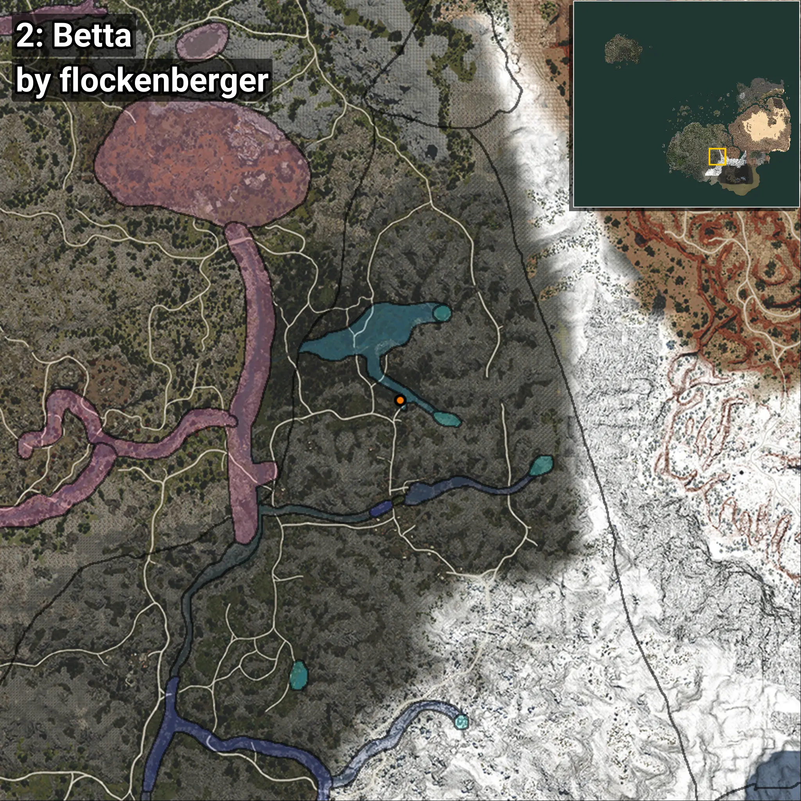
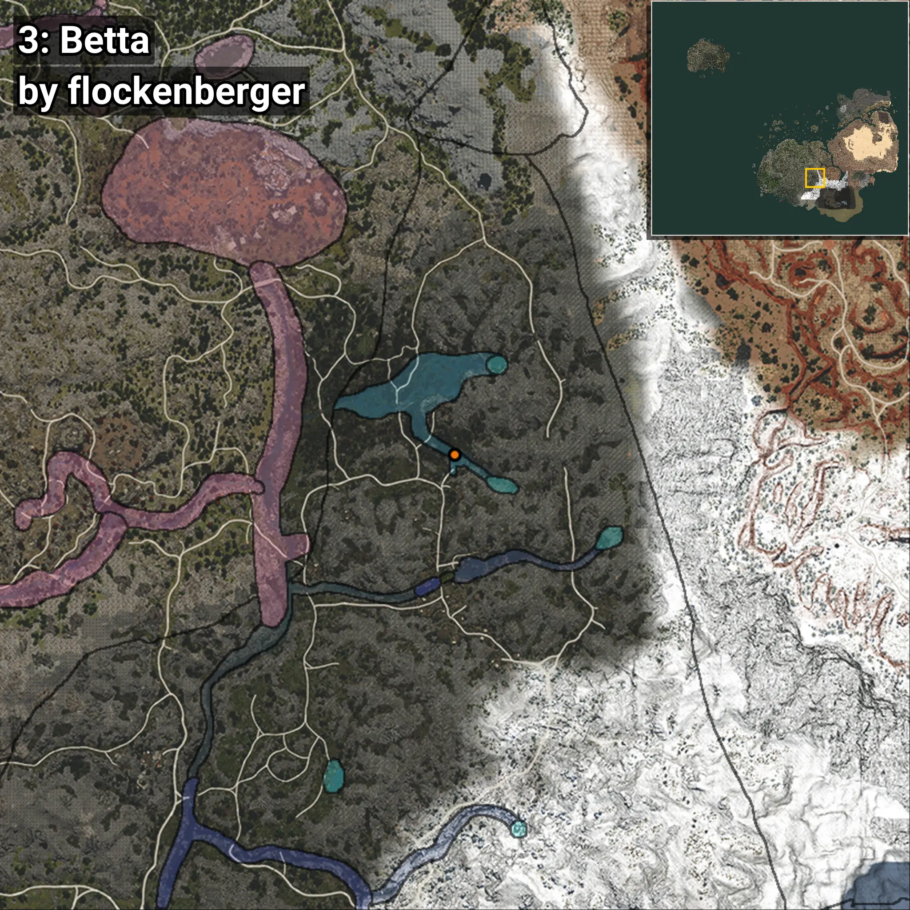
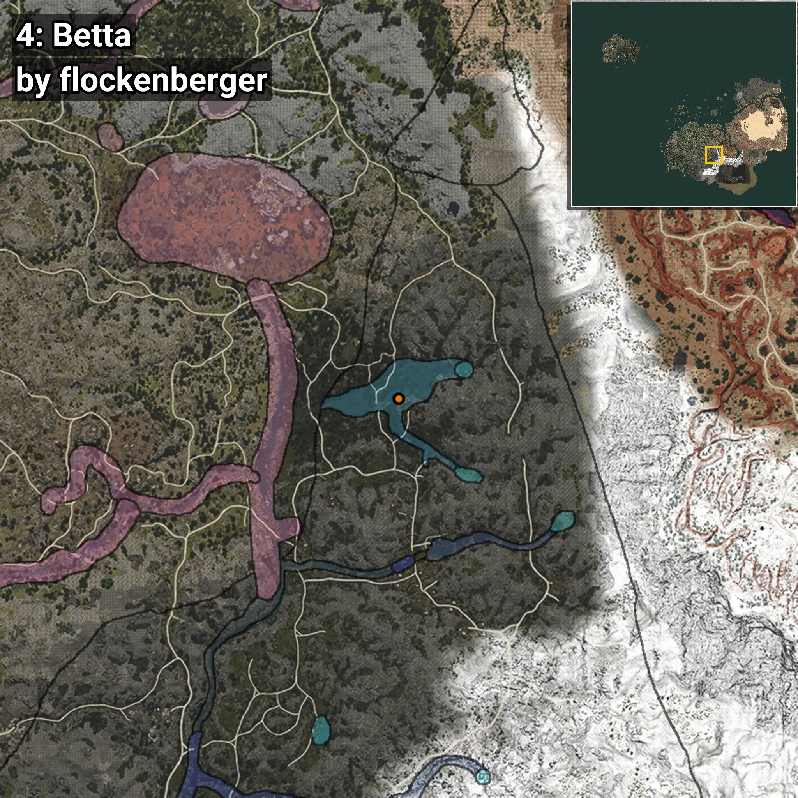
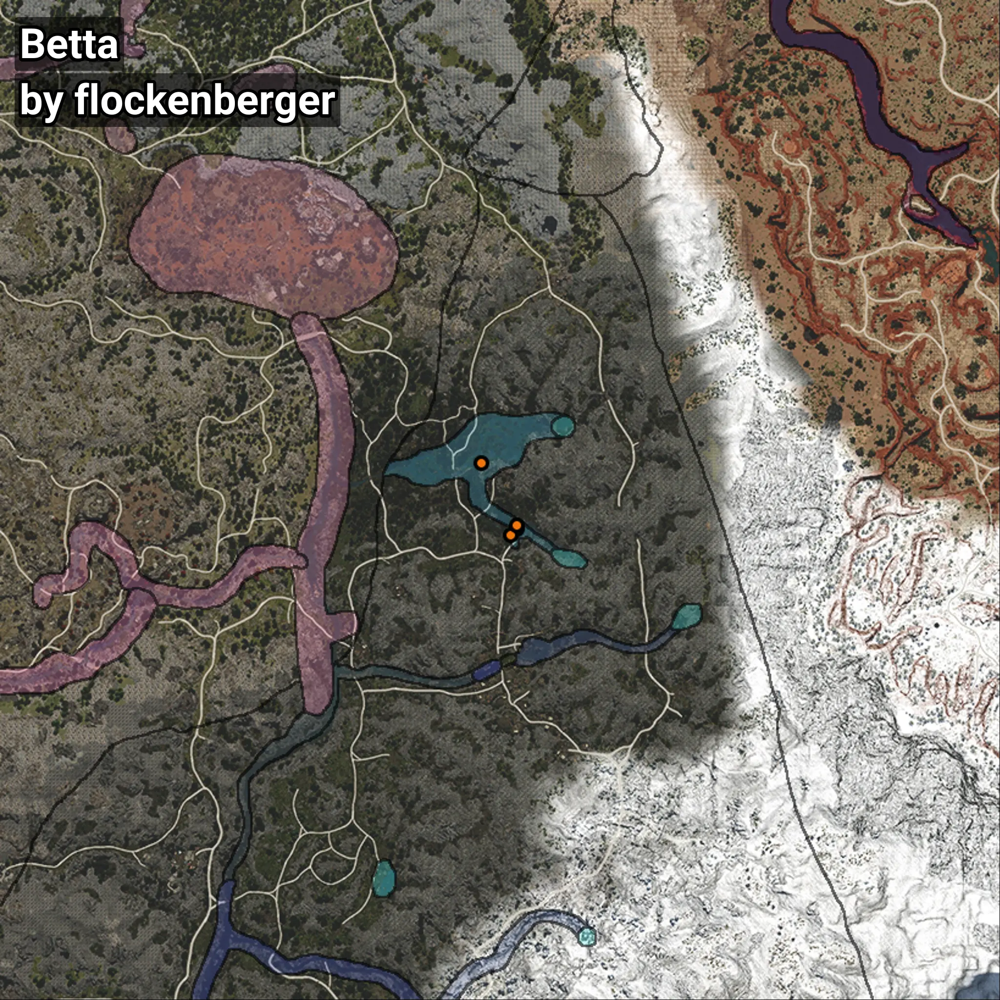

# Betta
```xml
<!--
    Waypoints for: Betta
    Created by: flockenberger
-->
<WorldmapBookMark>
    <BookMark BookMarkName="0: Betta" PosX="171486.0" PosY="14031.0" PosZ="-351920.0" />
    <BookMark BookMarkName="1: Betta" PosX="171442.0" PosY="13997.431" PosZ="-352122.7" />
    <BookMark BookMarkName="2: Betta" PosX="170012.89" PosY="13783.148" PosZ="-353720.22" />
    <BookMark BookMarkName="3: Betta" PosX="171587.0" PosY="13904.0" PosZ="-351422.0" />
    <BookMark BookMarkName="4: Betta" PosX="162812.27" PosY="11575.388" PosZ="-335833.6" />
</WorldmapBookMark>
```

## ⚠️ Disclaimer
Waypoints are generated based on the __**character’s position**__ — __not__ where the fishing float landed.
Fish are determined by where your **float** lands!
In ocean spots especially, the direction you cast your rod can place your float in a **different fishing zone**, which may result in catching the wrong type of fish.
Please pay attention to the preview images showing where each location is in relation to the outlined zones.

- You can verify your float’s position using the guide [**HERE**](https://flockenberger.github.io/bdo-fish-position/)
- Or watch the video guide [**HERE**](https://youtu.be/t-VXcRoNojk)

## Previews
      