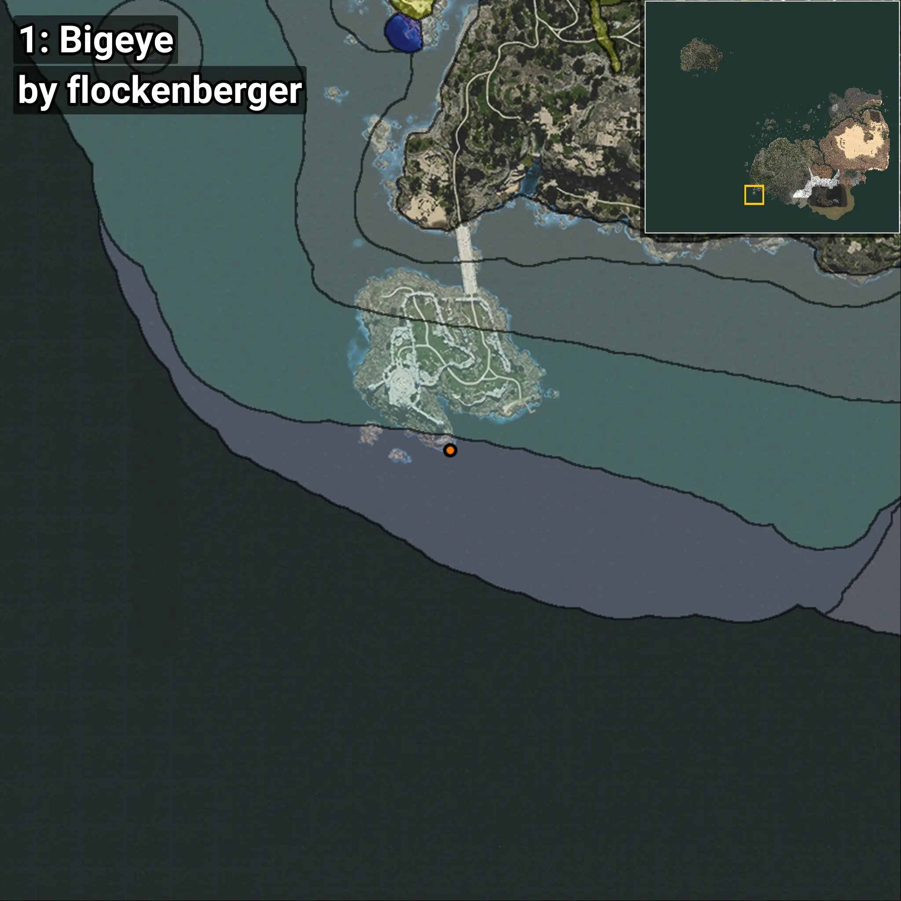
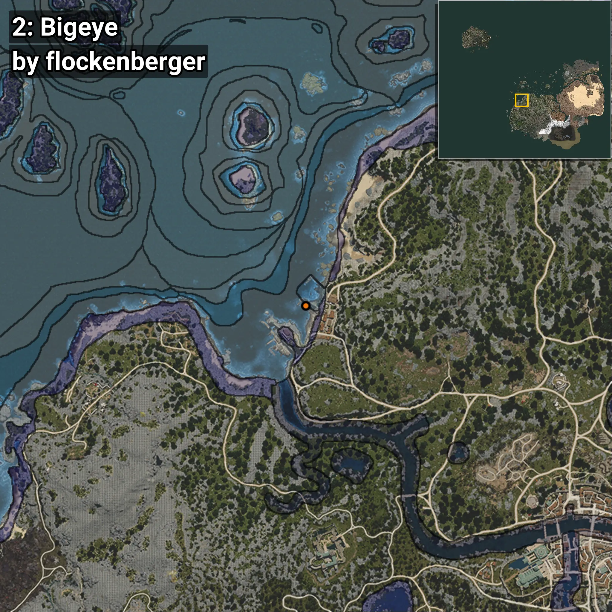
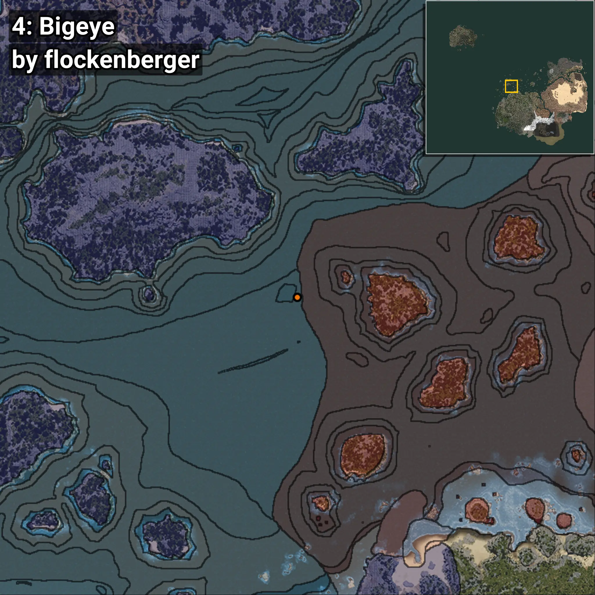
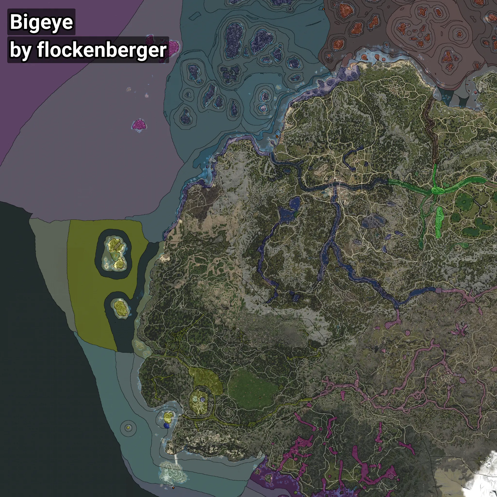

# Bigeye
```xml
<!--
    Waypoints for: Bigeye
    Created by: flockenberger
-->
<WorldmapBookMark>
    <BookMark BookMarkName="0: Bigeye" PosX="-551611.0" PosY="-8069.0" PosZ="-608692.0" />
    <BookMark BookMarkName="1: Bigeye" PosX="-551240.5" PosY="-8121.248" PosZ="-608394.9" />
    <BookMark BookMarkName="2: Bigeye" PosX="-361354.0" PosY="-7959.0" PosZ="38479.0" />
    <BookMark BookMarkName="3: Bigeye" PosX="-360705.0" PosY="-8051.0" PosZ="36191.0" />
    <BookMark BookMarkName="4: Bigeye" PosX="-275292.0" PosY="-7683.0" PosZ="271841.0" />
</WorldmapBookMark>
```

## ⚠️ Disclaimer
Waypoints are generated based on the __**character’s position**__ — __not__ where the fishing float landed.
Fish are determined by where your **float** lands!
In ocean spots especially, the direction you cast your rod can place your float in a **different fishing zone**, which may result in catching the wrong type of fish.
Please pay attention to the preview images showing where each location is in relation to the outlined zones.

- You can verify your float’s position using the guide [**HERE**](https://flockenberger.github.io/bdo-fish-position/)
- Or watch the video guide [**HERE**](https://youtu.be/t-VXcRoNojk)

## Previews
      