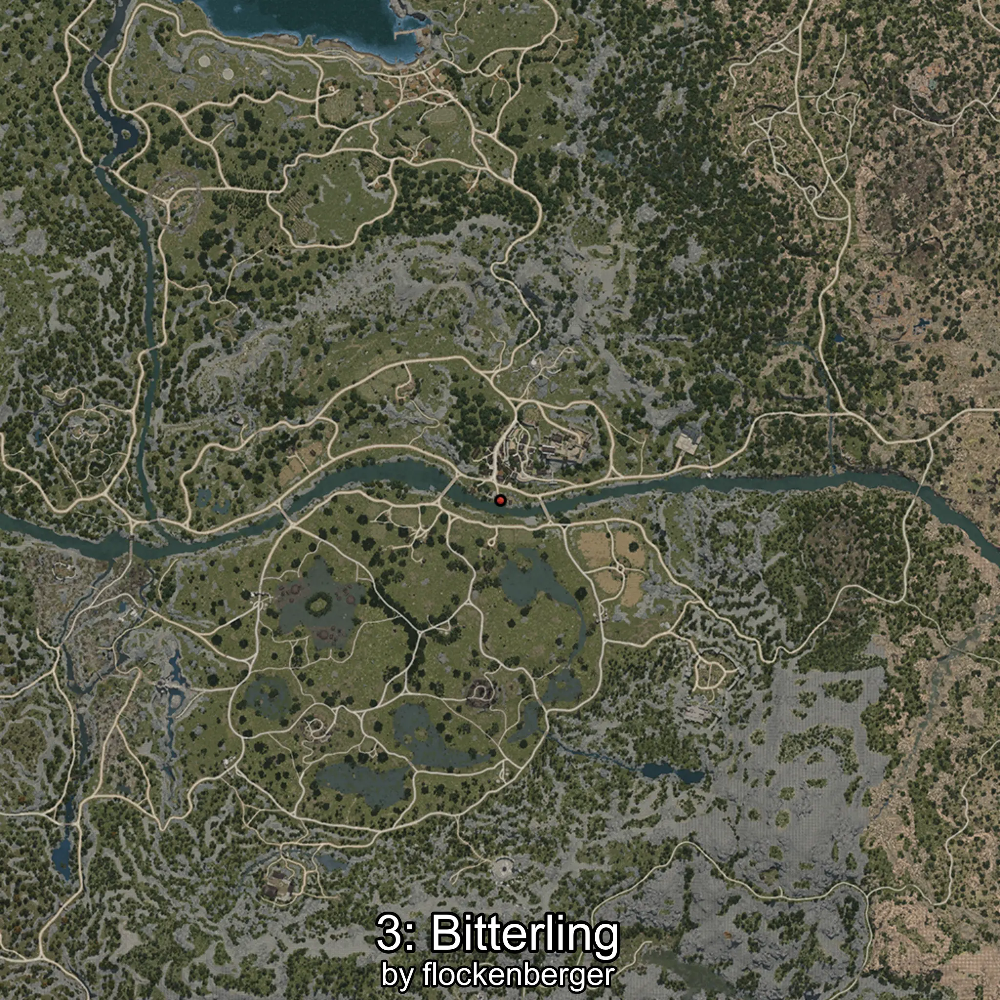
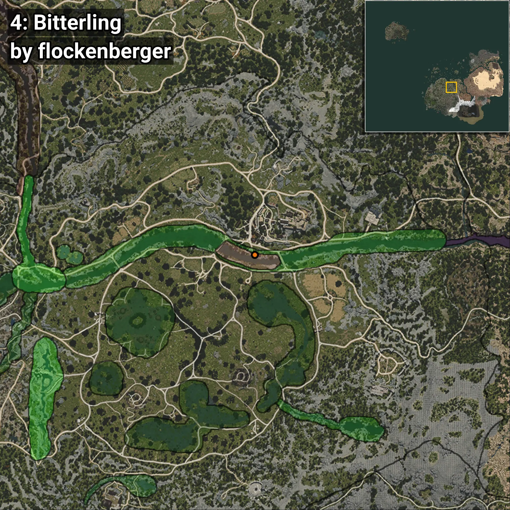
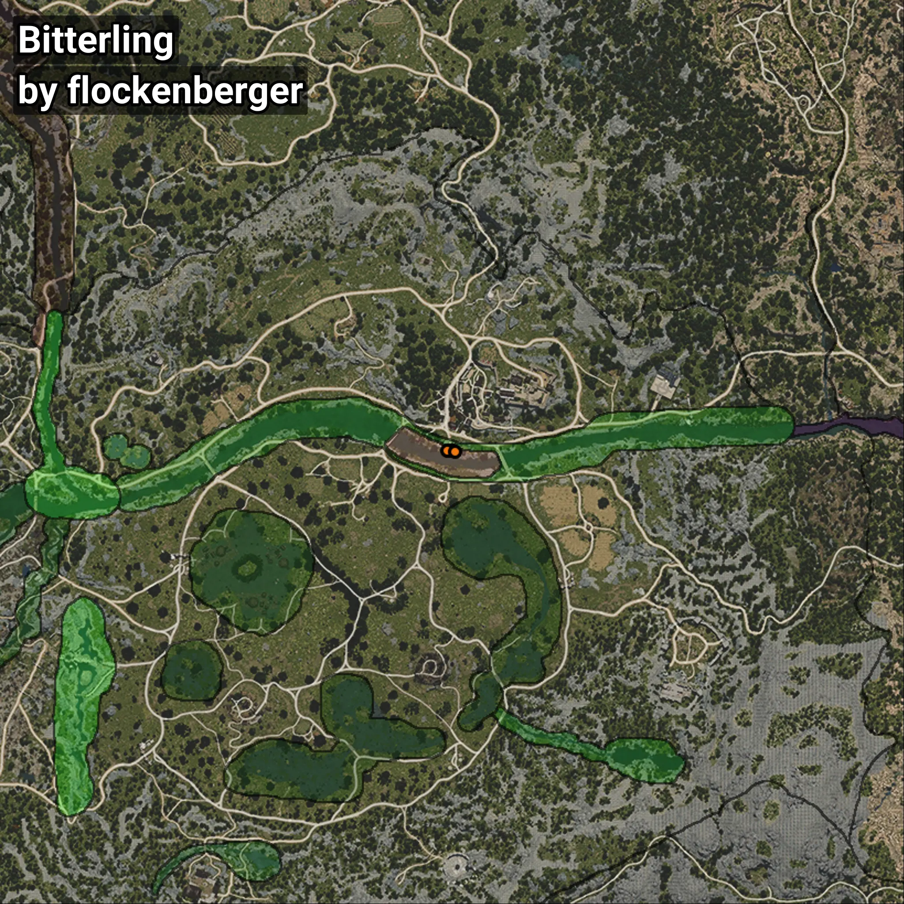

# Bitterling
```xml
<!--
    Waypoints for: Bitterling
    Created by: flockenberger
-->
<WorldmapBookMark>
    <BookMark BookMarkName="0: Bitterling" PosX="38828.0" PosY="-3986.0" PosZ="-50719.0" />
    <BookMark BookMarkName="1: Bitterling" PosX="38909.0" PosY="-3977.0" PosZ="-50735.0" />
    <BookMark BookMarkName="2: Bitterling" PosX="37659.0" PosY="-3816.0" PosZ="-50855.0" />
    <BookMark BookMarkName="3: Bitterling" PosX="37640.0" PosY="-3816.0" PosZ="-50865.0" />
    <BookMark BookMarkName="4: Bitterling" PosX="39532.0" PosY="-3975.0" PosZ="-51059.0" />
</WorldmapBookMark>
```

## ⚠️ Disclaimer
Waypoints are generated based on the __**character’s position**__ — __not__ where the fishing float landed.
Fish are determined by where your **float** lands!
In ocean spots especially, the direction you cast your rod can place your float in a **different fishing zone**, which may result in catching the wrong type of fish.
Please pay attention to the preview images showing where each location is in relation to the outlined zones.

- You can verify your float’s position using the guide [**HERE**](https://flockenberger.github.io/bdo-fish-position/)
- Or watch the video guide [**HERE**](https://youtu.be/t-VXcRoNojk)

## Previews
      