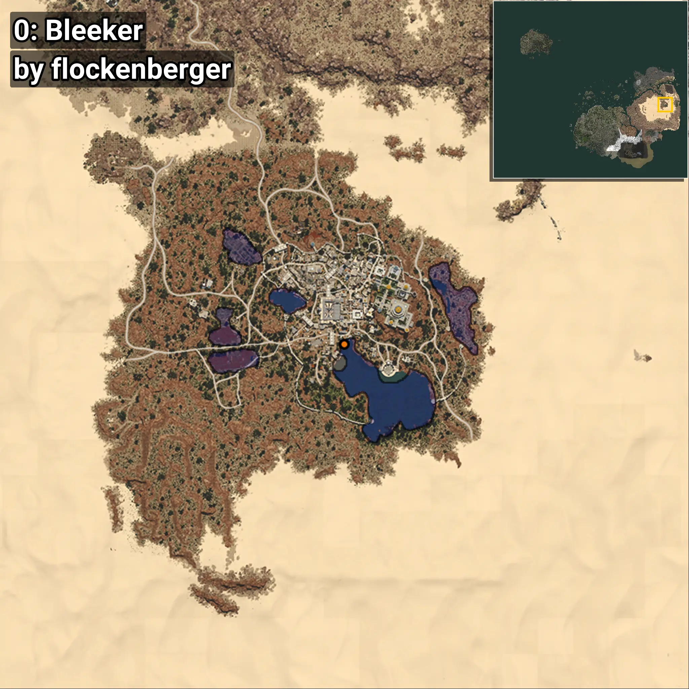
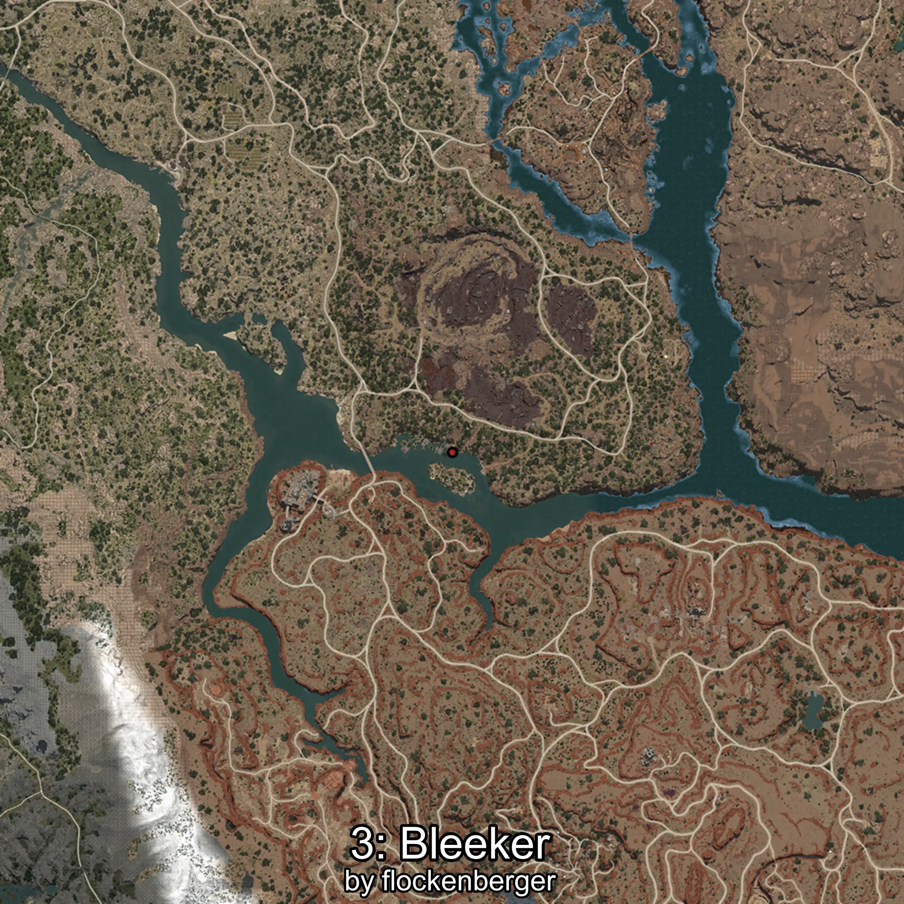
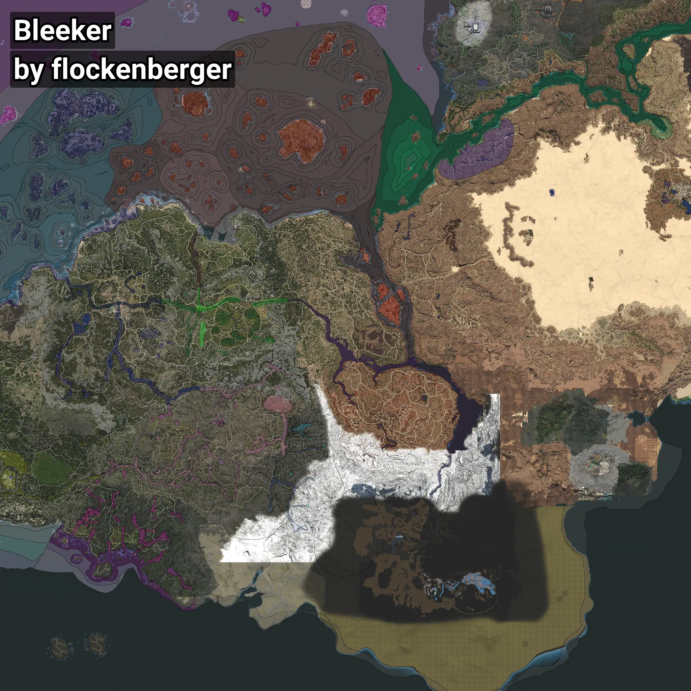

# Bleeker
```xml
<!--
    Waypoints for: Bleeker
    Created by: flockenberger
-->
<WorldmapBookMark>
    <BookMark BookMarkName="0: Bleeker" PosX="1031135.0" PosY="10493.0" PosZ="187129.0" />
    <BookMark BookMarkName="1: Bleeker" PosX="1031140.0" PosY="10500.0" PosZ="187143.0" />
    <BookMark BookMarkName="2: Bleeker" PosX="-506714.0" PosY="-6191.0" PosZ="-481983.0" />
    <BookMark BookMarkName="3: Bleeker" PosX="1031120.8" PosY="10480.733" PosZ="187126.6" />
    <BookMark BookMarkName="4: Bleeker" PosX="1032299.0" PosY="10619.0" PosZ="188995.0" />
</WorldmapBookMark>
```

## ⚠️ Disclaimer
Waypoints are generated based on the __**character’s position**__ — __not__ where the fishing float landed.
Fish are determined by where your **float** lands!
In ocean spots especially, the direction you cast your rod can place your float in a **different fishing zone**, which may result in catching the wrong type of fish.
Please pay attention to the preview images showing where each location is in relation to the outlined zones.

- You can verify your float’s position using the guide [**HERE**](https://flockenberger.github.io/bdo-fish-position/)
- Or watch the video guide [**HERE**](https://youtu.be/t-VXcRoNojk)

## Previews
      