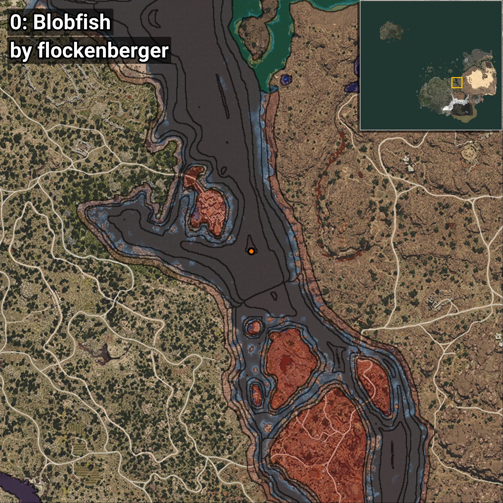
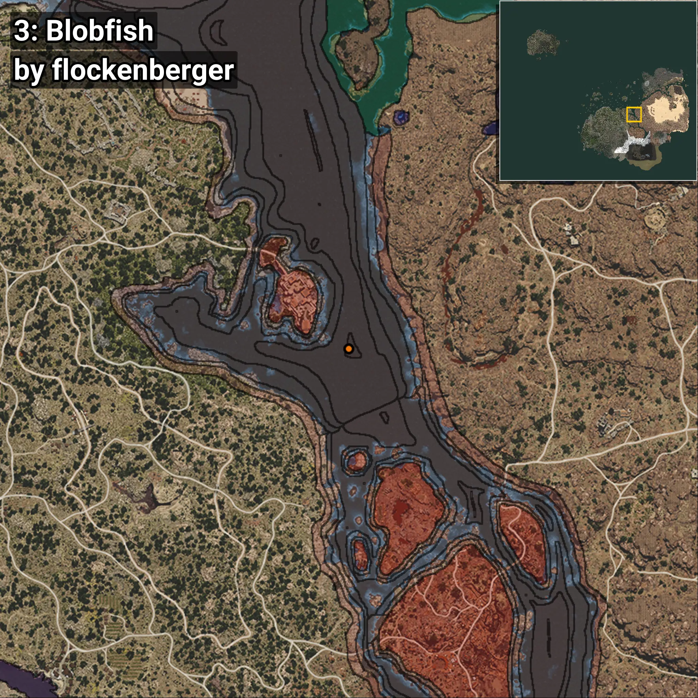
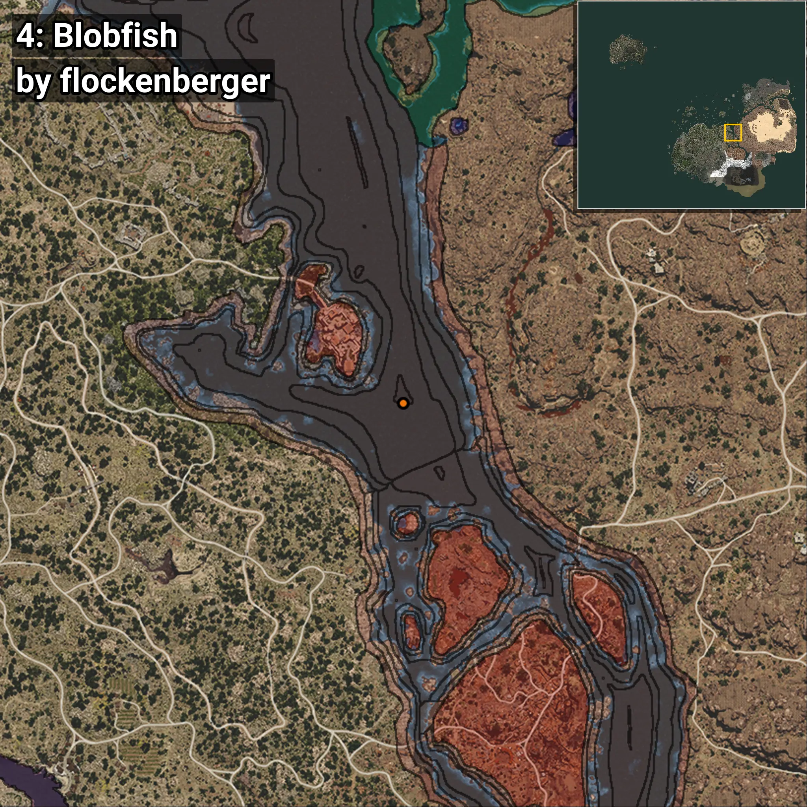
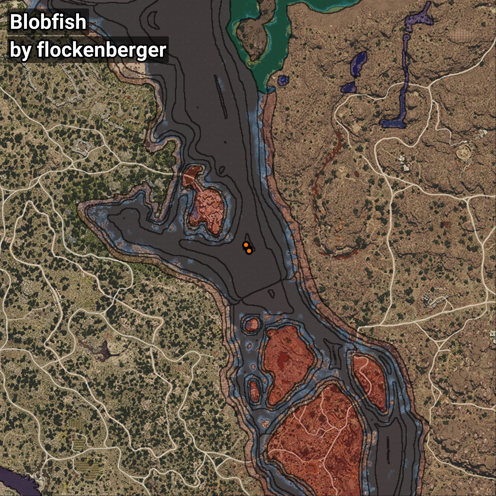

# Blobfish
```xml
<!--
    Waypoints for: Blobfish
    Created by: flockenberger
-->
<WorldmapBookMark>
    <BookMark BookMarkName="0: Blobfish" PosX="329256.4" PosY="-7729.808" PosZ="33696.1" />
    <BookMark BookMarkName="1: Blobfish" PosX="329182.0" PosY="-8066.0" PosZ="34311.0" />
    <BookMark BookMarkName="2: Blobfish" PosX="327980.0" PosY="-7925.0" PosZ="35803.0" />
    <BookMark BookMarkName="3: Blobfish" PosX="327690.03" PosY="-7762.3057" PosZ="35877.375" />
    <BookMark BookMarkName="4: Blobfish" PosX="329265.0" PosY="-8093.0" PosZ="32958.0" />
</WorldmapBookMark>
```

## ⚠️ Disclaimer
Waypoints are generated based on the __**character’s position**__ — __not__ where the fishing float landed.
Fish are determined by where your **float** lands!
In ocean spots especially, the direction you cast your rod can place your float in a **different fishing zone**, which may result in catching the wrong type of fish.
Please pay attention to the preview images showing where each location is in relation to the outlined zones.

- You can verify your float’s position using the guide [**HERE**](https://flockenberger.github.io/bdo-fish-position/)
- Or watch the video guide [**HERE**](https://youtu.be/t-VXcRoNojk)

## Previews
      